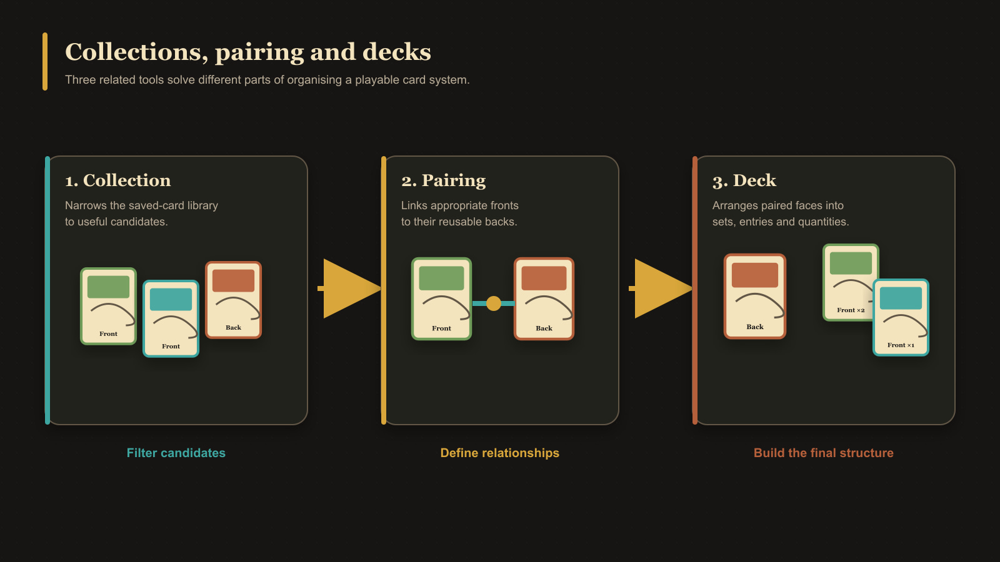

# Collections, Pairing, and Decks

Collections, pairings, and decks connect cards for different reasons. Understanding that distinction makes the larger workflows much easier.

For individual definitions, see [What Is a Collection?](../concepts/what-is-a-collection.md), [What Is Pairing?](../concepts/what-is-pairing.md), and [What Is a Deck?](../concepts/what-is-a-deck.md).

For the deck-source filter workflow, see [Use Collections While Building a Deck](./use-collections-while-building-a-deck.md).

## Collections organize the library

A collection is a named grouping of saved cards. Adding or removing membership does not duplicate or delete the card. Use collections for folders, projects, themes, or any grouping that helps you browse.

## Pairing connects printable faces

Pairing tells the app which front and back cards belong together for browsing, export, and deck workflows. One back can be shared by several fronts.

To pair cards:

1. Create and save a back-facing card such as Labelled Back.
2. Open its **Pairing** inspector tab.
3. Choose **Manage paired fronts**.
4. Select one or more front-facing cards.
5. Choose **Confirm**.

For front-side pairing, multiple backs, unpairing, and safety warnings, see [Pair and Unpair Card Faces](../making-cards/pair-and-unpair-card-faces.md).

## Decks model a playable system

A deck is structured rather than just grouped:

<!-- help-visual:p068:start -->
<figure class="hqcc-help-figure hqcc-help-figure--wide" markdown="span">
  
  <figcaption>Collections narrow the library, pairing defines reusable face relationships, and decks arrange those faces for play or print.</figcaption>
</figure>
<!-- help-visual:p068:end -->

- **Groups** divide the deck into larger sections.
- **Sets** are anchored by back faces.
- **Entries** are front faces inside a set.
- **Quantity** controls how many copies an entry contributes.
- Pairing helps the deck connect set backs with valid front cards.

The source panel separates **Back faces** and **Front faces** so each is dragged into the correct structural role. Removing an entry from a deck does not delete its saved card.

Removing a pairing is different from removing an entry. If a deck entry depends on the exact pairing being removed, the app warns that confirming will also remove that dependent entry. Use **Open deck** in the warning to inspect the affected location first.

For a complete first-deck procedure, see [Create and Build a Deck](./create-and-build-a-deck.md).

## Export eligibility

An empty deck cannot be exported. The main Export control becomes available once the first set exists. Deck PDF export then offers scopes such as Complete sets, All sets, and Selected sets. It can produce fronts-only or front-and-back output and supports paper size, orientation, duplex presets, bleed, marks, and reusable Export Profiles.

See [Export Cards as PNG Images](../exporting-and-printing/export-cards-as-png-images.md) for the deck's unique-image export, or [Export a Deck as PDF](../exporting-and-printing/export-a-deck-as-pdf.md) for quantity-aware print sheets.

## Build the deck

Drag a back face onto the visible empty card slot inside **Groups** to create a set. Select that set, then drag fronts onto the empty slot in **Entries**. If the back already has paired fronts, the app adds them to the new set automatically.
