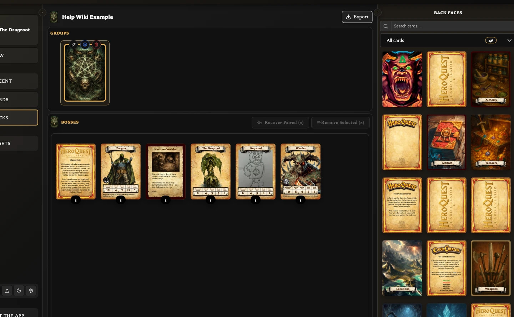

# Create and Build a Deck

Use a deck when you need more than a loose collection of cards: you want fronts connected to backs, sections, order, quantities, or print-ready structure.

## Before you begin

Save at least one back-facing card and one front-facing card. Pairing them first is useful but not required; see [What Is Pairing?](../concepts/what-is-pairing.md).

## Create the deck

1. Choose **Decks** in the left navigation.
2. Choose **Create deck**.
3. Enter a **Title** and, optionally, a **Description**.
4. Choose **Create deck**.

The new deck opens immediately. It already contains one empty group, but no sets or entries.

## Create the first set

<!-- help-visual:p069:start -->
<figure class="hqcc-help-figure hqcc-help-figure--wide" markdown="span">
  
  <figcaption>A deck set starts with a back face and contains the front entries that share it.</figcaption>
</figure>
<!-- help-visual:p069:end -->

1. In the right panel, choose **Back faces**.
2. Use search or **Collections** if you need to narrow the list.
3. Drag the back-facing card onto the empty card-shaped slot under **Groups**.

Drop onto the empty slot itself, not just the surrounding Groups board. The back appears in Groups as a new set, that set becomes selected, and **Export** becomes available.

If the back is already paired with front-facing cards, those paired fronts are automatically added to the new set as entries.

## Add a front-facing card

1. Select the set you want to change.
2. In the right panel, choose **Front faces**.
3. Find the front using search or **Collections**.
4. Drag it down to the empty slot or another position in **Entries**.

The front appears in Entries and is no longer offered in the source list for that set. You can add an unpaired front this way; the app creates the relationship needed by the deck.

## Set the number of copies

Use **Increase quantity** and **Decrease quantity** beside an entry. The number shown on the entry is the number of copies used for quantity-aware PDF planning and export.

Deleting the entry removes it from this set; it does not delete the saved card.

## Check the result

Choose **Deck Info** in the right panel. After adding one front and increasing its quantity to two, for example, you should see one group, one set, one entry, and a **Quantity total** of two.

Choose **Preview** to see the deck visually. When you are ready to export, see [Export Cards as PNG Images](../exporting-and-printing/export-cards-as-png-images.md) or [Export a Deck as PDF](../exporting-and-printing/export-a-deck-as-pdf.md).

## Related guides

- [Understand the Decks Workspace](./understand-the-decks-workspace.md)
- [What Is a Deck?](../concepts/what-is-a-deck.md)
- [Collections, Pairing, and Decks](./collections-pairing-and-decks.md)
- [Organize Deck Groups and Sets](./organize-deck-groups-and-sets.md)
- [Manage and Recover Deck Entries](./manage-and-recover-deck-entries.md)
