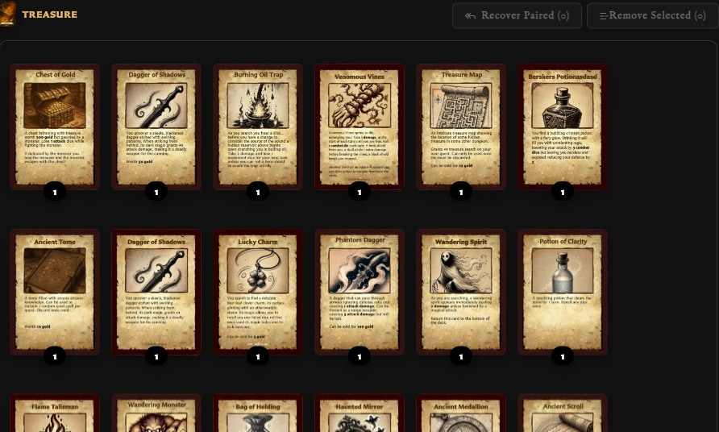

# Manage and Recover Deck Entries

**Entries** contains the front-facing cards in the selected set. The board title and thumbnail identify the set's back, so check them before changing cards in a deck with several sets.

## Reorder entries and change quantities

Drag an entry to another position in Entries to change its order. Use **Increase quantity** and **Decrease quantity** to set the number of copies from 1 to 12.

<!-- help-visual:p074:start -->
<figure class="hqcc-help-figure hqcc-help-figure--wide" markdown="span">
  
  <figcaption>Entry controls let you change quantities and arrange the order of fronts within a set.</figcaption>
</figure>
<!-- help-visual:p074:end -->

Order affects how the set is organized. Quantity affects quantity-aware PDF planning and export totals; it does not create duplicate saved cards.

## Select and remove several entries

Click an entry to select it. Hold **Ctrl** on Windows or **Command** on macOS while clicking to build a selection, then choose **Remove Selected**.

The confirmation offers two different results:

- **Remove from set** removes the selected deck entries but keeps the front/back pairings.
- **Remove and unpair** removes the entries and the matching front/back pairings.

Both choices leave the saved front and back cards in your library.

## Recover paired cards

**Paired (Not In Set)** counts fronts that are still paired with the selected set's back but do not currently have an entry in that set. This commonly happens after using **Remove from set**.

<!-- help-visual:p075:start -->
<figure class="hqcc-help-figure hqcc-help-figure--wide" markdown="span">
  
  <figcaption>Recover Paired restores eligible paired fronts to a set after they have been removed.</figcaption>
</figure>
<!-- help-visual:p075:end -->

1. Select the required set.
2. Choose **Recover Paired**.
3. Select one, several, or all of the listed fronts.
4. Choose **Recover Selected**.

The recovered fronts return as entries. Their saved cards and existing pairings are reused; no duplicate cards are created.

If the count is zero, there are no paired fronts available to recover. Add a front from **Front faces** or manage the relationship in the card's Pairing tab.

## Edit or remove one entry

Point to an entry to reveal **Edit card** and **Delete entry**. Editing opens the saved front in the Card Editor. Deleting opens the same remove-or-unpair decision used for a larger selection.

## Related guides

- [Create and Build a Deck](./create-and-build-a-deck.md)
- [Understand the Pairing Tab](../making-cards/understand-the-pairing-tab.md)
- [Pair and Unpair Card Faces](../making-cards/pair-and-unpair-card-faces.md)
