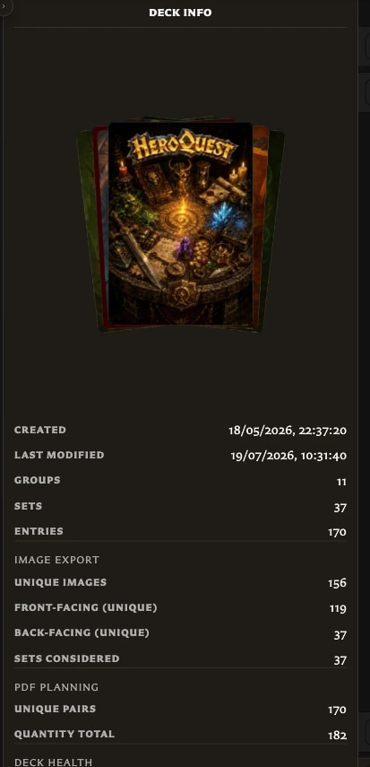

# Manage Decks and Deck Details

The **Decks** list is where you find, open, describe, and remove saved decks. These actions change the deck as an organized project; they do not delete the saved cards used by it.

## Find and open a deck

Use the search box to match either a deck title or the title of a card used in the deck. Clear the search to return to the complete list.

<!-- help-visual:p067:start -->
<figure class="hqcc-help-figure hqcc-help-figure--wide" markdown="span">
  
  <figcaption>The Decks list shows each saved deck with its cover and provides search and creation controls.</figcaption>
</figure>
<!-- help-visual:p067:end -->

You can open a deck in any of these ways:

- Double-click its tile.
- Select it and press **Enter**.
- Use **Open** on the tile.

The tile actions appear when you point to or focus the tile.

## Change the title or description

<!-- help-visual:p071:start -->
<figure class="hqcc-help-figure hqcc-help-figure--portrait" markdown="span">
  
  <figcaption>Deck Info contains the deck identity, dates, and counts that describe its current structure.</figcaption>
</figure>
<!-- help-visual:p071:end -->

1. Point to the deck tile and choose **Edit**.
2. Change the required **Title** or optional **Description**.
3. Choose **Save**.

The description helps identify the purpose of the deck, but it does not appear on its cards.

## Select and delete decks

Click a tile to select it. Hold **Ctrl** on Windows or **Command** on macOS while clicking to add or remove individual decks from the selection.

Choose **Delete selected**, or press **Delete** or **Backspace** while the deck list has focus. Review the number of decks in the confirmation before continuing.

Deleting a deck removes its groups, sets, entries, quantities, and other deck organization. It does not delete its saved cards or remove their pairings.

## Can I duplicate a deck?

Deck duplication is not available from the Decks screen in version 0.8.0. Create another deck and add the required sets and entries manually.

## Next

- [Understand the Decks Workspace](./understand-the-decks-workspace.md)
- [Organize Deck Groups and Sets](./organize-deck-groups-and-sets.md)
- [Manage and Recover Deck Entries](./manage-and-recover-deck-entries.md)
