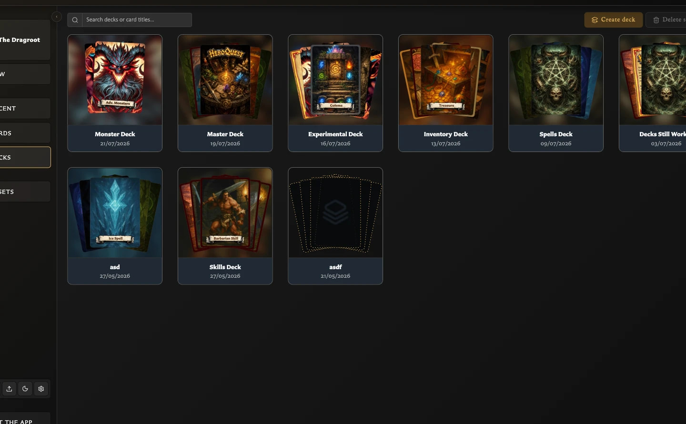

# Understand the Decks Workspace

The Decks workspace is where you turn saved front- and back-facing cards into an organized deck. A deck can record sections, which fronts use each back, card order, and how many copies are needed.

## The Decks list

Choose **Decks** in the left navigation to see your saved decks.

<!-- help-visual:p066:start -->
<figure class="hqcc-help-figure hqcc-help-figure--wide" markdown="span">
  
  <figcaption>The Decks list shows each saved deck with its cover and provides search and creation controls.</figcaption>
</figure>
<!-- help-visual:p066:end -->

At the top of the screen you can:

- Search deck titles and the titles of cards used by a deck.
- Choose **Create deck** to start a new deck.
- Select one or more decks and choose **Delete selected**.

Each deck tile shows its title, last-updated date, and a small card preview. Click a tile once to select it, double-click it to open it, or use the tile's **Open**, **Edit**, and **Delete** actions.

Deleting a deck removes that deck's organization. It does not delete the saved cards or their front-and-back pairings.

## Inside an open deck

An open deck has three main working areas.

<!-- help-visual:p064:start -->
<figure class="hqcc-help-figure hqcc-help-figure--wide" markdown="span">
  
  <figcaption>An open deck shows its groups and sets beside the front- or back-face cards available to add.</figcaption>
</figure>
<!-- help-visual:p064:end -->

### Groups

**Groups** is the upper board. It contains the deck's larger sections and the sets inside them. Each set is represented by its back-facing card.

A new deck starts with an empty group. Drag a card from **Back faces** onto the empty card-shaped slot to create the first set. When more sets exist, groups become overlapping card fans. Point to a group to inspect it or select a set to expand that group. Set insertion, movement, cover-card, edit, and delete controls appear around the cards when relevant.

### Entries

Select a set to show its **Entries** board below Groups. Entries are the front-facing cards that use the selected set's back.

From here you can:

- Drag front-facing cards into the set.
- Increase or decrease the quantity beside an entry.
- Reorder entries.
- Edit a card or remove an entry from the set.
- Recover paired fronts that are not currently in the set.

Removing an entry from a deck does not delete its saved card.

### Source faces panel

The panel on the right supplies cards and information for the deck. Use its vertical tabs to switch between:

- **Back faces** - saved back-facing cards that can become sets.
- **Front faces** - saved front-facing cards that can become entries.
- **Preview** - a visual preview of the current deck.
- **Deck Info** - created and modified dates, group/set/entry counts, image-export totals, PDF quantity totals, and paired cards missing from sets.

Back faces and Front faces each provide search and a **Collections** filter. This lets you narrow the source list without changing collection membership or the deck itself. You can also collapse the source panel when you need more working space.

## Export availability

The main **Export** control is disabled while the deck has no sets. It becomes available after the first back-facing card creates a set.

The contents of a particular image or PDF export still depend on the sets, entries, quantities, and export scope you choose. See [Export Cards as PNG Images](../exporting-and-printing/export-cards-as-png-images.md) and [Export a Deck as PDF](../exporting-and-printing/export-a-deck-as-pdf.md).

## Keyboard shortcuts

While an open deck has an enabled Export control, press **E** to open or close the Export menu. With the menu open, press **I** for image export or **P** for PDF export.

If those keys do nothing, see [Fix Keyboard Shortcut Problems](../troubleshooting/fix-keyboard-shortcut-problems.md).

## Next

- [Create and Build a Deck](./create-and-build-a-deck.md)
- [Manage Decks and Deck Details](./manage-decks-and-deck-details.md)
- [Organize Deck Groups and Sets](./organize-deck-groups-and-sets.md)
- [Manage and Recover Deck Entries](./manage-and-recover-deck-entries.md)
- [What Are Deck Groups, Sets, and Entries?](../concepts/what-are-deck-groups-sets-and-entries.md)
- [Use Collections While Building a Deck](./use-collections-while-building-a-deck.md)
