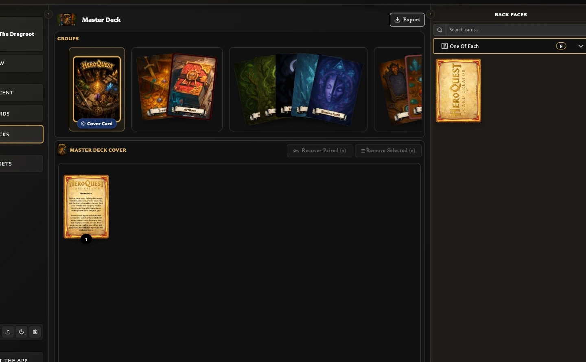

# Use Collections While Building a Deck

Collections can narrow the source cards shown beside a deck. They do not become deck groups or sets automatically; they act as a filter while you choose cards for the deck structure.

## Filter the deck source

<!-- help-visual:p070:start -->
<figure class="hqcc-help-figure hqcc-help-figure--wide" markdown="span">
  
  <figcaption>A collection filter narrows the source panel without changing the structure already in the deck.</figcaption>
</figure>
<!-- help-visual:p070:end -->

1. Open **Decks** and open or create a deck.
2. In the source panel, choose **Back faces** or **Front faces**.
3. Open the **Collections** selector beneath the card search.
4. Choose a named collection.

The source panel now shows eligible cards from that collection only. You can also search within the filtered result.

## Why the collection list changes

The source panel applies the current face mode first:

- **Back faces** offers collections containing eligible back-facing cards.
- **Front faces** offers collections containing eligible front-facing cards.
- The counts show how many eligible source cards currently match, not necessarily the collection's total membership in Cards.
- Collections with no eligible cards for the current face mode are omitted.

Slash-based collection folders are preserved in the selector. Folder headings organize the menu, but only named collection leaves can be selected.

## Collection versus deck structure

Filtering helps you find source cards; it does not add them to the deck. Decks still use [groups, sets, entries, and quantities](../concepts/what-are-deck-groups-sets-and-entries.md), with back faces and front faces serving different roles.

## Related help

- [Collections FAQ](../managing-your-library/collections/index.md)
- [Collections, Pairing, and Decks](./collections-pairing-and-decks.md)
