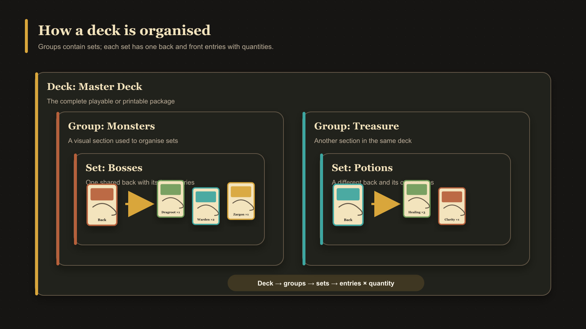

# What Are Deck Groups, Sets, and Entries?

A deck uses three levels to describe its contents:

- A **group** is an unnamed visual section used to organize related sets.
- A **set** is identified and anchored by a back-facing card.
- An **entry** is a front-facing card inside a set and has a quantity.

In simple terms, a group contains sets, and each set contains the front cards that use its back. This is why the deck source panel separates **Back faces** from **Front faces**.

## Example

A group could contain a set using a Treasure back. The individual treasure fronts would be entries in that set, each with the number of copies needed.

<!-- help-visual:p109:start -->
<figure class="hqcc-help-figure hqcc-help-figure--wide" markdown="span">
  
  <figcaption>A deck contains groups, groups contain sets, and sets combine one back with front entries and quantities.</figcaption>
</figure>
<!-- help-visual:p109:end -->

## How groups stay manageable

Groups with several sets appear as overlapping card fans. Point to a group for a partial view or select one of its sets to expand it fully. The selected set controls which fronts appear in Entries.

Groups and sets do not need separate names: the back cards identify the sets, and their visual arrangement identifies the groups. You can reorder sets or move them between groups, but the groups themselves are not reordered.

Removing a deck entry does not necessarily remove its pairing. A paired front that is no longer an entry becomes **Paired (Not In Set)** and can be recovered into the set.

## Next

- [What Is a Deck?](./what-is-a-deck.md)
- [What Is Pairing?](./what-is-pairing.md)
- [Create and Build a Deck](../building-decks/create-and-build-a-deck.md)
- [Organize Deck Groups and Sets](../building-decks/organize-deck-groups-and-sets.md)
