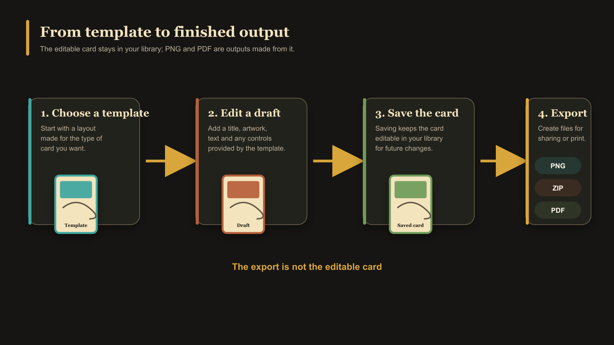

# What Is a Card?

A card is an editable design created from one of the app's [templates](./what-is-a-template.md). It can contain text, statistics, colours, artwork, and other options supported by that template.

Cards can represent front faces or back faces. After you save a card, it appears in **Cards**, where you can reopen, duplicate, organize, pair, or export it.

## A card is not just an image

The saved card keeps the information needed to edit it again. An exported PNG is a finished image made from that card, but editing the PNG outside the app does not change the saved card.

<!-- help-visual:p102:start -->
<figure class="hqcc-help-figure hqcc-help-figure--wide" markdown="span">
  
  <figcaption>A template becomes an editable draft, then a saved card; PNG, ZIP, and PDF files are outputs made from it.</figcaption>
</figure>
<!-- help-visual:p102:end -->

Uploaded artwork is also separate. It lives in [Assets](./what-is-an-asset.md) and can be reused by more than one card.

## Next

- [Create Your First Card](../getting-started/create-your-first-card.md)
- [What Is a Draft?](./what-is-a-draft.md)
