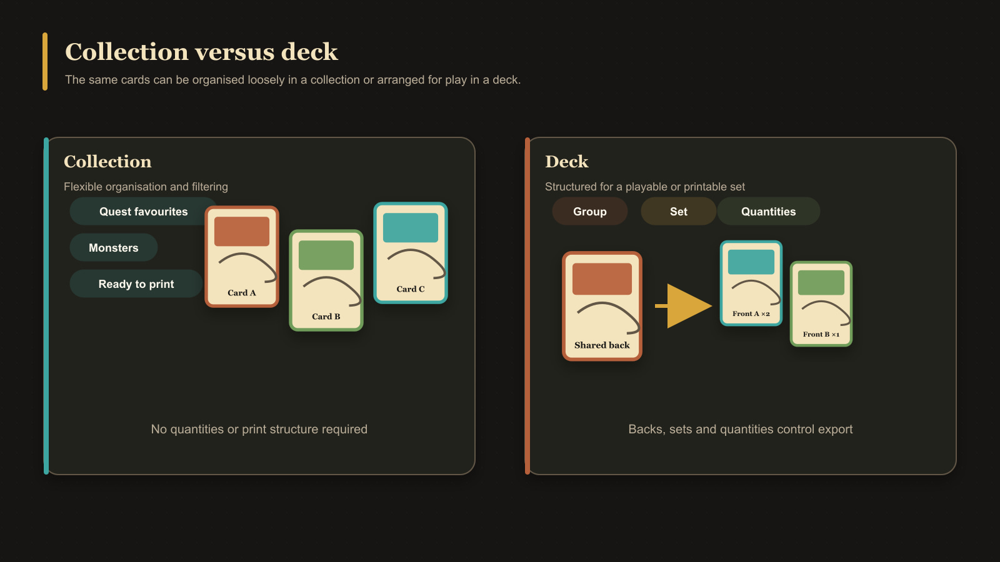

# What Is a Deck?

A deck is a structured, playable arrangement of saved cards. It records how card fronts and backs belong together, how cards are divided into sections, their order, and how many copies should be included.

Decks can be used to prepare an organized PDF export with options for fronts, backs, duplex printing, paper size, bleed, and print marks.

## Deck versus collection

A [collection](./what-is-a-collection.md) is a flexible way to organize cards in the library. A deck adds print and play structure through [groups, sets, entries, and quantities](./what-are-deck-groups-sets-and-entries.md).

<!-- help-visual:p107:start -->
<figure class="hqcc-help-figure hqcc-help-figure--wide" markdown="span">
  
  <figcaption>Collections organise cards flexibly; decks add groups, sets, shared backs, and quantities.</figcaption>
</figure>
<!-- help-visual:p107:end -->

Removing something from a deck does not delete its saved card. Deleting the whole deck also removes only the deck organization, not its cards or pairings.

An empty deck has nothing to export. Its **Export** control becomes available after the first back-facing card creates a set; the results of each export then depend on that set's entries, quantities, and the scope you choose.

## Next

- [What Are Deck Groups, Sets, and Entries?](./what-are-deck-groups-sets-and-entries.md)
- [Understand the Decks Workspace](../building-decks/understand-the-decks-workspace.md)
- [Create and Build a Deck](../building-decks/create-and-build-a-deck.md)
- [Collections, Pairing, and Decks](../building-decks/collections-pairing-and-decks.md)
