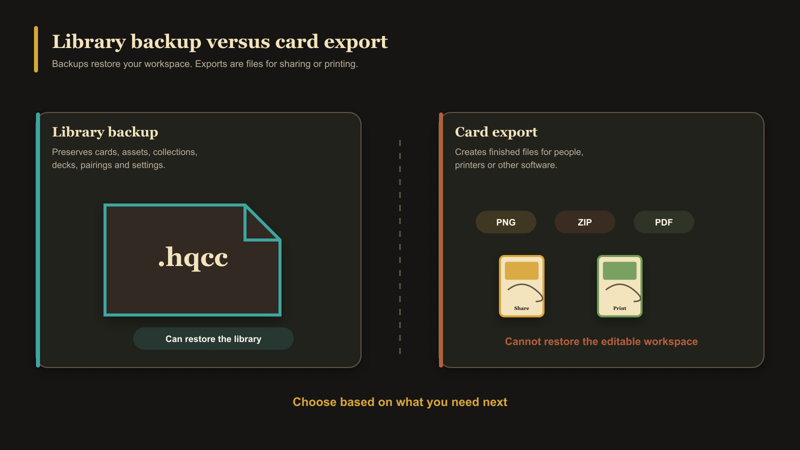

# What Is a Library Backup?

A library backup is a portable `.hqcc` file containing the editable library stored in the current browser profile or installed app copy. This includes cards, assets, collections, decks, pairings, and settings that belong to that library.

It exists because the app stores your working library locally rather than automatically syncing it to an online account. The backup lets you preserve that work, move it to another app location, or recover it later.

It does not include every personal preference. Language, theme, and several display or editing preferences remain specific to the browser profile or installed copy where they were chosen.

## Backup versus card export

A PNG, ZIP, or PDF export produces finished card files for viewing or printing. A `.hqcc` backup preserves editable app data so it can be imported back into HeroQuest Card Creator.

<!-- help-visual:p110:start -->
<figure class="hqcc-help-figure hqcc-help-figure--wide" markdown="span">
  
  <figcaption>A library backup restores the workspace; card exports are finished files intended for sharing or printing.</figcaption>
</figure>
<!-- help-visual:p110:end -->

Importing a backup replaces the library already stored in the current browser profile; it does not merge two libraries. Create a fresh backup before importing anything you may need to undo.

## Next

- [Back Up and Restore Your Library](../settings-and-data/back-up-and-restore-your-library.md)
- [Understand Backups and Local Data](../settings-and-data/understand-backups-and-local-data.md)
