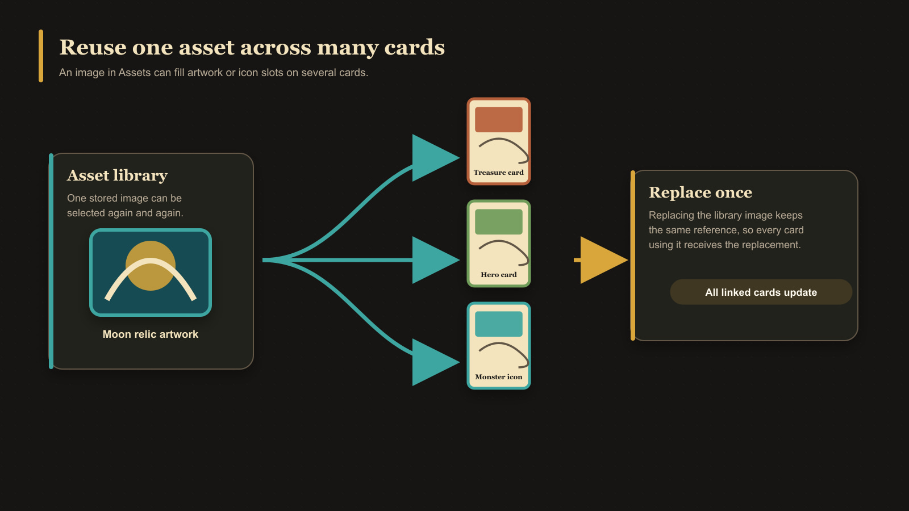

# What Is an Asset?

An asset is an image stored in the app's reusable image library. Upload an image once, then select that asset when adding artwork or an icon to one or more cards.

Each asset has useful information such as its file type, dimensions, size, date added, kind, and which cards use it. Its **kind** helps the app show appropriate images in Artwork and Icon fields. Artwork is intended for main illustrations and backgrounds; Icon is intended for smaller icon fields. You can override an incorrect automatic classification without changing the image itself.

## Asset versus card image

The asset is the shared source image. A card refers to that asset and stores its own positioning, scale, and rotation. Replacing a shared asset can therefore update the source used by several cards, while adjusting its framing on one card affects that card's presentation.

<!-- help-visual:p105:start -->
<figure class="hqcc-help-figure hqcc-help-figure--wide" markdown="span">
  
  <figcaption>One saved asset can fill image slots on several cards, and replacing it updates every linked use.</figcaption>
</figure>
<!-- help-visual:p105:end -->

Assets are stored in the current browser profile and are included in a [library backup](./what-is-a-library-backup.md).

## Next

- [Understand the Assets Workspace](../managing-your-library/assets/understand-the-assets-workspace.md)
- [Upload and Organize Assets](../managing-your-library/assets/upload-and-organize-assets.md)
- [Replace, Convert, and Delete Assets](../managing-your-library/assets/replace-convert-and-delete-assets.md)
- [Add and Position Artwork](../making-cards/add-and-position-artwork.md)
