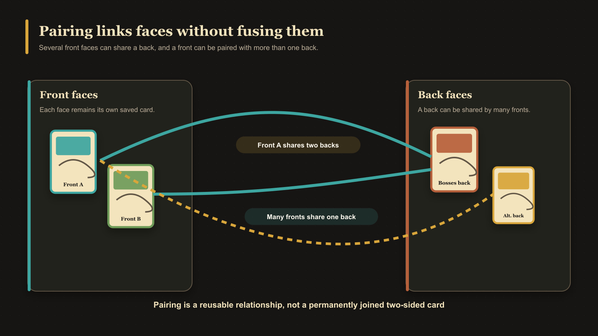

# What Is Pairing?

Pairing records which front-facing and back-facing cards belong together. It helps the app keep related faces together during browsing, export, and deck-building workflows.

One back can be paired with several front cards. A front can also be paired with more than one back. This is useful when different cards share a back design or when one front needs to be available with different backs.

Pairing does not decide how many copies a deck contains. A deck entry has its own quantity. Pairing instead tells the app which opposite faces are valid relationships.

## Pairing versus a two-sided card

The front and back remain separate saved cards. Pairing connects them; it does not merge them into one editable card or copy the artwork from one face to the other.

<!-- help-visual:p108:start -->
<figure class="hqcc-help-figure hqcc-help-figure--wide" markdown="span">
  
  <figcaption>Pairing links reusable faces without permanently joining them into a single two-sided card.</figcaption>
</figure>
<!-- help-visual:p108:end -->

Pairing is also different from a [collection](./what-is-a-collection.md), which groups cards for library organization, and from a [deck](./what-is-a-deck.md), which organizes cards into sets and quantities.

Removing a pairing does not delete either saved card. If a deck entry depends on that exact relationship, however, confirming the removal also removes the dependent deck entry after a warning.

## Next

- [Collections, Pairing, and Decks](../building-decks/collections-pairing-and-decks.md)
- [Understand the Pairing Tab](../making-cards/understand-the-pairing-tab.md)
- [Pair and Unpair Card Faces](../making-cards/pair-and-unpair-card-faces.md)
- [What Is a Deck?](./what-is-a-deck.md)
