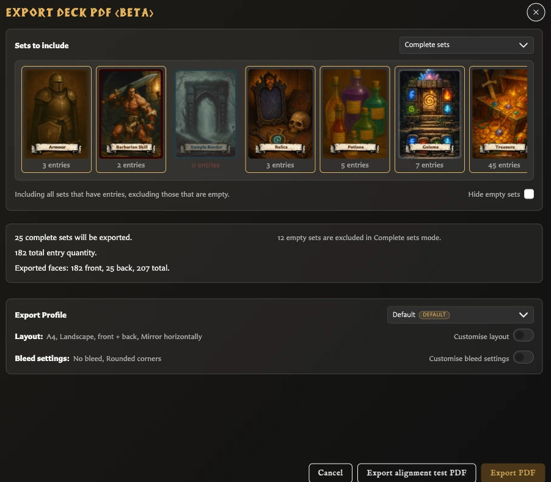

# Export a Deck as PDF

Deck PDF export creates print sheets rather than a folder of separate card images. It follows the deck's groups, sets, card order, and quantities so repeated cards are included as repeated print copies.

Choose **Front + back** to create matching front and reverse sheets for double-sided printing, or **Fronts only** when you only need the front faces.

## Export a deck PDF

<!-- help-visual:p082:start -->
<figure class="hqcc-help-figure hqcc-help-figure--wide" markdown="span">
  
  <figcaption>Deck PDF setup summarises included sets, face totals, profile choices, and print layout before export.</figcaption>
</figure>
<!-- help-visual:p082:end -->

1. Open **Decks** and open the deck you want to print.
2. Choose **Export**, then **PDF Export**.
3. Choose which sets to include.
4. Review or customise the paper, orientation, face mode, duplex preset, bleed, and export profile.
5. Check the summary, then choose **Export PDF**.

The deck must contain at least one set before the Export control becomes available. **Complete sets** still needs card entries, while **All sets** or **Selected sets** can include an empty set using a placeholder front.

## Choose which sets to include

The PDF summary offers three scopes:

- **Complete sets** includes every set that contains card entries and leaves out empty sets.
- **All sets** includes empty sets as well. An empty set uses one placeholder front so its back can still be placed in the run.
- **Selected sets** includes only the sets you choose. A selected empty set also uses a placeholder front.

The summary shows the included sets, total card quantity, and number of print positions before you export.

## How fronts and backs are arranged

Each deck entry becomes one or more print positions according to its quantity. The app places front faces onto sheets in deck order. In **Front + back** mode, it also creates a corresponding reverse sheet using each set's back face for the cards in that set.

<!-- help-visual:p083:start -->
<figure class="hqcc-help-figure hqcc-help-figure--panoramic" markdown="span">
  
  <figcaption>The reverse sheet mirrors the placement of the front sheet so matching faces align during duplex printing.</figcaption>
</figure>
<!-- help-visual:p083:end -->

The matching front and back occupy related positions so the sheets can be printed double-sided and cut into cards. Your printer may turn or flip the reverse side differently, so the app provides duplex presets:

| Preset | What it does to the back sheet |
| --- | --- |
| **Normal** | Keeps backs in the same positions as their fronts |
| **Mirror horizontally** | Flips back positions from left to right |
| **Rotate 180°** | Turns backs upside down within their current positions |
| **Mirror + rotate 180°** | Flips positions left to right and turns the backs 180 degrees |

There is no single correct preset for every printer. Use **Export alignment test PDF** before a large print run, print it with the same duplex settings and paper path you intend to use, and check both position and orientation.

## Layout and print options

The PDF window can use an Export Profile and allows per-export changes including:

- A4 or Letter paper.
- Portrait or landscape orientation.
- Fronts only or front and back.
- Duplex arrangement for the reverse sheets.
- Margins and spacing through the customised layout.
- Bleed handling, crop marks, cut marks, and rounded corners where enabled.

Choose the bleed source that matches your card images: either the image already includes bleed, or the layout should add it around the trimmed image. The preview summary reports the effective choices before generation begins.

When printing the resulting PDF, use your PDF reader's **Actual size** or **100%** setting rather than **Fit to page**. Automatic scaling can change the card size and move fronts and backs out of alignment.

## PDF export versus Image Export

Use **PDF Export** for a print run. It respects deck quantities and prepares front and back sheets.

Use **Image Export** when you need one PNG for each unique face used by the deck. It deliberately does not repeat the same image to match deck quantities.

## Related help

- [Fix Export and Print Problems](../troubleshooting/fix-export-and-print-problems.md)
- [Configure Export Defaults and Profiles](../settings-and-data/configure-export-defaults-and-profiles.md)
- [Export Cards as PNG Images](./export-cards-as-png-images.md)
- [Collections, Pairing, and Decks](../building-decks/collections-pairing-and-decks.md)
- [What Is a Deck?](../concepts/what-is-a-deck.md)
