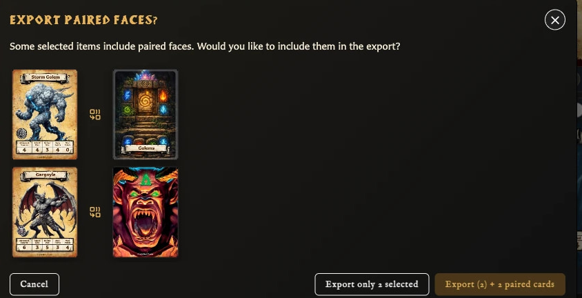
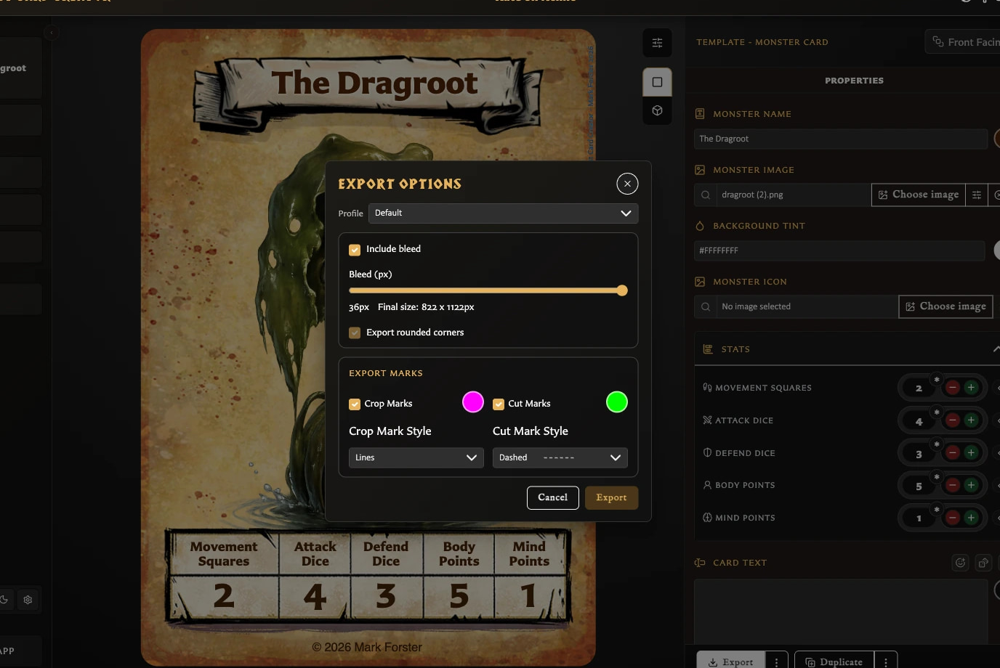

# Export Cards as PNG Images

Image export creates finished PNG pictures of your cards. Use it when you want individual card images for sharing, uploading, or arranging in another program. You can export the card open in the editor, a selection from Cards, a whole collection, or the unique faces used by a deck.

## Export cards from Cards or a collection

<!-- help-visual:p078:start -->
<figure class="hqcc-help-figure hqcc-help-figure--wide" markdown="span">
  
  <figcaption>Select cards in Cards, then use Export to create PNG files for the selected faces.</figcaption>
</figure>
<!-- help-visual:p078:end -->

1. Open **Cards**.
2. Open **All cards**, **Unfiled**, or a named collection.
3. Select the cards you want to export.
4. Choose **Export (count)**. Inside a collection, the action reads **Export (count) from this collection**.
5. Review any paired-face or missing-image questions, then continue the export.

The app creates one ZIP file containing a PNG for each successfully exported card face.

To export a whole collection, open the collection, clear any card selection, and choose **Export all from this collection**. Selecting cards changes the scope to that selected subset.

## Include paired faces

When the chosen cards have paired faces outside the current selection or collection, the app asks whether to include them. This is useful when you have selected fronts but also need their shared back, or selected a back and also need its paired fronts.

<!-- help-visual:p080:start -->
<figure class="hqcc-help-figure hqcc-help-figure--wide" markdown="span">
  
  <figcaption>When selected cards have pairings, bulk export can include the connected faces in the same ZIP.</figcaption>
</figure>
<!-- help-visual:p080:end -->

The question shows the related cards and gives you two choices:

- Export only the cards in your current selection or collection.
- Include the additional paired faces in the same ZIP.

The extra faces do not have to belong to the open collection. Choosing to include them adds them for this export only; it does not change collection membership.

## What is in the ZIP?

Each successfully generated card face is a separate PNG. The ZIP uses card names for its image filenames and adds a short identifier when needed to prevent two files from having the same name.

Your active export settings can also add bleed, rounded corners, crop marks, or cut marks. If **Ask before export** is enabled, the app lets you review those choices before it begins.

If required saved images are missing, the app warns you before continuing. You can cancel, or proceed without the affected faces. When you proceed, the ZIP includes **export-issues.txt**, which lists the faces skipped because their required images could not be found. Keep that file with the export until you have checked which images need fixing.

The issues file is specifically a report of known skipped faces, such as missing-image cases. It is not a guarantee that every possible unexpected export error will have a face-specific entry.

## Export the card open in the editor

<!-- help-visual:p081:start -->
<figure class="hqcc-help-figure hqcc-help-figure--wide" markdown="span">
  
  <figcaption>Editor export applies the chosen profile and image options to the card face currently open.</figcaption>
</figure>
<!-- help-visual:p081:end -->

1. Open or create the card you want.
2. Choose **Export** beneath the Properties panel.
3. Review the export settings if the app asks.

The main Export action downloads the current face as one PNG rather than a ZIP. You can export an unsaved draft this way, although saving first makes it easier to find and export the card again later.

### Export a paired card

A saved paired card adds extra choices to the Export menu:

- On a front with one paired back, choose **Export both faces**.
- On a back with one paired front, choose **Export both faces**.
- On a back shared by several fronts, choose **Export this face + active front** or **Export this face + all paired fronts**.

Exports containing more than one face are downloaded as a ZIP. An unpaired card only offers the current-face PNG export.

## Export deck images

1. Open **Decks** and open the deck.
2. Choose **Export** and then **Image Export**.
3. Review the summary of front-facing cards, back-facing cards, sets, and total unique images.
4. Confirm the export.

Deck Image Export creates a ZIP containing each distinct card face used by the deck once. A front repeated within a set, given a higher quantity, or reused in another set still produces one PNG. A back shared by several sets also produces one PNG.

This makes Image Export a clean set of reusable card pictures; it is not a quantity-matched print run. Use [Export a Deck as PDF](./export-a-deck-as-pdf.md) when you need repeated copies laid out for printing.

The deck must contain exportable set structure before the Export action becomes available.

## Related help

- [Fix Export and Print Problems](../troubleshooting/fix-export-and-print-problems.md)
- [Configure Export Defaults and Profiles](../settings-and-data/configure-export-defaults-and-profiles.md)
- [Filter and Export a Collection](../managing-your-library/collections/filter-and-export-a-collection.md)
- [Export a Deck as PDF](./export-a-deck-as-pdf.md)
- [What Is Pairing?](../concepts/what-is-pairing.md)
- [Collections, Pairing, and Decks](../building-decks/collections-pairing-and-decks.md)
