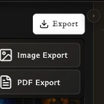

# Exporting and Printing

Create card images and print-ready PDFs, then prepare them for the way you intend to print or share them.

<!-- help-visual:p077:start -->
<figure class="hqcc-help-figure hqcc-help-figure--thumbnail" markdown="span">
  
  <figcaption>Deck export offers image files for reuse and a PDF prepared for printing.</figcaption>
</figure>
<!-- help-visual:p077:end -->

## In this section

- [Export a Deck as PDF](./export-a-deck-as-pdf.md)
- [Export Cards as PNG Images](./export-cards-as-png-images.md)
