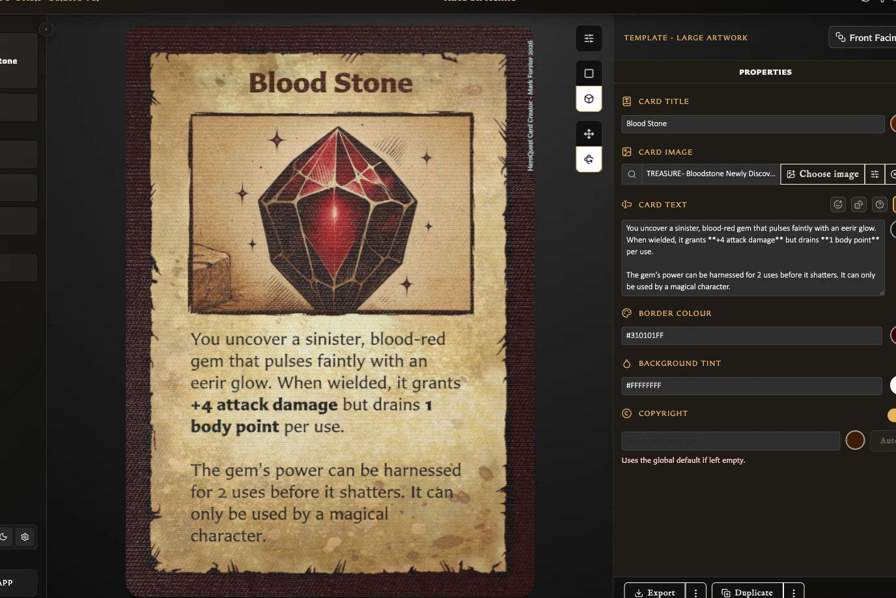

# Card, Template, and Text Questions

These concise answers use the same wording captured during product exploration. Follow the linked guide when you need fuller context or step-by-step instructions.

## How do I create my first card?

Choose New, select a template, enter a title, and Save.

[Read the full guidance](../getting-started/create-your-first-card.md)

## Which card templates can I start from?

New offers Hero, Monster, Small/Large Artwork, Rules, Hero Back, Logo Back, and Labelled Back templates.

[Read the full guidance](../getting-started/create-your-first-card.md)

## What does the card editor contain?

The editor combines a live preview, preview toolbar, and template-specific inspector.

<!-- help-visual:p011:start -->
<figure class="hqcc-help-figure hqcc-help-figure--wide" markdown="span">
  
  <figcaption>Standard preview shows the finished card alongside the properties used to build it.</figcaption>
</figure>
<!-- help-visual:p011:end -->

[Read the full guidance](../getting-started/create-your-first-card.md)

## Do I need artwork before saving?

Artwork is optional; a title is enough to enable Save.

[Read the full guidance](../getting-started/create-your-first-card.md)

## Why is Save disabled?

Save is disabled when the current draft lacks its required non-empty title/label or has no unsaved change.

[Read the full guidance](../getting-started/create-your-first-card.md)

## Can I preview changes before saving?

Editor changes update the card preview before saving.

[Read the full guidance](../getting-started/create-your-first-card.md)

## How do I tell a draft from a saved card?

The inspector status distinguishes draft, saved, and Modified state.

[Read the full guidance](../getting-started/create-your-first-card.md)

## What actions become available after saving?

Saved cards gain Duplicate and pairing/collection/deck context in addition to Export and Save changes.

[Read the full guidance](../making-cards/duplicate-a-card.md)

## How do I put an uploaded image on a card?

In the editor choose Choose image, select an asset, confirm, then save.

[Read the full guidance](../making-cards/add-and-position-artwork.md)

## How do I reposition, resize, or rotate card artwork?

Image adjustments provide axis movement, nudging, centring, scale, auto-fit, and rotation.

[Read the full guidance](../making-cards/add-and-position-artwork.md)

## How do I reset or restore image framing?

Use centre/auto-scale/reset rotation or the adjacent restore/clear control, depending on current state.

[Read the full guidance](../making-cards/add-and-position-artwork.md)

## How do I make precise image adjustments?

Hold Option/Alt while adjusting for precision steps.

[Read the full guidance](../making-cards/add-and-position-artwork.md)

## How do I make card text bold or italic?

Use Markdown asterisks or `<b>`/`<i>` rich-text tags.

[Read the full guidance](../making-cards/format-card-text.md)

## How do I insert dice symbols in card text?

Insert combat or D6 tokens using the syntax listed in Formatting help.

[Read the full guidance](../making-cards/format-card-text.md)

## How do I create dotted leader lines?

Use `[Label[.]Value]`; wrap related rows in leader-group syntax.

[Read the full guidance](../making-cards/format-card-text.md)

## How do I align part of the card text?

Wrap text with `:::al`, `:::ac`, or `:::ar` alignment directives.

[Read the full guidance](../making-cards/format-card-text.md)

## How do I colour, underline, or resize individual text?

Rich-text tags support colour, underline, scale, title, and subtitle treatments.

[Read the full guidance](../making-cards/format-card-text.md)

## How do I keep long titles and stat headings readable?

Global Text fitting controls minimum title/stat size and ellipsis preference.

[Read the full guidance](../making-cards/format-card-text.md)

## Can body text automatically scale to fit?

The Card text toolbar has a per-card body scale-to-fit toggle.

[Read the full guidance](../making-cards/format-card-text.md)

## How do I create a back-facing card?

Choose a back template such as Labelled Back, enter its label, and save.

[Read the full guidance](../building-decks/collections-pairing-and-decks.md)

## What keyboard shortcuts can I use in the Card Editor?

In the Card Editor, V switches Standard and Interactive previews; M switches Pan and Rotate only while Interactive preview is active.

[Read the full guidance](../reference/keyboard-shortcuts.md)

## What am I seeing in the Card Editor?

The editor shows the current card in a live preview beside a template-specific Properties panel.

[Read the full guidance](../making-cards/understand-the-card-editing-view.md)

## How does the Standard preview help me edit a card?

Standard is the main editing preview; field changes appear on the card immediately, before Save.

[Read the full guidance](../making-cards/understand-the-card-editing-view.md)

## Can I select an editing field by clicking the card?

Click an editable part of the Standard preview to focus its matching field; selecting artwork also exposes direct move, scale, and rotate controls.

[Read the full guidance](../making-cards/understand-the-card-editing-view.md)

## What is the Interactive preview for?

Interactive previews the card as a physical object so it can be tilted, turned, and viewed from the reverse.

[Read the full guidance](../making-cards/understand-the-card-editing-view.md)

## What is the difference between Pan and Rotate?

Pan gives a limited tilt that recentres when released; Rotate permits a complete turn and retains the chosen angle.

[Read the full guidance](../making-cards/understand-the-card-editing-view.md)

## Which fields can appear in Properties?

Properties can include title, image, stats, text, tint, border, icon, back logo, and copyright fields, depending on the template.

[Read the full guidance](../making-cards/understand-the-card-editing-view.md)

## What body-text tools are available?

Body-text tools can include emoji, configurable inline dice, Formatting help, colours, backdrop layout, visibility, and scale to fit.

<!-- help-visual:p024:start -->
<figure class="hqcc-help-figure hqcc-help-figure--wide" markdown="span">
  
  <figcaption>Body-text tools sit beside the text field so you can format content while watching the card update.</figcaption>
</figure>
<!-- help-visual:p024:end -->

[Read the full guidance](../making-cards/understand-the-card-editing-view.md)

## Why do body-text options vary between templates?

Templates show only relevant text controls; fixed text areas can offer scale to fit, while some backs add optional text and backdrop controls.

[Read the full guidance](../making-cards/understand-the-card-editing-view.md)

## What does Text fitting settings change?

Text fitting settings changes app-wide minimum sizes and ellipsis behavior for titles and stat headings, not per-card body-text fitting.

[Read the full guidance](../making-cards/understand-the-card-editing-view.md)

## How do I access the available card templates?

Choose New in the left navigation, or press N when shortcuts are available, to open Choose a template.

[Read the full guidance](../making-cards/choose-a-card-template.md)

## Which card templates are available?

The picker offers Hero Card, Monster Card, Small Artwork, Large Artwork, Rules, Hero Back, Logo Back, and Labelled Back.

[Read the full guidance](../making-cards/choose-a-card-template.md)

## When should I use Hero Card or Monster Card?

Use Hero Card for Hero-style characters and stats; use Monster Card for Monster-style stats and a dedicated monster icon.

[Read the full guidance](../making-cards/choose-a-card-template.md)

## When should I use Small Artwork or Large Artwork?

Small Artwork leaves more room for rules text; Large Artwork gives more space to the illustration.

[Read the full guidance](../making-cards/choose-a-card-template.md)

## When should I use the Rules template?

Rules is a front-facing, text-led reference layout with a large formatted text area and no main artwork field.

[Read the full guidance](../making-cards/choose-a-card-template.md)

## Which back-facing template should I use?

Choose Hero Back for a character-deck treatment, Logo Back for a vertical logo-led reverse, or Labelled Back for a named illustrated back.

[Read the full guidance](../making-cards/choose-a-card-template.md)

## How do I create a card from a template?

Choose New, select a template preview, complete its required name/title/label, add optional content, and Save the draft.

[Read the full guidance](../making-cards/choose-a-card-template.md)

## Can I create my own card template?

The eight layouts are built in; cards can customize supported content and appearance, but users cannot design new template structures in the app.

[Read the full guidance](../making-cards/choose-a-card-template.md)

## What does Save do for a draft and for a modified saved card?

Save creates a library card from a draft or updates the same card when its status is Modified; success returns the status to saved.

[Read the full guidance](../making-cards/save-or-discard-card-changes.md)

## Why is Save unavailable?

Save requires the template's non-empty title, name, or back label and, for an existing card, an unsaved change.

[Read the full guidance](../making-cards/save-or-discard-card-changes.md)

## What happens if I leave a card with unsaved changes?

Leaving a modified card opens **Discard changes?**: Cancel stays, Save persists then continues, and Discard continues without the edits.

[Read the full guidance](../making-cards/save-or-discard-card-changes.md)

## Are draft changes kept automatically, and what can still be lost?

The current new-card draft resumes after an ordinary reload, but it is not a library card and can be lost by discarding, replacing the draft, or clearing local app data.

[Read the full guidance](../making-cards/save-or-discard-card-changes.md)

## What happens if Save cannot complete before navigation?

Save-before-navigation continues only after a successful save; missing required wording or a save failure keeps the user in the editor.

[Read the full guidance](../making-cards/save-or-discard-card-changes.md)

## How do I duplicate a saved card?

Open a saved card, choose **Duplicate**, edit the resulting draft, then Save it to create the independent copy.

[Read the full guidance](../making-cards/duplicate-a-card.md)

## When does a duplicate become a separate saved card?

Duplicate creates a draft first; the copy becomes an independent saved card only on its first successful Save.

[Read the full guidance](../making-cards/duplicate-a-card.md)

## How does the app name duplicated cards?

The suggested name adds or increments a numeric suffix, such as `Card` to `Card (2)` and `Card (2)` to `Card (3)`.

[Read the full guidance](../making-cards/duplicate-a-card.md)

## Does a duplicate inherit the source card's collections?

On first save, a duplicate is appended to every collection that currently contains its source card; this applies to both duplicate choices.

[Read the full guidance](../making-cards/duplicate-a-card.md)

## Does a duplicate inherit the source card's deck membership?

Deck membership is not copied; add the new saved card to the required deck separately.

[Read the full guidance](../making-cards/duplicate-a-card.md)

## Why is Duplicate missing or unavailable?

Duplicate appears only for a saved card; save the draft first. Drafts also cannot manage collections or pairings.

[Read the full guidance](../making-cards/duplicate-a-card.md)

## What is the difference between Duplicate and Duplicate with pairing?

Duplicate should omit pairing and Duplicate with pairing should retain it, but v0.8.0 currently ignores the pairing choice and saved the verified copy unpaired.

[Read the full guidance](../troubleshooting/fix-card-saving-and-duplication-problems.md)

## Why do the Properties controls change between templates?

Properties shows only the fields that the current template can display, so changing templates changes the available controls.

[Read the full guidance](../making-cards/understand-template-specific-card-controls.md)

## Which controls are available on each card template?

The eight templates combine different title, image, stats, text, colour, icon, logo, and copyright controls according to their visible layouts.

[Read the full guidance](../making-cards/understand-template-specific-card-controls.md)

## How do I change Hero and Monster statistics?

Use direct entry or the minus and plus controls under Stats; Hero has Attack, Defend, Body, and Mind, while Monster also has Movement.

[Read the full guidance](../making-cards/use-advanced-hero-and-monster-controls.md)

## How do I show a wildcard stat?

Enter `*` to display a wildcard; its separate asterisk marker is unavailable because the wildcard already uses that symbol.

[Read the full guidance](../making-cards/use-advanced-hero-and-monster-controls.md)

## How do I show two values for one stat?

Choose **Add second value**, set it independently, and remove it again when the stat should return to one value.

[Read the full guidance](../making-cards/use-advanced-hero-and-monster-controls.md)

## How do I change the format between two stat values?

A split stat can display as `x / y`, `x ( y )`, or `( x ) y`.

[Read the full guidance](../making-cards/use-advanced-hero-and-monster-controls.md)

## How do I add an asterisk to one stat value?

Use the asterisk button beside each numeric value; the two values in a split stat carry independent markers.

[Read the full guidance](../making-cards/use-advanced-hero-and-monster-controls.md)

## How do I choose and adjust a Monster icon?

Select an image in Monster icon, then adjust its horizontal and vertical position, scale, or rotation.

[Read the full guidance](../making-cards/use-advanced-hero-and-monster-controls.md)

## How do I change a card title's colour?

Choose the title field's colour swatch, select or enter a colour, and save the card.

[Read the full guidance](../making-cards/customize-titles-colours-and-copyright.md)

## How do I show or hide a Labelled Back label?

Labelled Back provides a visibility switch for its Back label.

[Read the full guidance](../making-cards/customize-titles-colours-and-copyright.md)

## How do I move a Labelled Back label to the top or bottom?

Labelled Back can place its label at the top or bottom; other templates use their fixed title position.

[Read the full guidance](../making-cards/customize-titles-colours-and-copyright.md)

## What is the difference between Ribbon and Plain label styles?

Ribbon uses the template's ribbon treatment, while Plain displays the label without that ribbon treatment.

[Read the full guidance](../making-cards/customize-titles-colours-and-copyright.md)

## Which templates let me change the border colour?

Border colour is available on Small Artwork, Large Artwork, and Labelled Back.

[Read the full guidance](../making-cards/customize-titles-colours-and-copyright.md)

## Which templates let me change the background tint?

Background tint is available on Hero, Monster, Small Artwork, Large Artwork, Hero Back, Logo Back, and Labelled Back.

[Read the full guidance](../making-cards/customize-titles-colours-and-copyright.md)

## How do I change body-text colour?

Use the colour swatch beside the card, rules, or back-text field to change that card's main text colour.

[Read the full guidance](../making-cards/customize-titles-colours-and-copyright.md)

## What are Smart colour suggestions?

Smart suggestions are colours derived from the current card to provide useful starting choices; choosing one saves an ordinary colour value.

[Read the full guidance](../making-cards/customize-titles-colours-and-copyright.md)

## What is the difference between Default and Revert for a colour?

Default applies the template's standard colour; Revert restores the value from the start of the current edit.

[Read the full guidance](../making-cards/customize-titles-colours-and-copyright.md)

## How does a card use or override the global copyright text?

Empty per-card copyright text uses the global Settings default; entered text overrides it only for that card.

[Read the full guidance](../making-cards/customize-titles-colours-and-copyright.md)

## How do I show or hide copyright on one card?

Use the Copyright visibility control to show or hide the line on the current card.

[Read the full guidance](../making-cards/customize-titles-colours-and-copyright.md)

## What do Auto, fixed, and transparent copyright colours do?

Auto chooses a readable copyright colour, a fixed colour forces that choice, and transparent makes the line invisible without changing its text.

[Read the full guidance](../making-cards/customize-titles-colours-and-copyright.md)

## How do I choose a default or custom back logo?

Hero Back and Logo Back share a chooser containing the built-in Default logo and saved custom logos.

[Read the full guidance](../making-cards/customize-card-back-logos-and-text.md)

## How do I add and manage custom back logos?

Use **Add Another** to upload one custom logo and **Manage Logos** to inspect or remove saved choices.

[Read the full guidance](../making-cards/customize-card-back-logos-and-text.md)

## What happens if I delete a custom logo used by cards?

Deleting a used custom logo requires switching affected cards to Default or replacing it with another saved logo.

[Read the full guidance](../making-cards/customize-card-back-logos-and-text.md)

## What is the difference between Hero Back, Logo Back, and Labelled Back controls?

Hero Back combines a logo and text, Logo Back uses the shared logo without back text, and Labelled Back uses an Assets image, configurable label, and optional text.

[Read the full guidance](../making-cards/customize-card-back-logos-and-text.md)

## Which back templates support back text?

Hero Back always has Back text, Labelled Back can enable optional Back text, and Logo Back has no Back text field.

[Read the full guidance](../making-cards/customize-card-back-logos-and-text.md)

## How do I customize the backdrop behind back text?

Supported back text can show or hide its backdrop, change edge inset and corner treatment, fill or fit the area, and set text and backdrop colours.

[Read the full guidance](../making-cards/customize-card-back-logos-and-text.md)

## What body-text tools are available in the Card Editor?

Body-text fields provide emoji, inline-dice, and formatting helpers, plus colour and Scale to fit where the template supports them.

[Read the full guidance](../making-cards/understand-body-text-tools.md)

## How do I insert an emoji into body text?

Place the cursor in body text, open Insert emoji, and choose a symbol; the picker inserts it and closes.

[Read the full guidance](../making-cards/insert-emoji-and-dice.md)

## How do I insert an inline die without typing its token?

Open Insert inline dice, choose a family, face, and colours, preview it, then select Insert.

[Read the full guidance](../making-cards/format-card-text.md)

## What do D6, Icon dice, and Detail dice mean?

D6 provides values 1-6, Icon dice provides skull and shield faces, and Detail dice provides CD, AD, DD, and MD symbols.

[Read the full guidance](../making-cards/insert-emoji-and-dice.md)

## How do I change and preview an inline die's colours?

Choose separate background and symbol or pip colours, then check Preview and Token before inserting.

[Read the full guidance](../making-cards/insert-emoji-and-dice.md)

## What are Defaults and Recent in the inline-dice picker?

Defaults provides ready-made dice; Recent recalls configured choices you have inserted or copied.

[Read the full guidance](../making-cards/insert-emoji-and-dice.md)

## What is the difference between Insert and Copy for an inline die?

Insert places the die at the cursor and closes the picker; Copy copies its token and keeps the picker open.

[Read the full guidance](../making-cards/insert-emoji-and-dice.md)

## Where is an emoji or die inserted in my text?

An emoji or die is inserted at the cursor, or replaces the currently selected text.

[Read the full guidance](../making-cards/insert-emoji-and-dice.md)

## Which templates provide Scale to fit for body text?

Small Artwork, Large Artwork, Rules, Hero Back, and enabled Labelled Back text provide per-card Scale to fit.

[Read the full guidance](../making-cards/fit-body-text-on-a-card.md)

## What does Scale to fit do to body text?

Scale to fit shrinks and reflows overflowing body text down to a minimum size and saves that choice with the card.

[Read the full guidance](../making-cards/fit-body-text-on-a-card.md)

## What is the difference between fixed and flexible body-text areas?

Fixed body-text areas have a set boundary and may need fitting; flexible Hero and Monster areas adjust with their content.

[Read the full guidance](../making-cards/fit-body-text-on-a-card.md)

## How do blank lines and paragraph spacing affect fitting?

Blank lines and paragraph gaps consume height and shrink proportionally when fitting is active.

[Read the full guidance](../making-cards/fit-body-text-on-a-card.md)

## How much body text can I enter?

Body-text fields accept up to 2,000 characters; this input limit is separate from whether the wording visually fits.

[Read the full guidance](../making-cards/understand-body-text-tools.md)

## Why does M not change the card preview?

M changes Pan and Rotate only while Interactive preview is active; press V first when Standard preview is selected.

[Read the full guidance](../reference/keyboard-shortcuts.md)
