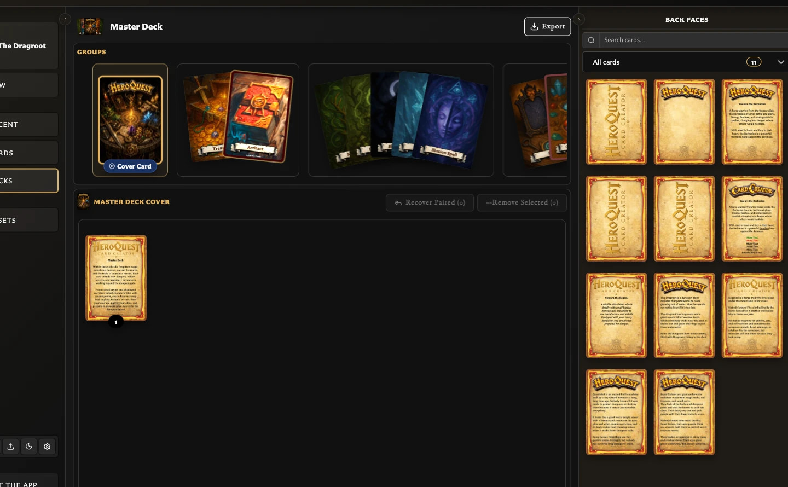

# Deck and Pairing Questions

These concise answers use the same wording captured during product exploration. Follow the linked guide when you need fuller context or step-by-step instructions.

## How do I create a deck?

Open Decks, choose Create deck, enter a title and optional description, and confirm; the new deck opens immediately.

[Read the full guidance](../building-decks/create-and-build-a-deck.md)

## Why does a deck separate front and back faces?

Back faces anchor sets; front faces become entries, so the source panel separates them.

[Read the full guidance](../building-decks/use-collections-while-building-a-deck.md)

## How do deck groups, sets, and entries relate?

Groups contain sets; sets use back faces; entries are front faces with quantities.

[Read the full guidance](../building-decks/understand-the-decks-workspace.md)

## Why is deck Export disabled?

Export is disabled while the deck has no sets and becomes available after the first back face creates a set.

[Read the full guidance](../building-decks/create-and-build-a-deck.md)

## How do I pair a front card with its back?

On the saved back, open Pairing, Manage paired fronts, select fronts, and Confirm.

[Read the full guidance](../making-cards/pair-and-unpair-card-faces.md)

## Can one back be shared by several front cards?

A back can pair with multiple fronts; the pairing picker is multi-select.

[Read the full guidance](../making-cards/pair-and-unpair-card-faces.md)

## Why does the front card look disabled in the pairing picker?

Pair tiles work with pointer input but incorrectly expose `aria-disabled=true` because drag is disabled in pair mode.

[Read the full guidance](../troubleshooting/fix-pairing-problems.md)

## How do I turn a paired back into a deck set?

Drag the back onto the visible empty card slot inside Groups; the back becomes a set and paired fronts are added automatically.

[Read the full guidance](../building-decks/create-and-build-a-deck.md)

## How do I use collections to filter front and back cards while building a deck?

In a deck's source panel, switch to Back faces or Front faces, then choose a collection from Collections; only collections and cards eligible for that face mode are shown.

[Read the full guidance](../building-decks/use-collections-while-building-a-deck.md)

## What keyboard shortcuts can I use while editing a deck?

In deck detail, E toggles the enabled Export menu; with it open, I starts image export and P starts PDF export.

[Read the full guidance](../building-decks/understand-the-decks-workspace.md)

## What is the Decks workspace for?

Decks turns saved front and back cards into organized, quantity-aware structures for play, image export, and printable PDF planning.

[Read the full guidance](../building-decks/understand-the-decks-workspace.md)

## What am I seeing in the Decks list?

The Decks list provides search, Create deck, selection and deletion, plus per-deck previews and Open, Edit, and Delete actions.

[Read the full guidance](../building-decks/understand-the-decks-workspace.md)

## What am I seeing inside an open deck?

An open deck contains Groups and Entries boards, an Export control, and a collapsible source panel for faces, preview, and deck information.

<!-- help-visual:p065:start -->
<figure class="hqcc-help-figure hqcc-help-figure--wide" markdown="span">
  
  <figcaption>An open deck shows its groups and sets beside the front- or back-face cards available to add.</figcaption>
</figure>
<!-- help-visual:p065:end -->

[Read the full guidance](../building-decks/understand-the-decks-workspace.md)

## What can I use the deck source panel tabs for?

Back faces supplies set backs, Front faces supplies entries, Preview renders the deck, and Deck Info summarizes structure and export planning.

[Read the full guidance](../building-decks/understand-the-decks-workspace.md)

## How do I create a set and add a front-facing card?

Drop a back onto the empty slot in Groups, select its set, then drop a front onto the empty slot in Entries.

[Read the full guidance](../building-decks/create-and-build-a-deck.md)

## What happens when a paired back is added to a deck?

Creating a set from a paired back automatically adds all fronts currently paired with that back as entries.

[Read the full guidance](../building-decks/create-and-build-a-deck.md)

## How do I change the number of copies of a deck entry?

Use Increase quantity and Decrease quantity on an entry; Deck Info reflects the resulting quantity total.

[Read the full guidance](../building-decks/create-and-build-a-deck.md)

## What does Deck Info show?

Deck Info shows dates, group/set/entry counts, unique image totals, PDF pair and quantity totals, and paired fronts missing from sets.

[Read the full guidance](../building-decks/understand-the-decks-workspace.md)

## Does deleting a deck delete its saved cards or pairings?

Deleting a deck removes only its organization; its saved cards and their pairings remain available.

[Read the full guidance](../building-decks/understand-the-decks-workspace.md)

## What can I see and do in the Pairing tab?

Pairing summarizes the current relationships, offers face-appropriate management controls, and displays paired faces that can be opened in the editor.

<!-- help-visual:p035:start -->
<figure class="hqcc-help-figure hqcc-help-figure--wide" markdown="span">
  
  <figcaption>The Pairing tab lists the back faces connected to the card and provides pairing actions.</figcaption>
</figure>
<!-- help-visual:p035:end -->

[Read the full guidance](../making-cards/understand-the-pairing-tab.md)

## Why do I have to save a card before pairing it?

Pairings attach to saved cards, so a draft shows a save-first notice and disables its pairing control until the first successful Save.

[Read the full guidance](../making-cards/pair-and-unpair-card-faces.md)

## Can one front card be paired with more than one back?

A saved front can select and retain one or several saved back-facing cards.

[Read the full guidance](../making-cards/pair-and-unpair-card-faces.md)

## How do I pair one back with several fronts?

On a saved back, choose **Manage paired fronts**, select any number of saved fronts, and Confirm.

[Read the full guidance](../making-cards/pair-and-unpair-card-faces.md)

## How do I open a paired card from the Pairing tab?

Choose a paired thumbnail in the Pairing tab to open that front or back in the Card Editor; unsaved changes are protected first.

[Read the full guidance](../making-cards/understand-the-pairing-tab.md)

## How do I change the fronts or backs already selected for a pairing?

Reopen the face selector, change its preselected cards, and Confirm; the new selection replaces that face's previous set of relationships.

[Read the full guidance](../making-cards/pair-and-unpair-card-faces.md)

## How do I remove one back pairing from a front?

On a front, choose **Unpair back card** beside one back and confirm; other relationships remain intact.

[Read the full guidance](../making-cards/pair-and-unpair-card-faces.md)

## How do I unpair a front from every back?

On a front, choose **Unpair from all back facing cards**, review the impact, and confirm to remove every back relationship for that front.

[Read the full guidance](../making-cards/pair-and-unpair-card-faces.md)

## Why does the app warn before removing pairings?

Confirmation protects against removing one or several relationships unexpectedly and reports deck consequences when present.

[Read the full guidance](../making-cards/pair-and-unpair-card-faces.md)

## What happens if I remove a pairing used by a deck?

Confirming removal of a pairing used by a deck also removes deck entries that depend on that exact relationship; the saved cards remain.

[Read the full guidance](../making-cards/pair-and-unpair-card-faces.md)

## Can I inspect an affected deck before unpairing?

A pairing-in-use warning provides **Open deck** to inspect the first affected deck and set before continuing.

[Read the full guidance](../making-cards/pair-and-unpair-card-faces.md)

## What happens to pairings if I change a card between front- and back-facing?

Changing a saved card's face role warns before removing invalid pairings and reports dependent deck locations before applying the change.

[Read the full guidance](../making-cards/pair-and-unpair-card-faces.md)

## Does starting a card with a different template transfer the current pairings?

**New** starts another card or draft; pairings remain with the original saved card and must be created separately after the new card is saved.

[Read the full guidance](../making-cards/pair-and-unpair-card-faces.md)

## What can I do from the Decks list?

The Decks list supports search, creation, selection, opening, editing, and deletion, with a visual preview for each saved deck.

[Read the full guidance](../building-decks/manage-decks-and-deck-details.md)

## Can deck search find a deck by one of its card titles?

Deck search matches both deck titles and titles of cards used inside decks.

[Read the full guidance](../building-decks/manage-decks-and-deck-details.md)

## How do I change a deck's title or description?

Use a tile's **Edit** action to change its required title or optional description, then Save.

[Read the full guidance](../building-decks/manage-decks-and-deck-details.md)

## How do I select and delete several decks?

Use Ctrl/Command-click for additive selection, then **Delete selected**; deletion removes deck organization but preserves cards and pairings.

[Read the full guidance](../building-decks/manage-decks-and-deck-details.md)

## Can I duplicate a deck?

Deck duplication is not available in the v0.8.0 Decks screen, although the v0.6.0 release documentation described it as available.

[Read the full guidance](../troubleshooting/fix-deck-editing-problems.md)

## Why do sets overlap or expand in Groups?

Multi-set groups use overlapping card fans: pointing partially spreads them and selecting a set expands its group and targets Entries.

[Read the full guidance](../building-decks/organize-deck-groups-and-sets.md)

## How do I create another group?

Drop a back at the right-side new-group position to create another group around a new set.

[Read the full guidance](../building-decks/organize-deck-groups-and-sets.md)

## Can I name sets or groups, or reorder groups?

Groups and sets have no separate names, and groups are not reordered; sets are identified by backs and can be moved within or between visual groups.

[Read the full guidance](../building-decks/organize-deck-groups-and-sets.md)

## How do I reorder a set or move it to another group?

Drag a set to another insertion position in its group, another group, or the new-group position.

[Read the full guidance](../building-decks/organize-deck-groups-and-sets.md)

## How do I choose the deck's cover card?

Choose **Set cover card** on an expanded set; it becomes the single prominent cover set in deck previews.

[Read the full guidance](../building-decks/organize-deck-groups-and-sets.md)

## How do I edit the back-facing card used by a set?

Choose **Edit card** on an expanded set to open its back-facing card in the Card Editor.

[Read the full guidance](../building-decks/organize-deck-groups-and-sets.md)

## Can I change the back used by an existing set?

The v0.8.0 deck workspace does not expose the earlier documented Change back flow; recreate the set with the required back instead.

[Read the full guidance](../troubleshooting/fix-deck-editing-problems.md)

## What happens when I delete a set?

Deleting a set removes that set and its entries but preserves saved cards and pairings; it also clears that set as the cover when necessary.

[Read the full guidance](../building-decks/organize-deck-groups-and-sets.md)

## How do I reorder deck entries and change their quantities?

Drag entries to reorder them and use the quantity controls to choose 1 through 12 copies for quantity-aware planning.

[Read the full guidance](../building-decks/manage-and-recover-deck-entries.md)

## How do I select and remove several entries?

Use Ctrl/Command-click to select entries, then **Remove Selected** and review the bulk confirmation.

[Read the full guidance](../building-decks/manage-and-recover-deck-entries.md)

## What is the difference between Remove from set and Remove and unpair?

**Remove from set** keeps pairings and permits recovery; **Remove and unpair** removes each matching pairing as well as its entry.

[Read the full guidance](../building-decks/manage-and-recover-deck-entries.md)

## What does Paired (Not In Set) mean?

**Paired (Not In Set)** counts unique fronts still paired to the selected back but currently absent from that set's Entries.

[Read the full guidance](../building-decks/manage-and-recover-deck-entries.md)

## How do I recover paired fronts into a set?

Choose **Recover Paired**, select one, several, or all listed fronts, then **Recover Selected** to recreate their entries.

[Read the full guidance](../building-decks/manage-and-recover-deck-entries.md)

## What happens if I drop a card or set outside a valid target?

An invalid or outside drop makes no structural change; use the visible slot or insertion position for the intended board.

[Read the full guidance](../troubleshooting/fix-deck-editing-problems.md)

## What happens when moving or deleting the final set empties a group?

Empty source groups are removed after their final set moves or is deleted when other groups remain; the only empty group is retained as a starting slot.

[Read the full guidance](../building-decks/organize-deck-groups-and-sets.md)

## Can the same back card anchor two sets in one deck?

One back card can anchor only one set within the same deck.

[Read the full guidance](../building-decks/organize-deck-groups-and-sets.md)

## Why do the deck export shortcuts do nothing?

E requires an exportable open deck; I and P require its Export menu to be open before they choose images or PDF.

[Read the full guidance](../reference/keyboard-shortcuts.md)
