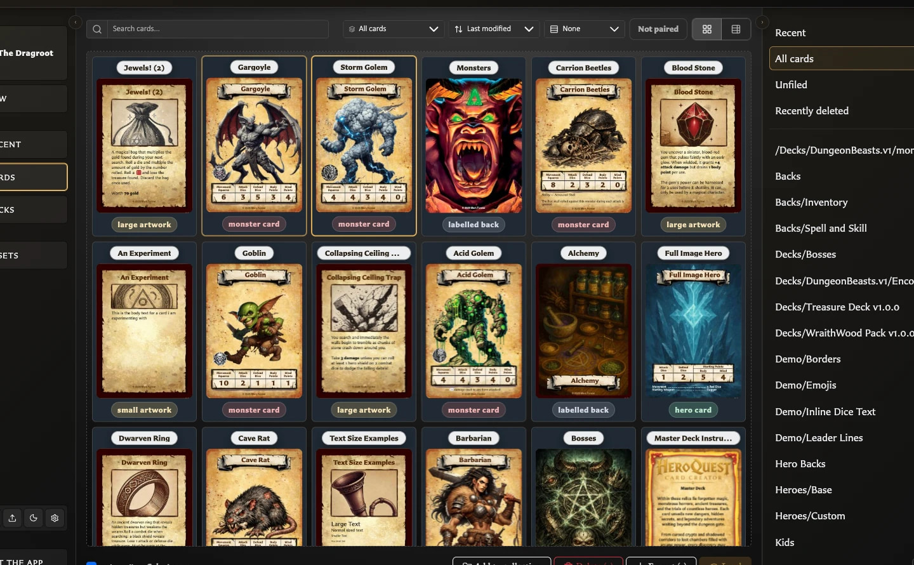
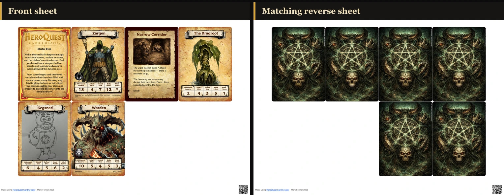

# Export and Printing Questions

These concise answers use the same wording captured during product exploration. Follow the linked guide when you need fuller context or step-by-step instructions.

## How do I export several saved cards together?

Bulk Export creates one ZIP from the selected/visible card scope.

[Read the full guidance](../managing-your-library/collections/filter-and-export-a-collection.md)

## Can exports include bleed and print marks?

Export settings include bleed, rounded corners, crop/cut marks, paper, orientation, duplex, and bleed source.

[Read the full guidance](../settings-and-data/configure-export-defaults-and-profiles.md)

## What must a deck contain before PDF export is available?

The deck Export menu requires at least one set; PDF contents then depend on entries, quantities, selected scope, face mode, and layout options.

[Read the full guidance](../building-decks/collections-pairing-and-decks.md)

## How do I export every card in a collection?

Open a populated collection, clear card selection, and choose Export all from this collection.

[Read the full guidance](../managing-your-library/collections/filter-and-export-a-collection.md)

## Can I export only selected cards from a collection?

Select cards within an open collection and choose Export (count) from this collection to export only that subset.

[Read the full guidance](../managing-your-library/collections/filter-and-export-a-collection.md)

## Where can I export cards from?

Export PNG images from a Cards selection or collection, the card open in the editor, or an open deck; use deck PDF export for a print run.

<!-- help-visual:p079:start -->
<figure class="hqcc-help-figure hqcc-help-figure--wide" markdown="span">
  
  <figcaption>Select cards in Cards, then use Export to create PNG files for the selected faces.</figcaption>
</figure>
<!-- help-visual:p079:end -->

[Read the full guidance](../exporting-and-printing/export-cards-as-png-images.md)

## How do I export selected cards or a whole collection as PNG images?

Select cards and choose Export (count), or open a collection with no selection and choose Export all from this collection; the result is a ZIP of PNG images.

[Read the full guidance](../exporting-and-printing/export-cards-as-png-images.md)

## What does including paired faces in an export mean?

The paired-face prompt can add a selected front's back or a selected back's paired fronts without changing collection membership.

[Read the full guidance](../exporting-and-printing/export-cards-as-png-images.md)

## What is included in a bulk image export ZIP?

Bulk export creates one PNG per successfully generated face in a ZIP and disambiguates duplicate filenames.

[Read the full guidance](../exporting-and-printing/export-cards-as-png-images.md)

## What happens if a card face cannot be exported?

Known missing-asset skips are listed in export-issues.txt, but an unexpected null image render is counted without a face-specific report line.

[Read the full guidance](../troubleshooting/fix-export-and-print-problems.md)

## How do I export the card open in the editor?

Choose Export in the Card Editor to download the current face as a single PNG.

[Read the full guidance](../exporting-and-printing/export-cards-as-png-images.md)

## How do I export an individual card with its paired faces?

A paired front or singly paired back offers Export both faces; a back shared by several fronts can export the active front or all paired fronts with it.

[Read the full guidance](../exporting-and-printing/export-cards-as-png-images.md)

## What does Deck Image Export include?

Deck Image Export creates a ZIP containing each distinct set back and each distinct entry front once.

[Read the full guidance](../exporting-and-printing/export-cards-as-png-images.md)

## Why does Deck Image Export include repeated faces only once?

Deck Image Export deliberately removes duplicate faces, including quantity repeats; use PDF export when repeated print copies are required.

[Read the full guidance](../exporting-and-printing/export-cards-as-png-images.md)

## How do I export a deck as a printable PDF?

Open an exportable deck, choose Export > PDF Export, choose set scope and layout options, review the summary, and choose Export PDF.

[Read the full guidance](../exporting-and-printing/export-a-deck-as-pdf.md)

## How are front and back faces arranged for double-sided printing?

Fronts are laid out in deck order and quantity; Front + back mode creates corresponding reverse sheets using each set's back and the chosen duplex transformation.

<!-- help-visual:p084:start -->
<figure class="hqcc-help-figure hqcc-help-figure--panoramic" markdown="span">
  
  <figcaption>The reverse sheet mirrors the placement of the front sheet so matching faces align during duplex printing.</figcaption>
</figure>
<!-- help-visual:p084:end -->

[Read the full guidance](../exporting-and-printing/export-a-deck-as-pdf.md)

## Which deck PDF scope and layout options are available?

Deck PDF export supports complete/all/selected sets, fronts-only or front-and-back mode, paper, orientation, duplex, bleed, marks, spacing, profiles, and an alignment test.

[Read the full guidance](../settings-and-data/configure-export-defaults-and-profiles.md)

## When should I create different export profiles?

Create separate profiles for repeatable digital, home-print, duplex, proofing, or print-service configurations.

[Read the full guidance](../settings-and-data/configure-export-defaults-and-profiles.md)

## What is image bleed and how should I choose its size?

Bleed extends artwork beyond the trim edge to protect against small cutting differences; use the pixel amount required by the print workflow.

[Read the full guidance](../settings-and-data/configure-export-defaults-and-profiles.md)

## What is the difference between crop marks and cut marks?

Crop marks are separate trim-position guides, while cut marks provide a more continuous boundary; both require bleed and offer configurable styles and colours.

[Read the full guidance](../settings-and-data/configure-export-defaults-and-profiles.md)

## When should exported cards have rounded corners?

Rounded corners are useful for finished-looking digital images but should be off when a rectangular print or bleed workflow requires artwork outside the final edge.

[Read the full guidance](../settings-and-data/configure-export-defaults-and-profiles.md)

## What does Ask before export do?

Ask before export opens image options for each run; those run-specific choices do not overwrite the saved profile.

[Read the full guidance](../settings-and-data/configure-export-defaults-and-profiles.md)

## How do paper size and orientation affect a PDF export?

A4 or Letter and portrait or landscape determine the physical PDF sheet and how many card positions fit on it.

[Read the full guidance](../settings-and-data/configure-export-defaults-and-profiles.md)

## What is the difference between Fronts only and Front + back?

Fronts only produces no reverse sheets; Front + back creates corresponding reverse sheets without changing card pairings.

[Read the full guidance](../settings-and-data/configure-export-defaults-and-profiles.md)

## Which duplex preset should I use?

Duplex presets reposition or rotate reverse sheets, but the correct choice depends on the printer; use the alignment test PDF first.

[Read the full guidance](../settings-and-data/configure-export-defaults-and-profiles.md)

## What do PDF bleed source and Bleed per edge mean?

PDF bleed source says whether the card image already contains bleed or is trim-only; Bleed per edge records the physical layout amount in millimetres.

[Read the full guidance](../settings-and-data/configure-export-defaults-and-profiles.md)

## Does the Text clipped warning appear in exports or Deck Preview?

The warning band is excluded from exports and Deck Preview, but the clipped wording remains absent, so the overflow must still be fixed.

[Read the full guidance](../troubleshooting/fix-clipped-or-overflowing-card-text.md)

## What do Exporting images, Finalizing, and Cancelling mean?

Exporting images prepares each included face, Finalizing assembles the ZIP or PDF, and Cancelling means the app is stopping the active run.

[Read the full guidance](../troubleshooting/fix-export-and-print-problems.md)

## What happens if I cancel an image or PDF export?

Cancel changes the progress action to Cancelling, stops the run, and does not produce the completed ZIP or PDF or change the source work.

[Read the full guidance](../troubleshooting/fix-export-and-print-problems.md)

## What should I do when no images were exported?

Check that the scope contains cards, try one saved card, repair missing artwork, then retry a smaller selection to identify an affected face.

[Read the full guidance](../troubleshooting/fix-export-and-print-problems.md)

## What should I do when the app could not export images?

Keep the source work unchanged, retry once, then narrow the run or restore the default PDF layout to isolate the failure.

[Read the full guidance](../troubleshooting/fix-export-and-print-problems.md)

## Why did an export finish without an apparent download?

Check browser downloads and permissions, then retry a single card or alignment PDF before splitting a large run into smaller parts.

[Read the full guidance](../troubleshooting/fix-export-and-print-problems.md)

## Does export-issues.txt list every failed card face?

The issues file lists known skips such as missing artwork, but an unexpected face-generation failure may increase the failure count without receiving a face-specific line.

[Read the full guidance](../troubleshooting/fix-export-and-print-problems.md)

## Why is PDF export unavailable for the chosen scope?

PDF and alignment-test actions are disabled when the selected scope produces no print positions; review excluded empty or unselected sets.

[Read the full guidance](../troubleshooting/fix-export-and-print-problems.md)

## What does Layout has no printable slots mean?

The chosen page layout cannot fit one card; reduce margins or spacing, change orientation, or restore the default layout.

[Read the full guidance](../troubleshooting/fix-export-and-print-problems.md)

## What should I do when the app cannot build PDF sheets?

Recheck the scope and print-position summary, restore the default layout, and retry without changing the deck if no sheets can be built.

[Read the full guidance](../troubleshooting/fix-export-and-print-problems.md)

## Why are printed cards the wrong physical size?

Match the PDF paper size and print at Actual size or 100% with automatic page fitting disabled.

[Read the full guidance](../troubleshooting/fix-export-and-print-problems.md)

## Why are card backs in the wrong sheet positions?

Print the alignment test and choose a horizontally mirrored duplex preset when reverse faces occupy the wrong left-to-right positions.

[Read the full guidance](../troubleshooting/fix-export-and-print-problems.md)

## Why are card backs upside down or inconsistently aligned?

Use a 180-degree preset for consistently inverted backs; varying physical offsets indicate printer registration rather than a deck change.

[Read the full guidance](../troubleshooting/fix-export-and-print-problems.md)

## How do I test PDF scale and duplex alignment safely?

Export and print the alignment test with the intended paper, scale, duplex setting, and feed path before a full run.

[Read the full guidance](../troubleshooting/fix-export-and-print-problems.md)

## What should I check before printing a full deck?

Confirm scope, paper, orientation, face mode, scale, duplex result, and cutting guides, changing one choice at a time until the test is correct.

[Read the full guidance](../troubleshooting/fix-export-and-print-problems.md)
