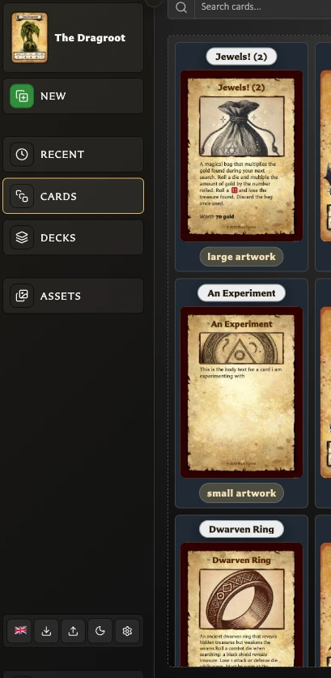

# Getting Started and Navigation Questions

These concise answers use the same wording captured during product exploration. Follow the linked guide when you need fuller context or step-by-step instructions.

## Why is my card library empty?

A new browser profile intentionally starts with no saved cards.

[Read the full guidance](../getting-started/create-your-first-card.md)

## Can I start with example cards?

The empty Cards view links to a free sample `.hqcc` library.

[Read the full guidance](../getting-started/create-your-first-card.md)

## What are the main areas of the app?

The main areas are the Card Editor, Cards, Decks, Assets, Settings, and the controls for backups, language, and appearance.

<!-- help-visual:p006:start -->
<figure class="hqcc-help-figure hqcc-help-figure--portrait" markdown="span">
  
  <figcaption>The expanded navigation provides direct access to New, Recent, Cards, Decks, and Assets.</figcaption>
</figure>
<!-- help-visual:p006:end -->

[Read the full guidance](../concepts/what-is-the-card-editor.md)

## What keyboard shortcuts can I use to navigate around the app?

Press bare R, C, D, A, Q, or N to open Recent, Cards, Decks, Assets, Settings, or New Card; press S to focus the current screen's primary search when available.

[Read the full guidance](../reference/keyboard-shortcuts.md)

## When are keyboard shortcuts available?

Shortcuts pause while you are typing, using modifier keys, holding a key down, or working in an open app window.

[Read the full guidance](../reference/keyboard-shortcuts.md)

## What is available in the left navigation?

The left navigation combines the current-card shortcut, New, Recent, Cards, Decks, Assets, quick language/backup/theme/settings controls, and the download or update action.

[Read the full guidance](../getting-started/understand-app-navigation.md)

## How do I return to the card currently open in the editor?

Choose the current card's thumbnail and title at the top of the navigation to return to it from another workspace.

[Read the full guidance](../getting-started/understand-app-navigation.md)

## How do I start a new card from another workspace?

Choose **New** from any workspace to open the template picker; closing it leaves the current card unchanged.

[Read the full guidance](../getting-started/understand-app-navigation.md)

## How do the main navigation destinations differ?

Recent reopens viewed cards, Cards manages the library, Decks manages deck projects, and Assets manages reusable images.

[Read the full guidance](../getting-started/understand-app-navigation.md)

## Why will the navigation not expand?

At widths of 1280 pixels or less, automatic compact mode overrides the manual state, so **Expand navigation** cannot expand the bar until the window is wider.

[Read the full guidance](../troubleshooting/fix-navigation-download-and-screen-problems.md)

## What do the small controls at the bottom of the navigation do?

The bottom strip provides Language, Export library, Import library, Theme, and Settings without leaving the current workspace.

[Read the full guidance](../getting-started/understand-app-navigation.md)

## Where can I see the running app version and app type?

The footer links the running version to its matching release and identifies whether you are using the web or downloaded app.

[Read the full guidance](../getting-started/understand-app-navigation.md)

## How do I get a downloadable copy of the app?

Choose **Get the app** to open the HeroQuest Card Creator page on itch.io and obtain the downloadable version.

[Read the full guidance](../getting-started/get-and-update-the-app.md)

## What is the difference between Get the app and Check for updates?

**Get the app** is acquisition wording for hosted copies; **Check for updates?** appears for downloaded or directly opened local copies and links to the current itch download.

[Read the full guidance](../getting-started/get-and-update-the-app.md)

## How does the app tell me a newer version is available?

A supported local build shows a header notice naming the newer version and links to itch; npm builds also offer an npm link.

[Read the full guidance](../getting-started/get-and-update-the-app.md)

## Which app copies perform automatic update checks?

Download builds check published GitHub releases, npm builds check the npm package, and itch-hosted or unrecognized builds do not perform remote checks.

[Read the full guidance](../getting-started/get-and-update-the-app.md)

## What happens to update checking while I am offline?

No new check runs while offline; a previously confirmed update can remain visible until connectivity returns.

[Read the full guidance](../getting-started/get-and-update-the-app.md)

## How do I run the downloaded app?

Extract the bundle, then open `index.html` or run the included macOS, Windows, or shell server launcher.

[Read the full guidance](../getting-started/use-a-downloaded-copy.md)

## Should I open index.html or use the bundled server?

Direct file opening is simplest, while the bundled local server is the more reliable browser experience; each launch method can have separate stored data.

[Read the full guidance](../getting-started/use-a-downloaded-copy.md)

## What does Desktop optimized mean?

The non-blocking notice means the app may partly work on that device, but desktop browsers and wider windows are the supported, easier editing experience.

[Read the full guidance](../troubleshooting/fix-navigation-download-and-screen-problems.md)

## How do I find the Collections panel on a narrow screen?

Use the collections-panel control to open Collections as a drawer on narrow screens or expand it on wider screens.

[Read the full guidance](../troubleshooting/fix-cards-workspace-problems.md)

## Why does a shortcut do nothing while I am typing?

Letter shortcuts pause while focus is in a text, number, multiline, selection, or other editable field so typing remains ordinary input.

[Read the full guidance](../reference/keyboard-shortcuts.md)

## Why do navigation shortcuts stop while an app window is open?

Global shortcuts pause while a foreground app window such as Recent, Settings, or Choose a template is open.

[Read the full guidance](../reference/keyboard-shortcuts.md)

## Why does a letter shortcut not work with Ctrl, Cmd, Alt, or Shift?

The main app shortcuts are bare letters and deliberately reject Ctrl, Cmd, Alt, or Shift; only the separate template-picker combination uses modifiers.

[Read the full guidance](../reference/keyboard-shortcuts.md)

## Are keyboard shortcuts different on macOS and Windows?

Bare letters are the same on macOS and Windows; the alternate template combination is labelled Cmd on macOS and Meta elsewhere.

[Read the full guidance](../reference/keyboard-shortcuts.md)

## Why does S not focus search?

S works only where a main browse search exists and is not already suppressed by typing or an open app window.

[Read the full guidance](../reference/keyboard-shortcuts.md)

## Why does holding a shortcut key not repeat the action?

Held-key repeat signals are ignored; release the key and press it again to repeat the action deliberately.

[Read the full guidance](../reference/keyboard-shortcuts.md)

## Is there another shortcut for opening Choose a template?

Cmd+Shift+Y on macOS, or Meta+Shift+Y elsewhere, opens Choose a template; bare N opens the same window more simply.

[Read the full guidance](../reference/keyboard-shortcuts.md)
