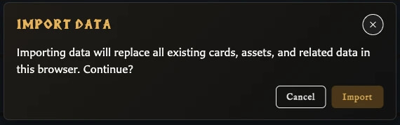

# Settings, Backup, and Data Questions

These concise answers use the same wording captured during product exploration. Follow the linked guide when you need fuller context or step-by-step instructions.

## How do I import the sample library?

Download the sample file, choose Import library, accept the replacement warning, and select the file.

[Read the full guidance](../settings-and-data/back-up-and-restore-your-library.md)

## How do I back up my complete library?

Export library creates a portable `.hqcc` backup of local app data.

[Read the full guidance](../settings-and-data/back-up-and-restore-your-library.md)

## Which backup format should I use?

Use the recommended compact format for 0.5.6+; use compatibility format only for 0.5.5 fallback.

[Read the full guidance](../settings-and-data/back-up-and-restore-your-library.md)

## What happens when I import a library?

Import validates one backup file and replaces existing browser-profile app data rather than merging.

<!-- help-visual:p100:start -->
<figure class="hqcc-help-figure hqcc-help-figure--compact" markdown="span">
  
  <figcaption>Import replaces the current browser library, so the app asks for confirmation before continuing.</figcaption>
</figure>
<!-- help-visual:p100:end -->

[Read the full guidance](../settings-and-data/back-up-and-restore-your-library.md)

## How do I switch between light, dark, and system appearance?

Theme offers Light, Dark, and Use system preference and applies the choice immediately.

[Read the full guidance](../settings-and-data/change-language-and-appearance.md)

## How do I change the app language?

Open Language in the left navigation and choose another language; the visible interface updates immediately.

[Read the full guidance](../settings-and-data/change-language-and-appearance.md)

## What can I configure in Settings?

Settings covers export, labels, collections, fitting, copyright, assets, appearance, debug, and system options.

[Read the full guidance](../settings-and-data/settings-reference.md)

## Can I save reusable export defaults?

Export profiles can be saved, renamed, deleted, and selected as default.

[Read the full guidance](../settings-and-data/configure-export-defaults-and-profiles.md)

## Can I change how numbers are drawn on cards?

Appearance can align and fix the width of title/stat numerals; body text keeps its original behavior.

[Read the full guidance](../settings-and-data/change-language-and-appearance.md)

## Can I remove the developer credit from cards?

Credit the developer is a global checkbox that controls the small card credit.

[Read the full guidance](../settings-and-data/settings-reference.md)

## What is the Settings window for?

Settings holds preferences that affect the app or future work rather than only the card currently open.

<!-- help-visual:p088:start -->
<figure class="hqcc-help-figure hqcc-help-figure--wide" markdown="span">
  
  <figcaption>Settings uses category navigation on the left and the selected category’s controls on the right.</figcaption>
</figure>
<!-- help-visual:p088:end -->

[Read the full guidance](../settings-and-data/understand-the-settings-window.md)

## How do I open and navigate Settings?

Open Settings from the left navigation or press Q, then choose a category from the left side of the window.

[Read the full guidance](../settings-and-data/understand-the-settings-window.md)

## How are Settings changes saved or discarded?

Most settings apply immediately; Export Settings and Stat Label Overrides require Save and show Save, Discard, and Cancel when you leave with edits.

[Read the full guidance](../settings-and-data/understand-the-settings-window.md)

## What can I configure in Export Settings?

Export Settings controls reusable image and PDF defaults including bleed, marks, paper, face mode, duplex behavior, and PDF bleed.

[Read the full guidance](../settings-and-data/configure-export-defaults-and-profiles.md)

## How do I create and manage export profiles?

Use Save as to create a profile, then select, save, rename, set as default, or permanently delete eligible profiles.

[Read the full guidance](../settings-and-data/configure-export-defaults-and-profiles.md)

## Why are some export settings unavailable?

Export controls are enabled only when their prerequisite applies, such as enabling bleed before marks and enabling a mark before its color and style.

[Read the full guidance](../settings-and-data/configure-export-defaults-and-profiles.md)

## How do I replace the wording used for card stat labels?

Enable Stat Label Overrides, enter replacement shared, Monster, or Hero label wording, and choose Save.

[Read the full guidance](../settings-and-data/settings-reference.md)

## What can I change in the Collections settings?

Collections can group slash-delimited names into a folder-style tree while preserving each complete collection name.

[Read the full guidance](../settings-and-data/settings-reference.md)

## What do the global Text Fitting settings change?

Text Fitting sets separate global title and stat-heading preferences for ellipsis and minimum shrink size.

[Read the full guidance](../settings-and-data/settings-reference.md)

## How do Copyright Defaults affect cards?

Copyright Defaults supplies default wording and controls whether copyright is shown by default on each template.

[Read the full guidance](../settings-and-data/settings-reference.md)

## How does automatic asset classification work?

Automatic asset classification can suggest Artwork or Icon during upload; Safari disables the global option, but manual classification remains available.

[Read the full guidance](../settings-and-data/settings-reference.md)

## What can I change in Appearance settings?

Appearance controls theme plus separate aligned and fixed-width numeral styles for titles and stats.

[Read the full guidance](../settings-and-data/change-language-and-appearance.md)

## What does Credit the developer change?

Credit the developer controls the small creator credit on cards and is available at the bottom of every Settings category.

[Read the full guidance](../settings-and-data/settings-reference.md)

## What information is available in System settings?

System shows app information and an estimated browser-storage breakdown with a Refresh action.

[Read the full guidance](../settings-and-data/settings-reference.md)

## What are Debug Tools for?

Debug Tools exposes diagnostics, migration status, and destructive maintenance actions, but its notice still names version 0.5.x in v0.8.0.

[Read the full guidance](../troubleshooting/fix-settings-problems.md)

## How do I return to English, and why is the current language missing from the menu?

The active language is represented by the button flag and omitted from the choices; after switching away, English appears as an option beside the UK flag.

[Read the full guidance](../settings-and-data/change-language-and-appearance.md)

## Which languages are available?

v0.8.0 supports English, Czech, Danish, German, Spanish, French, Italian, Hungarian, Dutch, Norwegian Bokmal, Polish, Portuguese, Brazilian Portuguese, Finnish, Swedish, Greek, and Russian.

[Read the full guidance](../settings-and-data/change-language-and-appearance.md)

## What is the difference between the Theme menu and Appearance settings?

Theme is the quick Light, Dark, or system selector; Appearance contains the same theme choice plus title and stat numeral styling.

[Read the full guidance](../settings-and-data/change-language-and-appearance.md)

## Are app settings included in a library backup?

A `.hqcc` backup includes export profiles and selected library-related settings, but not every personal preference such as language or theme.

[Read the full guidance](../troubleshooting/fix-settings-problems.md)

## Where are the backup and restore controls, and what do their windows show?

**Export library** and **Import library** are adjacent actions in the left navigation; each opens a confirmation window before work begins.

[Read the full guidance](../settings-and-data/understand-backups-and-local-data.md)

## Where does the app keep my working library?

The working library belongs to the current browser profile or installed app copy and is not automatically synchronized through an online account.

[Read the full guidance](../settings-and-data/understand-backups-and-local-data.md)

## What is included in a library backup?

A backup preserves cards, recently deleted cards, assets, custom back logos, collections, pairings, decks, export profiles, and selected library-related settings.

[Read the full guidance](../settings-and-data/back-up-and-restore-your-library.md)

## Which preferences are not restored from a library backup?

Language, theme, collection display, automatic asset classification, general text fitting, numeral styling, and developer credit are not restored as portable library settings.

[Read the full guidance](../settings-and-data/back-up-and-restore-your-library.md)

## What happens while a library backup is being exported?

Export shows preparation, item progress, and finalising stages before downloading one `.hqcc` backup file.

[Read the full guidance](../settings-and-data/back-up-and-restore-your-library.md)

## How do I know a library import completed successfully?

A successful import displays **Import complete** and reports card, asset, collection, and deck totals.

[Read the full guidance](../settings-and-data/back-up-and-restore-your-library.md)

## Can I merge a backup with my current library?

Import replaces the destination library; there is no merge option.

[Read the full guidance](../settings-and-data/back-up-and-restore-your-library.md)

## How do I move my library to another browser profile or app copy?

Export from the source app location, transfer the `.hqcc` file, and import it in the destination after protecting any destination data.

[Read the full guidance](../settings-and-data/back-up-and-restore-your-library.md)

## Why will the app not accept my backup file?

Import accepts `.hqcc` and older `.hqcc.json` backups; unsupported, unreadable, invalid, and incompatible files are rejected with an error.

[Read the full guidance](../settings-and-data/back-up-and-restore-your-library.md)

## What should I do if an import stops or reports an error?

If import fails after replacement begins, stop editing and import the pre-import safety backup because the current library may be incomplete.

[Read the full guidance](../troubleshooting/fix-backup-and-restore-problems.md)

## Why does an imported library appear incomplete?

Compare the completion totals, clear workspace filters, check Recently deleted and each workspace, then restore the safety backup if expected content is genuinely absent.

[Read the full guidance](../settings-and-data/back-up-and-restore-your-library.md)

## Is the System storage estimate a backup?

**Settings > System** estimates storage used by the current app location; it does not create a backup or recovery file.

[Read the full guidance](../settings-and-data/understand-backups-and-local-data.md)

## Why is my library empty in another browser, profile, or app copy?

A different browser, profile, private window, cleared app location, or installed copy can have a separate empty library; use backup export/import to move work.

[Read the full guidance](../settings-and-data/back-up-and-restore-your-library.md)

## Why is my downloaded copy showing an empty library?

The library belongs to the browser and exact app location, so a different launch method, address, port, profile, or browser can open a separate empty library.

[Read the full guidance](../getting-started/use-a-downloaded-copy.md)

## How do I move my library between the hosted and downloaded apps?

Export a `.hqcc` backup from the source app location, open the destination copy, and import it after protecting any destination work.

[Read the full guidance](../getting-started/use-a-downloaded-copy.md)

## What is the difference between global Text fitting and per-card Scale to fit?

Global Text fitting controls titles and stat headings across the app; Scale to fit controls one card's fixed body-text area.

[Read the full guidance](../making-cards/fit-body-text-on-a-card.md)

## Can I customize the keyboard shortcuts?

No. Version 0.8.0 has a fixed shortcut set and no customization panel in Settings.

[Read the full guidance](../reference/keyboard-shortcuts.md)
