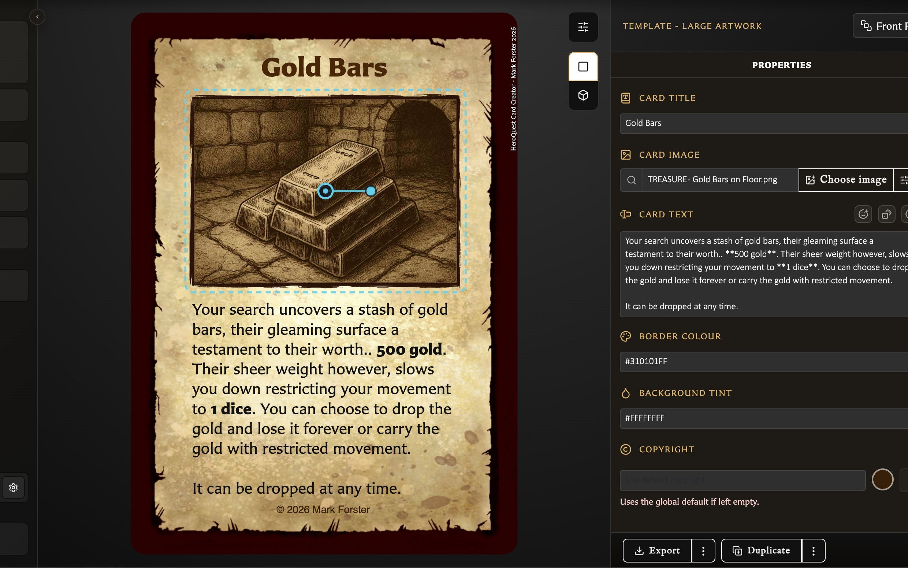

# Create Your First Card

You can create and save a card without uploading artwork first. The minimum requirement is a template and its non-empty identifying field: a title, name, or back label.

## Create the card

<!-- help-visual:p004:start -->
<figure class="hqcc-help-figure hqcc-help-figure--wide" markdown="span">
  
  <figcaption>Your draft updates in the preview as you add artwork, a title, and card text.</figcaption>
</figure>
<!-- help-visual:p004:end -->

1. Choose **New** in the left navigation. Its accessible description is **Create a new card from a template**.
2. Choose a template. See [Choose a Card Template](../making-cards/choose-a-card-template.md) if you are unsure which layout fits your card.
3. Enter the required identifying field shown by the template: a **Card title**, **Name**, or **Back label**.
4. Add any optional text, artwork, colours, stats, or template-specific options.
5. Check the live preview as you edit. Changes appear before you save.
6. Choose **Save**.

If Save is disabled, check that the required title, name, or back label is not empty. Artwork is optional.

## Tell drafts from saved cards

The inspector status starts as `draft`. After the first successful save it changes to `saved`. Further edits change the status to `Modified`, and Save becomes available again.

See [Understand Card States and Saving](../making-cards/understand-card-states-and-saving.md) for leaving with changes, draft recovery, and actions that require a saved card.

## Reopen the card

1. Open **Cards** from the left navigation.
2. Select the card with one click.
3. Choose **Load**.

You can also double-click the card tile to open it directly. A single click only selects the card so that actions such as Load, Delete, Add to collection, and bulk Export can operate on it.

## Starting with examples

A new installation intentionally has no saved cards. The empty Cards view links to a free sample library and explains how to import its `.hqcc` file. Import replaces the data currently stored in that browser profile, so see [Back Up and Restore Your Library](../settings-and-data/back-up-and-restore-your-library.md) before importing over existing work.

## Related help

- [Choose a Card Template](../making-cards/choose-a-card-template.md)
- [Understand the Card Editing View](../making-cards/understand-the-card-editing-view.md)
- [Save or Discard Card Changes](../making-cards/save-or-discard-card-changes.md)
- [Duplicate a Card](../making-cards/duplicate-a-card.md)
- [Add and Position Artwork](../making-cards/add-and-position-artwork.md)
- [Format Card Text](../making-cards/format-card-text.md)
- [Organize and Recover Cards](../managing-your-library/organize-and-recover-cards.md)
