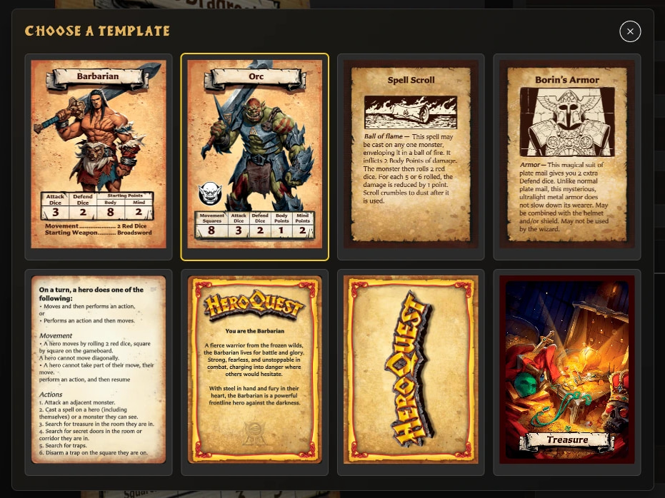

# Getting Started

Open the app, learn the main navigation, and create your first card.

<!-- help-visual:p002:start -->
<figure class="hqcc-help-figure hqcc-help-figure--wide" markdown="span">
  
  <figcaption>The template picker presents the available front- and back-facing layouts together.</figcaption>
</figure>
<!-- help-visual:p002:end -->

## In this section

- [Create Your First Card](./create-your-first-card.md)
- [Get and Update the App](./get-and-update-the-app.md)
- [Understand App Navigation](./understand-app-navigation.md)
- [Use a Downloaded Copy](./use-a-downloaded-copy.md)
