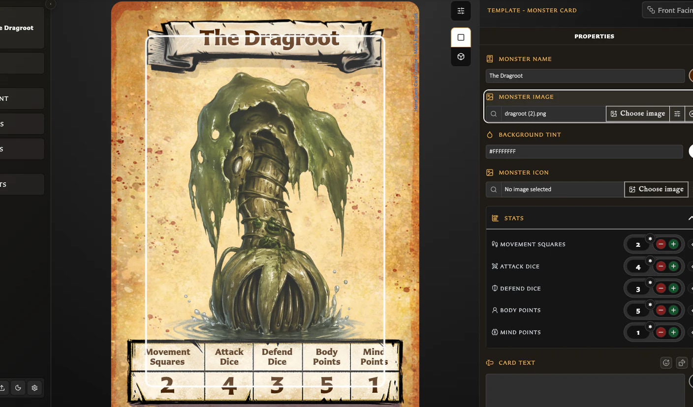

# HeroQuest Card Creator Help

Create, organise, export, and print your own HeroQuest cards. Choose the path that best matches what you want to do.

<!-- help-visual:p001:start -->
<figure class="hqcc-help-figure hqcc-help-figure--wide" markdown="span">
  
  <figcaption>The Card Editor keeps the card preview and its editable properties side by side.</figcaption>
</figure>
<!-- help-visual:p001:end -->

## New to the app?

Start with [Create Your First Card](./getting-started/create-your-first-card.md), then use [Getting Started](./getting-started/index.md) to learn where the main areas of the app are.

## Find help by task

- [Making Cards](./making-cards/index.md) covers templates, the Card Editor, artwork, text, saving, duplication, and pairing.
- [Managing Your Library](./managing-your-library/index.md) covers saved cards, Recent, assets, collections, and recovery.
- [Building Decks](./building-decks/index.md) covers deck projects, groups, sets, entries, quantities, and recovery.
- [Exporting and Printing](./exporting-and-printing/index.md) covers PNG images, print-ready PDFs, profiles, and duplex preparation.
- [Settings and Data](./settings-and-data/index.md) covers preferences, language, appearance, backups, and local data.

## Find help another way

- Use [Concepts](./concepts/index.md) when you want to understand a term such as template, asset, collection, pairing, or deck.
- Search the [Frequently Asked Questions](./faq/index.md) using the words you would naturally use.
- Open [Troubleshooting](./troubleshooting/index.md) when something is not working as expected.
- Use [Reference](./reference/index.md) for quick lookups such as keyboard shortcuts.
