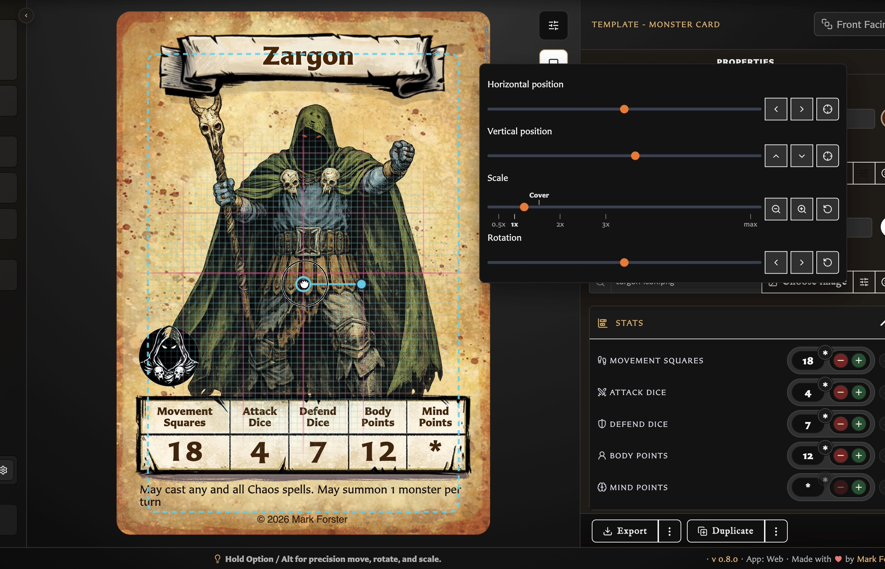

# Add and Position Artwork

Artwork is stored in the browser's shared **Assets** library. Upload an image once, then reuse it on multiple cards.

To populate and organize that library, see [Upload and Organize Assets](../managing-your-library/assets/upload-and-organize-assets.md).

## Add an image to a card

1. Open the card in the editor.
2. Under **Card image** or **Back image**, use the image button in the field toolbar.
3. Select an asset, then choose **Select**.
4. Save the modified card.

You can also search the asset field by filename. The selected asset remains a reusable library item rather than being copied into a card-specific upload area.

## Frame the artwork

Choose the image adjustment button in the image field toolbar. The controls let you:

<!-- help-visual:p015:start -->
<figure class="hqcc-help-figure hqcc-help-figure--wide" markdown="span">
  
  <figcaption>Selecting the artwork reveals controls for positioning, scaling, and rotating it within the card frame.</figcaption>
</figure>
<!-- help-visual:p015:end -->

- Move horizontally or vertically with sliders and nudge buttons.
- Centre either axis.
- Scale from zoomed out through full coverage and larger zoom levels.
- Auto-scale to fit the image bounds.
- Rotate left or right and reset rotation.

Hold **Option** on macOS or **Alt** on other keyboards for finer move, rotate, and scale adjustments. Use the nearby restore/reset controls if the framing gets away from you.

## Clip lower artwork on Hero and Monster cards

Hero and Monster main artwork can also offer an **Artwork lower clip** control. Use it when artwork continues into the lower text area and makes the card harder to read.

Turn on the lower clip, then move the slider to choose where the visible artwork should stop. When the artwork is selected in the preview, you can also drag the horizontal clip guide directly on the card.

While editing, the hidden part of the image may appear faintly below the guide so you can see what is being clipped away. That faint preview is only an editing aid. It is not included in exported card images or PDFs.

The clip changes only artwork visibility. It does not move, resize, rotate, or crop the source asset.

Monster icon fields use the same compact image toolbar for choosing and adjusting an icon, but they do not support lower artwork clipping.

## Manage the source asset

Source-image preview, classification, replacement, conversion, usage, and deletion belong to the Assets workspace. See [Understand the Assets Workspace](../managing-your-library/assets/understand-the-assets-workspace.md) and [Replace, Convert, and Delete Assets](../managing-your-library/assets/replace-convert-and-delete-assets.md).

## Storage note

Assets are stored locally in the current browser profile. Include them in regular `.hqcc` library backups; clearing browser data without a backup can remove them.

For direct card selection and the difference between Standard and Interactive preview, see [Understand the Card Editing View](./understand-the-card-editing-view.md).
