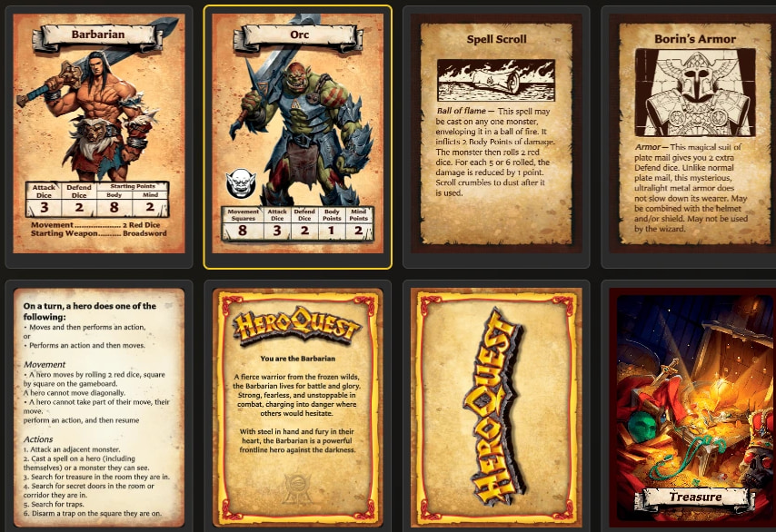
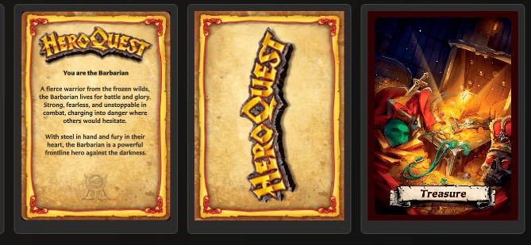

# Choose a Card Template

A template is the starting layout for a card. It decides where the title, artwork, text, statistics, logo, and other card parts can appear. Choose the template that best matches the information you need to present; you can then fill it with your own content and colours.

The app currently provides five front-facing templates and three back-facing templates.

## Open the template picker

<!-- help-visual:p003:start -->
<figure class="hqcc-help-figure hqcc-help-figure--wide" markdown="span">
  
  <figcaption>The template picker presents the available front- and back-facing layouts together.</figcaption>
</figure>
<!-- help-visual:p003:end -->

1. Choose **New** in the left navigation.
2. In **Choose a template**, select the preview for the layout you want.
3. The Card Editor opens a new draft using that template.
4. Enter the required name, title, or back label, add any optional content, and choose **Save**.

You can also press **N** to open the template picker when you are not typing in a field and another window is not open. On a new installation, the app may offer the template choices automatically so you can begin your first card.

Selecting a template starts a draft; it does not immediately add a card to your saved library. Artwork is optional, but the required name, title, or label must be present before the draft can be saved.

## Front-facing templates

<!-- help-visual:p012:start -->
<figure class="hqcc-help-figure hqcc-help-figure--wide" markdown="span">
  
  <figcaption>Front-facing templates range from character layouts to artwork-led and text-only cards.</figcaption>
</figure>
<!-- help-visual:p012:end -->

### Hero Card

Use **Hero Card** for a playable hero, named character, companion, or another character who needs a full Hero-style statistics row.

It provides:

- A hero name and large character artwork.
- Hero statistics such as Attack, Defend, Body, and Mind.
- Card text for abilities, equipment, or character notes.
- Background tint and text-colour options.

Choose this instead of Monster Card when the character should use the Hero-style presentation and does not need a separate monster icon.

### Monster Card

Use **Monster Card** for an enemy, creature, or other character who should use the Monster-style statistics layout.

It provides:

- A monster name and large monster artwork.
- A separate monster icon.
- Monster statistics, including the controls supported by the Monster layout.
- Card text for rules, behavior, or special abilities.
- Background tint and text-colour options.

Hero Card and Monster Card are visually related, but their statistics and icon areas are designed for different roles. Choose according to the type of character card you want to reproduce.

### Small Artwork

Use **Small Artwork** when the rules text is more important than the illustration. It has a smaller image window and a larger text area.

This is a flexible choice for cards such as spells, equipment, artifacts, treasures, abilities, events, or other effects that need a title, an illustration, and plenty of explanation. The name describes the layout, not a restriction on the subject of the card.

It provides a title, image, body text, border colour, and background tint.

### Large Artwork

Use **Large Artwork** when the illustration should be more prominent while the card still needs supporting rules or descriptive text.

It uses the same broad structure as Small Artwork but gives the image a taller area and leaves less room for text. It suits visually led items, characters, locations, events, or set-piece effects.

If you are unsure between the two Artwork templates, decide which needs more space:

- Choose **Small Artwork** for more text.
- Choose **Large Artwork** for more illustration.

### Rules

Use **Rules** for a text-heavy reference card, rules summary, reminder, quest instruction, or other card that does not need a main illustration.

The required **Name** identifies the card in your library. The visible card content is a large formatted **Rules text** area. It supports the body-text formatting and fitting tools described in [Format Card Text](./format-card-text.md).

Choose Rules when even Small Artwork would devote too much space to an image.

## Back-facing templates

Back-facing templates can be saved like any other card and then paired with one or more front-facing cards. They can also be used as the back faces that organize sets in a deck.

<!-- help-visual:p013:start -->
<figure class="hqcc-help-figure hqcc-help-figure--compact" markdown="span">
  
  <figcaption>Choose a back template according to whether you need a hero message, logo, or custom label and artwork.</figcaption>
</figure>
<!-- help-visual:p013:end -->

### Hero Back

Use **Hero Back** for a hero, character, or similar deck that should use the familiar horizontal HeroQuest logo treatment.

It provides a background tint, a choice of stock or saved custom logo, and optional back text with backdrop controls. This is the most purpose-specific of the three back templates.

### Logo Back

Use **Logo Back** when you want a clean, logo-led reverse with a large vertical HeroQuest logo.

You can change the parchment tint and choose the stock logo, a saved custom logo, or no logo. It does not provide a main artwork or body-text area, so choose it when the logo itself should dominate the design.

### Labelled Back

Use **Labelled Back** when you need a flexible, named card back, such as **Treasure**, **Equipment**, **Spells**, or a custom deck name.

It provides:

- A back label that can be shown or hidden, placed at the top or bottom, and displayed with or without its ribbon.
- A full-card image.
- Optional back text and backdrop controls.
- Border colour and background tint.

Choose Labelled Back when you need more control than Hero Back or Logo Back provides.

See [What Is Pairing?](../concepts/what-is-pairing.md) and [Collections, Pairing, and Decks](../building-decks/collections-pairing-and-decks.md) when you are ready to connect a back to its front cards.

## Quick choice guide

| If your card needs... | Start with... |
| --- | --- |
| A playable character and Hero-style statistics | **Hero Card** |
| An enemy, creature, monster statistics, and a monster icon | **Monster Card** |
| A small illustration and plenty of rules text | **Small Artwork** |
| A prominent illustration and supporting text | **Large Artwork** |
| A large text-only reference area | **Rules** |
| A character-deck back with a horizontal logo and optional text | **Hero Back** |
| A clean back dominated by a vertical logo | **Logo Back** |
| A named, illustrated, and highly configurable back | **Labelled Back** |

## Can I make my own template?

The layouts in the picker are built into the app. You can customize the content, artwork, colours, text formatting, and supported options within a template, but the app does not currently provide a blank-canvas template designer.

## Related help

- [What Is a Template?](../concepts/what-is-a-template.md)
- [Create Your First Card](../getting-started/create-your-first-card.md)
- [Understand the Card Editing View](./understand-the-card-editing-view.md)
