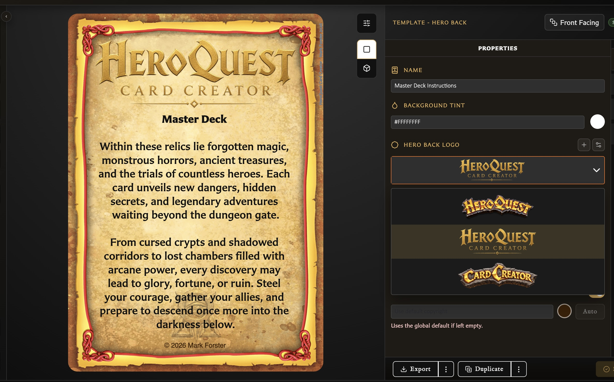

# Customize Card Back Logos and Text

Hero Back, Logo Back, and Labelled Back have different jobs. Hero Back combines a logo with back text, Logo Back centres attention on a logo without back text, and Labelled Back uses a normal image with a configurable label and optional text.

## Choose a back logo

Hero Back and Logo Back share the **Hero Back logo** chooser.

<!-- help-visual:p018:start -->
<figure class="hqcc-help-figure hqcc-help-figure--wide" markdown="span">
  
  <figcaption>Back-facing templates combine a live preview with controls for the logo, text, and backdrop.</figcaption>
</figure>
<!-- help-visual:p018:end -->

1. Open the logo field.
2. Choose the built-in **Default** logo or one of your saved custom logos.
3. Choose **Add Another** to upload one new logo when needed.
4. Select the logo and save the card.

Custom back logos are managed separately from ordinary Assets. **Manage Logos** shows each saved logo's preview, filename, and dimensions and lets you remove logos you no longer need.

## Remove a saved logo

An unused custom logo can be deleted immediately. If cards use it, the warning reports the affected cards and requires one of these safer outcomes:

- Switch the affected cards to **Default**.
- Replace the deleted logo with another saved logo.

The current draft is updated too when it uses that logo. Review affected card previews after the change, then save any open modified card.

## Add back text

Hero Back always includes a **Back text** field. Labelled Back can show or hide its optional Back text. Logo Back does not provide back text.

Use the text field for the content and its colour swatch for the lettering. The nearby backdrop controls can:

- Show or hide the backdrop behind the text.
- Inset the backdrop to match the card border or extend it flush to the edges.
- Use square corners all around or reserve the corners nearest the title treatment.
- Fill the available text area or fit the backdrop around the text.
- Change the backdrop colour, including making it transparent.

These choices affect the back-text area, not the card's main background tint. For formatting inside the text, see [Format Card Text](./format-card-text.md).

Labelled Back artwork is selected and positioned through **Back image**. See [Add and Position Artwork](./add-and-position-artwork.md) rather than using the custom-logo manager.
