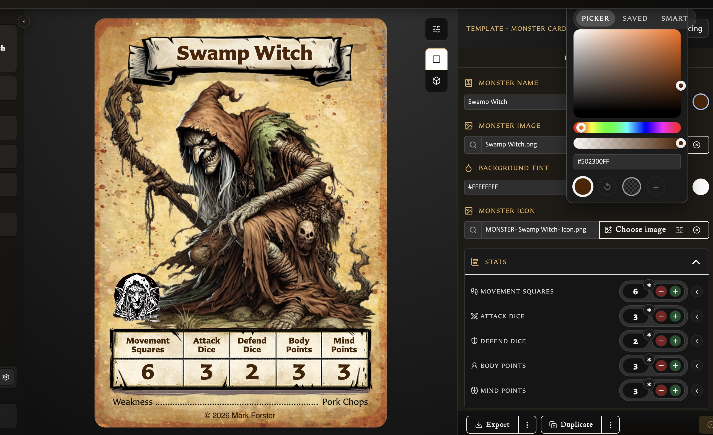

# Customize Titles, Colours, and Copyright

Colour and title choices belong to the current card. The Properties panel shows only the choices supported by its template.

## Change a title or label

Front-facing templates with a title or name let you change its text and colour. Labelled Back adds three extra choices:

- Show or hide the **Back label**.
- Place it at the top or bottom of the card.
- Display it as a **Ribbon** or **Plain** title.

These layout choices are specific to Labelled Back. Other templates place their title according to their fixed design.

## Change card colours

Choose the colour swatch beside a supported field:

<!-- help-visual:p016:start -->
<figure class="hqcc-help-figure hqcc-help-figure--wide" markdown="span">
  
  <figcaption>The colour picker previews a change on the card before you continue editing.</figcaption>
</figure>
<!-- help-visual:p016:end -->

- **Title colour** changes the title, name, or back label.
- **Body text colour** changes the main card, rules, or back text.
- **Border colour** is available on Small Artwork, Large Artwork, and Labelled Back.
- **Background tint** is available on Hero, Monster, Small Artwork, Large Artwork, Hero Back, Logo Back, and Labelled Back.

The colour window provides a picker, saved colours, and **Smart** suggestions based on the current card. A smart colour is a starting suggestion, not a permanent link to the artwork.

Where offered, **Transparent** removes that colour treatment. **Default** applies the template's standard colour. **Revert** returns to the value the card had when its current edit began, which may be different from the template default.

## Set copyright for one card

Every template includes a **Copyright** section.

- Leave the text empty to use the global copyright default from Settings.
- Enter text to override the default on this card.
- Use the visibility control when the copyright should not be shown.
- Keep the colour on **Auto** to let the card choose a readable colour for its background.
- Choose a fixed colour or transparent colour when the design needs a manual result.

The card-specific text and visibility are saved with the card. Changing the global default later continues to affect cards whose copyright field is still empty.

## Undo an unwanted colour change

While editing the colour, choose **Revert** if it is available. If you have not saved the card, you can also leave the editor and choose **Discard** to return all fields to the last saved version. After saving, choose the required colour again; Revert does not create a history of older saved versions.

For global copyright defaults, see [Settings Reference](../settings-and-data/settings-reference.md).
