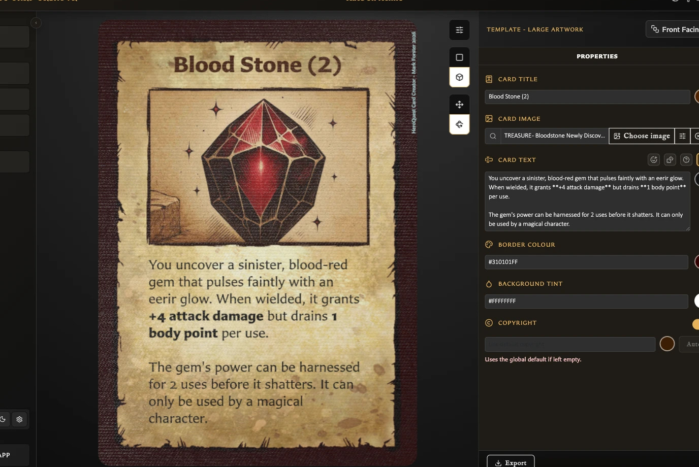

# Duplicate a Card

Use **Duplicate** when you want a new independent card that starts with the content and appearance of a saved card.

## Create the duplicate

<!-- help-visual:p033:start -->
<figure class="hqcc-help-figure hqcc-help-figure--wide" markdown="span">
  
  <figcaption>A duplicated card opens as a separate saved card that you can rename and edit independently.</figcaption>
</figure>
<!-- help-visual:p033:end -->

1. Open the saved card in the Card Editor.
2. Choose the main **Duplicate** action in the bottom toolbar.
3. Review the new draft and change any fields that should differ from the source.
4. Choose **Save** when the copy is ready.

Duplication is draft-first. Choosing **Duplicate** does not immediately add another saved card to the library. The copy becomes independent only after its first save.

## How is the copy named?

The app adds or increments a numbered suffix:

- `Goblin Scout` becomes `Goblin Scout (2)`.
- `Goblin Scout (2)` becomes `Goblin Scout (3)`.

You can replace the suggested name before saving.

## What is copied?

The duplicate draft starts with the source card's editable content and appearance, including its template, text, artwork choices, and card-specific options.

On the duplicate's first save, it is also added to every collection that contains the source card. It is added at the end of those collections. Later saves do not repeat this inheritance.

## What is not copied?

- The main **Duplicate** action does not copy card pairings.
- The new card is not automatically added to the source card's decks.
- The source card's viewed and modified history does not become shared history.
- Later changes to either card do not update the other.

## Duplicate with pairing

Open the arrow beside **Duplicate** to find **Duplicate with pairing**. The label says that the new copy should retain the source card's pairing while still following the draft-first workflow.

!!! warning "Version 0.8.0 issue"
    In version 0.8.0, **Duplicate with pairing** saved a front-facing copy without its existing back pairing. The current behavior does not reliably differ from ordinary **Duplicate**. After saving the copy, open **Pairing** and add the required back manually. Do not rely on this option to preserve a pairing until the product issue is fixed.

Collection inheritance still worked in that journey: the saved duplicate appeared in the same collection as its source.

## Why can I not duplicate the current card?

Duplicate is available only for saved cards. If the status says **draft**, complete the required title, name, or label and save the card first.

## Related guides

- [Understand Card States and Saving](./understand-card-states-and-saving.md)
- [Save or Discard Card Changes](./save-or-discard-card-changes.md)
- [What Is Pairing?](../concepts/what-is-pairing.md)
- [Add and Remove Cards from Collections](../managing-your-library/collections/add-and-remove-cards-from-collections.md)
