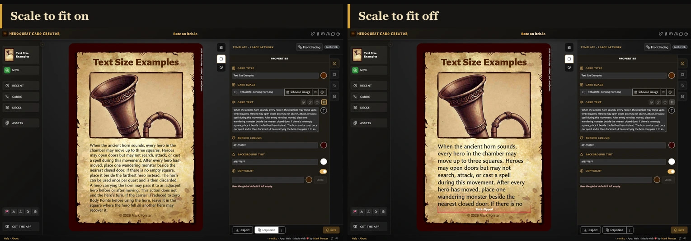

# Fit Body Text on a Card

Use **Scale to fit** when wording is too large for a card's fixed body-text area.

## Turn on Scale to fit

<!-- help-visual:p028:start -->
<figure class="hqcc-help-figure hqcc-help-figure--panoramic" markdown="span">
  
  <figcaption>Scale to fit reduces the text just enough to keep the complete body copy inside its available area.</figcaption>
</figure>
<!-- help-visual:p028:end -->

1. Open the card and select **Properties**.
2. Find its body-text field, such as **Card text**, **Rules text**, or **Back text**.
3. Turn on **Scale to fit**.
4. Check the card preview and save when the result is readable.

When the wording would otherwise overflow, the app reduces and reflows it to fit. This choice is saved for the current card; it does not change other cards.

## Which cards support it?

**Scale to fit** is available for the fixed body-text areas on **Small Artwork**, **Large Artwork**, **Rules**, **Hero Back**, and **Labelled Back**. Labelled Back must have back text enabled first.

It is not offered on **Hero Card** or **Monster Card** because their body-text areas adjust with their content. Logo Back has no body text.

## Why does spacing change?

Paragraph gaps and blank lines use vertical space. When fitting is needed, paragraph spacing reduces along with the text. Removing unnecessary blank lines can make the result larger and easier to read.

Formatting also affects how much room the text needs. Larger scale tags, headings, long unbroken wording, and leader lines may require more space than plain paragraphs.

## What if Scale to fit is not enough?

Fitting has a minimum readable size. If the content still cannot fit, the preview continues to show **Text clipped**. The app does not remove your saved wording, but the part outside the visible area is not shown on the card.

Use [Fix Clipped or Overflowing Card Text](../troubleshooting/fix-clipped-or-overflowing-card-text.md) to recover it.

## Is this the same as Text fitting settings?

No. **Text fitting** in Settings or the preview toolbar applies app-wide choices to titles and stat headings. **Scale to fit** beside a body-text field applies only to the current card's descriptive or rules wording.
