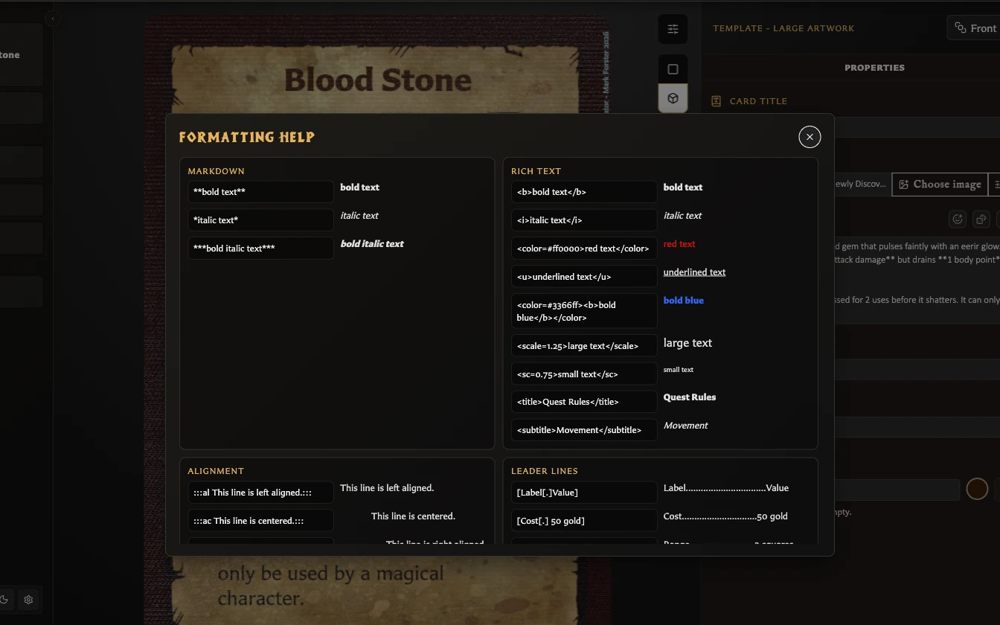

# Format Card Text

Open **Formatting help** beside the Card text field for live examples supported by the current version.

## Basic emphasis

```text
**bold text**
*italic text*
***bold italic text***
```

Equivalent rich-text tags such as `<b>`, `<i>`, `<u>`, and `<color=#ff0000>` are also supported. Tags can be nested.

## Size and headings

<!-- help-visual:p025:start -->
<figure class="hqcc-help-figure hqcc-help-figure--wide" markdown="span">
  
  <figcaption>Formatting Help shows the available text patterns and the result each one produces.</figcaption>
</figure>
<!-- help-visual:p025:end -->


```text
<scale=1.25>larger text</scale>
<sc=0.75>smaller text</sc>
<title>Quest Rules</title>
<subtitle>Movement</subtitle>
```

## Alignment

Wrap a block with an alignment directive:

```text
:::al Left aligned text.:::
:::ac Centred text.:::
:::ar Right aligned text.:::
```

## Leader lines

Leader lines place a label and value at opposite sides with a repeated character between them:

```text
[Cost[.] 50 gold]
[Weight[-] Light]
```

Multiple lines can be wrapped as a leader group when they need shared pivot and wrapping behaviour. Use the examples in Formatting help as the canonical syntax because malformed brackets are treated as ordinary text.

## Inline dice

The simplest approach is **Insert inline dice**, which lets you choose the face and colours and preview the result. See [Insert Emoji and Dice](./insert-emoji-and-dice.md).

Dice are stored as compact tokens. Examples include:

```text
&cd-s-w;
&cd-h-r;
&cd-m-bk;
&cd-ad-r;
&d6-6-w;
```

Combat faces include skull, hero shield, monster shield, combat die, attack die, defence die, and movement die. D6 tokens accept values 1-6. Named colours and hex colours are supported.

## Text fitting

Two different controls solve different problems:

- **Text fitting settings** in the preview toolbar sets global minimum sizes and ellipsis preferences for titles and stat headings.
- **Toggle scale to fit body text** beside Card text controls body-text fitting for the current card.

Global fitting changes affect other cards. Per-card body fitting is saved with the card.

For supported templates, fitting behavior, paragraph spacing, and the **Text clipped** warning, see [Fit Body Text on a Card](./fit-body-text-on-a-card.md). If the warning remains, see [Fix Clipped or Overflowing Card Text](../troubleshooting/fix-clipped-or-overflowing-card-text.md).

For an explanation of the text field, emoji and dice pickers, backdrop controls, and why options vary by template, see [Understand the Card Editing View](./understand-the-card-editing-view.md).
