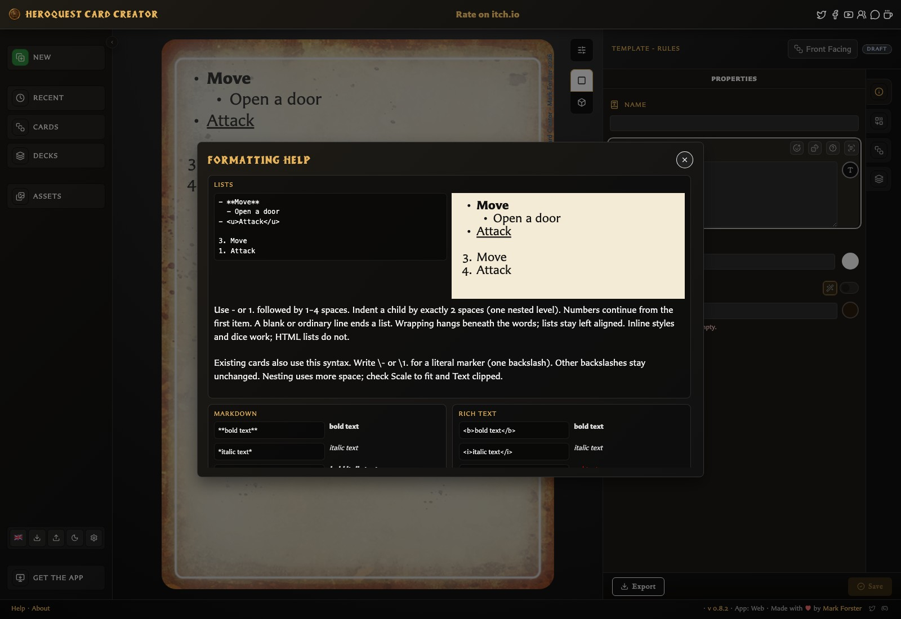

# Format Card Text

Open **Formatting help** beside the Card text field for live examples supported by the current version.

## Basic emphasis

```text
**bold text**
*italic text*
***bold italic text***
```

Equivalent rich-text tags such as `<b>`, `<i>`, `<u>`, and `<color=#ff0000>` are also supported. Tags can be nested.

## Lists

Card text, Rules text and Back text support a small Markdown-style list syntax,
not every feature of Markdown. Lists do not apply to card titles or stat headings.

```text
- **Move** up to six squares.
  - <i>Open a door</i> on the way.
- <color=#3366ff>Defend</color> with &cd-h-r;.

3. Choose a target.
1. Roll attack dice.
1. Apply the <u>damage</u>.
```

The numbered sequence above displays **3, 4, 5**. The first number sets the start;
later numbers are automatically consecutive. Zero and leading zeroes are
accepted (`03.` starts at 3). Source numbers contain one to nine digits.

- Start a root item at the beginning of a line with `- ` or `1. `.
- Use **exactly two ordinary spaces** before a child marker. Only one nested
  level is supported. A child needs a preceding parent; bullets and numbers can mix.
- Put one to four ordinary spaces between the marker and non-whitespace content.
  Tabs, five separator spaces, empty items and other indentation are not supported.
- Each item occupies one source line. Long items wrap automatically: continuation
  rows line up beneath the item's words, not its marker. Do not insert a newline
  to continue the same item.
- A blank or ordinary line ends the list and its numbering. Changing bullet/number
  type starts a new sequence; child numbering starts separately for each parent.
- Lists have no extra margins or gaps. Authored blank lines retain their normal spacing.
- Lists are left aligned even after a standalone centre/right directive; ordinary
  text afterwards resumes that alignment. List-looking lines inside an already
  open multiline inline-alignment construct remain ordinary text.
- Existing emphasis, underline, colour, scaling and dice work within items.
  Markers keep the base text style. Headings, leaders and alignment commands do
  not become blocks when written after a list marker.

These forms remain literal text, not lists:

```text
+ Other marker
* Other marker
-- Not nesting
-No space
1) Not supported
1.No space
<ul><li>Not an HTML list</li></ul>
<ol><li>Not an HTML list</li></ol>
```

Thematic-rule-like lines such as `---`, `- - -` and `- * *` are not list items.
The existing `---` separator still splits enabled text backdrops into sections,
each with independent numbering; it does not introduce a general horizontal rule.

To display a valid marker literally, add one backslash:

```text
\- This stays a hyphen.
\1. This stays the number I typed.
```

Only that marker escape removes a backslash. Other backslashes, including a
double backslash before a marker, remain unchanged. Escaped lines end a list.

**Existing cards:** matching saved text now renders as lists too, which can change
wrapping or numbering. The saved wording is not rewritten. Add the escape if
you want a literal marker, and recheck fitting before exporting older cards.

## Size and headings

<!-- help-visual:p025:start -->
<figure class="hqcc-help-figure hqcc-help-figure--wide" markdown="span">
  
  <figcaption>Formatting Help shows the available text patterns and the result each one produces.</figcaption>
</figure>
<!-- help-visual:p025:end -->


```text
<scale=1.25>larger text</scale>
<sc=0.75>smaller text</sc>
<title>Quest Rules</title>
<subtitle>Movement</subtitle>
```

## Alignment

Wrap a block with an alignment directive:

```text
:::al Left aligned text.:::
:::ac Centred text.:::
:::ar Right aligned text.:::
```

## Leader lines

Leader lines place a label and value at opposite sides with a repeated character between them:

```text
[Cost[.] 50 gold]
[Weight[-] Light]
```

Multiple lines can be wrapped as a leader group when they need shared pivot and wrapping behaviour. Use the examples in Formatting help as the canonical syntax because malformed brackets are treated as ordinary text.

## Inline dice

The simplest approach is **Insert inline dice**, which lets you choose the face and colours and preview the result. See [Insert Emoji and Dice](./insert-emoji-and-dice.md).

Dice are stored as compact tokens. Examples include:

```text
&cd-s-w;
&cd-h-r;
&cd-m-bk;
&cd-ad-r;
&d6-6-w;
```

Combat faces include skull, hero shield, monster shield, combat die, attack die, defence die, and movement die. D6 tokens accept values 1-6. Named colours and hex colours are supported.

## Text fitting

Two different controls solve different problems:

- **Text fitting settings** in the preview toolbar sets global minimum sizes and ellipsis preferences for titles and stat headings.
- **Toggle scale to fit body text** beside Card text controls body-text fitting for the current card.

Global fitting changes affect other cards. Per-card body fitting is saved with the card.

For supported templates, fitting behavior, paragraph spacing, and the **Text clipped** warning, see [Fit Body Text on a Card](./fit-body-text-on-a-card.md). If the warning remains, see [Fix Clipped or Overflowing Card Text](../troubleshooting/fix-clipped-or-overflowing-card-text.md).

For an explanation of the text field, emoji and dice pickers, backdrop controls, and why options vary by template, see [Understand the Card Editing View](./understand-the-card-editing-view.md).
