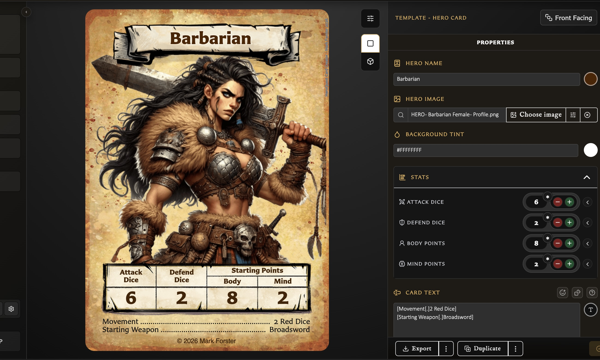

# Making Cards

Choose a template and turn it into a finished card with artwork, text, and the right card-specific details.

<!-- help-visual:p008:start -->
<figure class="hqcc-help-figure hqcc-help-figure--wide" markdown="span">
  
  <figcaption>Standard preview shows the finished card alongside the properties used to build it.</figcaption>
</figure>
<!-- help-visual:p008:end -->

## In this section

- [Add and Position Artwork](./add-and-position-artwork.md)
- [Choose a Card Template](./choose-a-card-template.md)
- [Customize Card Back Logos and Text](./customize-card-back-logos-and-text.md)
- [Customize Titles Colours and Copyright](./customize-titles-colours-and-copyright.md)
- [Duplicate a Card](./duplicate-a-card.md)
- [Fit Body Text on a Card](./fit-body-text-on-a-card.md)
- [Format Card Text](./format-card-text.md)
- [Insert Emoji and Dice](./insert-emoji-and-dice.md)
- [Pair and Unpair Card Faces](./pair-and-unpair-card-faces.md)
- [Save or Discard Card Changes](./save-or-discard-card-changes.md)
- [Understand Body Text Tools](./understand-body-text-tools.md)
- [Understand Card States and Saving](./understand-card-states-and-saving.md)
- [Understand Template-Specific Card Controls](./understand-template-specific-card-controls.md)
- [Understand the Card Editing View](./understand-the-card-editing-view.md)
- [Understand the Pairing Tab](./understand-the-pairing-tab.md)
- [Use Advanced Hero and Monster Controls](./use-advanced-hero-and-monster-controls.md)
