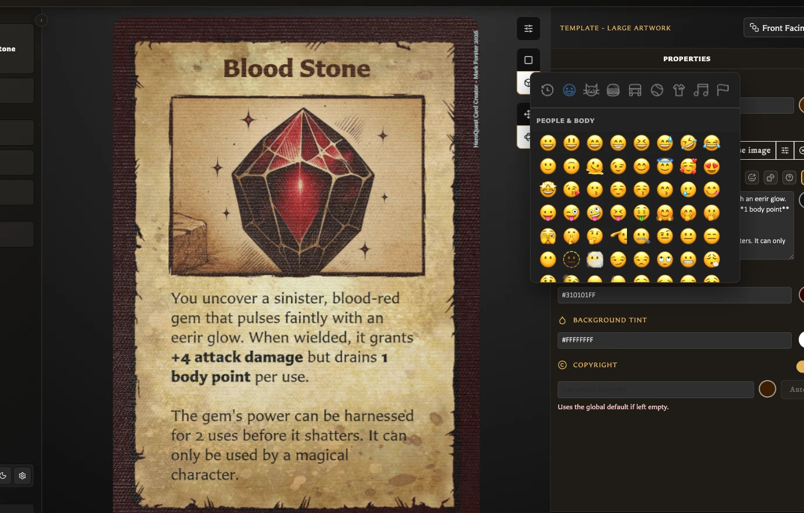
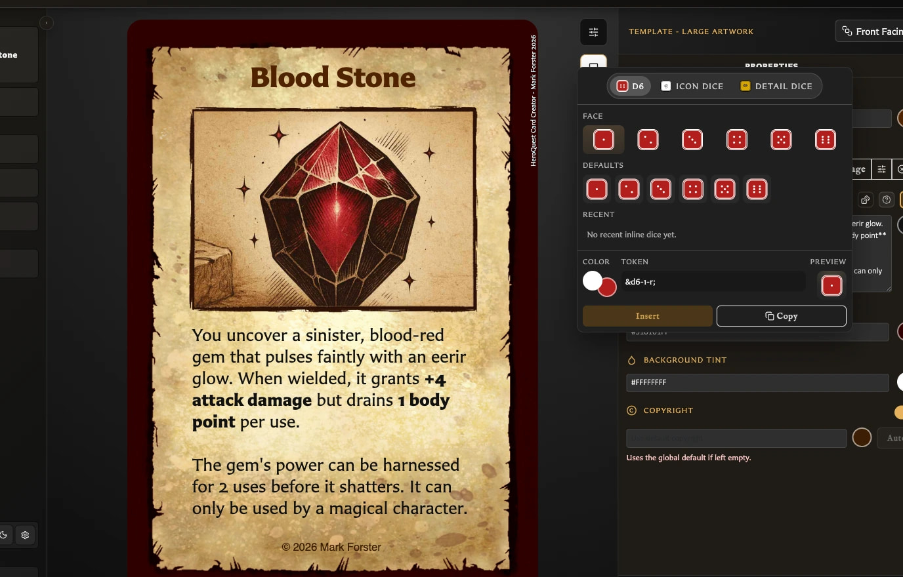

# Insert Emoji and Dice

The body-text helpers let you add symbols at the cursor without memorizing formatting codes.

## Insert an emoji

<!-- help-visual:p026:start -->
<figure class="hqcc-help-figure hqcc-help-figure--wide" markdown="span">
  
  <figcaption>The emoji picker inserts a selected symbol at the current position in the card text.</figcaption>
</figure>
<!-- help-visual:p026:end -->

1. Click in the body-text field where the symbol should appear.
2. Select **Insert emoji**.
3. Browse a category and choose an emoji.

The picker closes and inserts the emoji at the cursor. If text was selected, the emoji replaces it.

## Insert a die

<!-- help-visual:p027:start -->
<figure class="hqcc-help-figure hqcc-help-figure--wide" markdown="span">
  
  <figcaption>The dice configurator builds an inline die symbol with the face, colour, and detail you choose.</figcaption>
</figure>
<!-- help-visual:p027:end -->

1. Click in the body-text field where the die should appear.
2. Select **Insert inline dice**.
3. Choose a die family:
   - **D6** provides the numbered faces 1-6.
   - **Icon dice** provides skull, Hero shield, and Monster shield faces.
   - **Detail dice** provides compact CD, AD, DD, and MD symbols for combat, attack, defence, and movement dice.
4. Choose the face, background colour, and symbol or pip colour.
5. Check **Preview** and **Token** to confirm the result.
6. Select **Insert**.

The configured die is inserted at the cursor and the window closes.

## What are Defaults and Recent?

**Defaults** offers ready-made choices. **Recent** remembers configured dice that you have copied or inserted, making repeated styles quicker to reuse.

The picker starts with its standard D6 choice when opened again. Use **Recent** when you want a previously configured colour and face combination.

## What is the difference between Insert and Copy?

**Insert** places the die in the current text field and closes the picker. **Copy** copies the die's token so you can paste it elsewhere and leaves the picker open.

The token is the short text code that the card turns into a die symbol. You usually do not need to edit it manually. If you do want the syntax and examples, open **Formatting help** or see [Format Card Text](./format-card-text.md).
