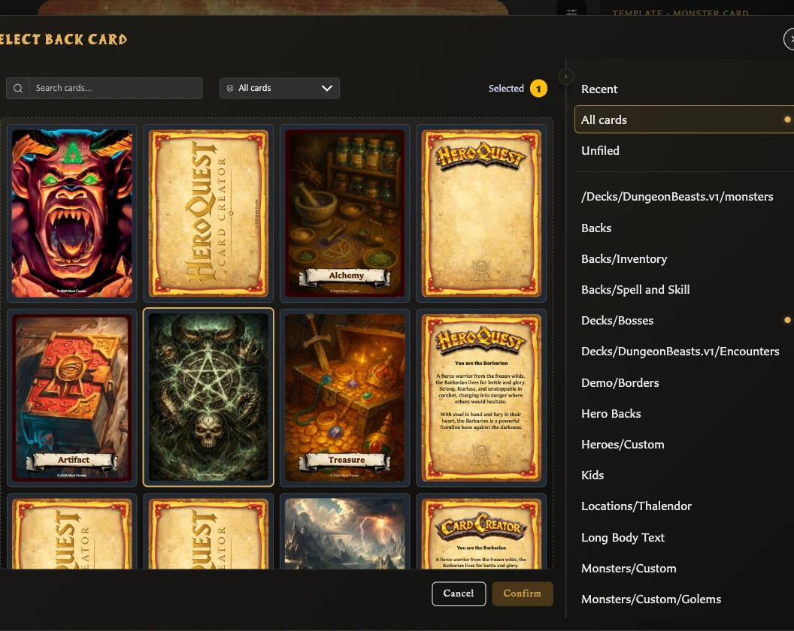
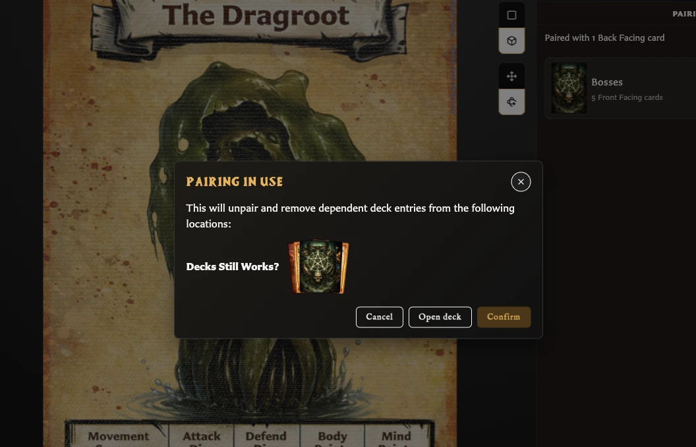

# Pair and Unpair Card Faces

Pairing connects separate saved front and back cards. You can manage the relationship from either face.

## Pair a front with one or more backs

1. Open and save the front-facing card.
2. Open the **Pairing** inspector tab.
3. Choose **Pair with a back card**.
4. Select one or more saved back-facing cards.
5. Choose **Confirm**.

The Pairing tab lists each selected back. If you open the selector again, the current backs are already selected; change the selection and confirm to replace the front's set of backs.

## Pair a back with one or more fronts

<!-- help-visual:p036:start -->
<figure class="hqcc-help-figure hqcc-help-figure--wide" markdown="span">
  
  <figcaption>The pairing selector combines card search, collection filters, and compatible back-face choices.</figcaption>
</figure>
<!-- help-visual:p036:end -->

1. Open and save the back-facing card.
2. Open the **Pairing** inspector tab.
3. Choose **Manage paired fronts**.
4. Select one or more saved front-facing cards.
5. Choose **Confirm**.

The selected fronts appear as thumbnails in the Pairing tab. Open **Manage paired fronts** again when you want to add or remove fronts.

## Unpair one back from a front

1. Open the front-facing card and choose **Pairing**.
2. Find the back you want to remove.
3. Choose **Unpair back card** beside that back.
4. Review the warning and choose **Confirm**.

Only the relationship between that front and that back is removed. Other backs paired with the same front, and other fronts paired with that back, remain connected.

## Unpair a front from every back

1. Open the front-facing card and choose **Pairing**.
2. Choose **Unpair from all back facing cards**.
3. Review how many relationships and decks are affected.
4. Choose **Confirm** only when you are ready.

This removes every back pairing for the current front.

You can also remove front pairings from a back by opening **Manage paired fronts**, deselecting the fronts you no longer want, and choosing **Confirm**.

## If a pairing is used by a deck

A deck set can contain entries that depend on a particular front-and-back pairing. Removing that pairing also removes those dependent entries from the affected deck locations.

<!-- help-visual:p038:start -->
<figure class="hqcc-help-figure hqcc-help-figure--wide" markdown="span">
  
  <figcaption>The app identifies deck entries that will be affected before an in-use pairing is removed.</figcaption>
</figure>
<!-- help-visual:p038:end -->

The warning names the affected deck and set before anything changes. Choose **Open deck** if you want to inspect the first affected location instead of continuing. Choose **Cancel** to leave both the pairing and deck entries unchanged.

!!! warning
    Confirming the warning removes the pairing and the listed dependent deck entries. It does not delete either saved card.

## Change whether a card is front- or back-facing

Changing a saved card's **Card face** role can make its current pairings invalid. The app warns before removing those relationships. If deck entries depend on them, a second warning identifies the affected deck locations.

Cancel if you need to inspect the pairings or decks first. Confirm only when the card should take the new face role and the old relationships are no longer required.

Choosing a different template through **New** starts a different card or draft; it does not transfer the current card's pairings.

## Duplicate a paired card

In v0.8.0, **Duplicate with pairing** does not reliably preserve the relationship. Save the duplicate, open its **Pairing** tab, and add the required front or back manually. See [Duplicate a Card](./duplicate-a-card.md).

## Related guides

- [Understand the Pairing Tab](./understand-the-pairing-tab.md)
- [What Is Pairing?](../concepts/what-is-pairing.md)
- [Create and Build a Deck](../building-decks/create-and-build-a-deck.md)
- [Fix Pairing Problems](../troubleshooting/fix-pairing-problems.md)
