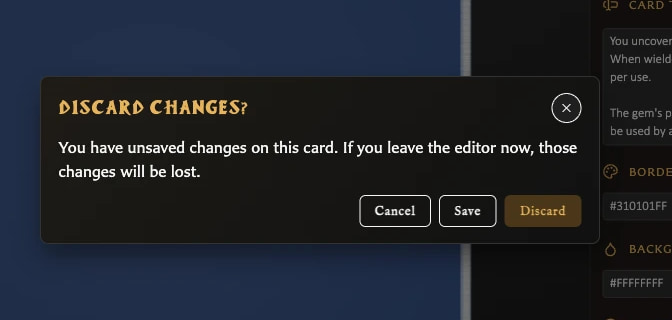

# Save or Discard Card Changes

Choose **Save** whenever you want the current editor contents to become the library version of the card.

## Save a new draft

1. Enter the card title, name, or back label required by the template.
2. Make the other changes you want.
3. Choose **Save** in the Card Editor toolbar.
4. Confirm that the status changes from **draft** to **saved**.

The card is now available in **Cards**. Collection, pairing, deck, and duplication actions can now refer to it as a saved card.

## Save changes to an existing card

1. Edit the saved card.
2. Confirm that its status changes to **Modified**.
3. Choose **Save**.
4. Confirm that the status returns to **saved**.

This updates the same library card. It does not create a second card or alter other cards that were previously duplicated from it.

## Leave while changes are unsaved

When you try to open another card, start a new card, or move to another app area while the current card is modified, the app opens **Discard changes?** with three choices:

<!-- help-visual:p031:start -->
<figure class="hqcc-help-figure hqcc-help-figure--compact" markdown="span">
  
  <figcaption>When you leave with unsaved edits, choose whether to stay, save the card, or discard the changes.</figcaption>
</figure>
<!-- help-visual:p031:end -->

- **Cancel** keeps you on the current card with the edits still in place.
- **Save** saves the current card, then continues to the destination only if saving succeeds.
- **Discard** continues without saving the current edits.

Choose **Cancel** if you are unsure. Choosing **Discard** cannot be undone through the Card Editor.

If saving is blocked because the required title, name, or label is empty, the app remains on the current card instead of continuing.

## Reloading or closing the browser

The browser may show its own unsaved-changes warning when you reload or close a tab containing a modified card. The wording and available choices belong to the browser rather than HeroQuest Card Creator.

## Related guides

- [Understand Card States and Saving](./understand-card-states-and-saving.md)
- [Duplicate a Card](./duplicate-a-card.md)
- [Organize and Recover Cards](../managing-your-library/organize-and-recover-cards.md)
