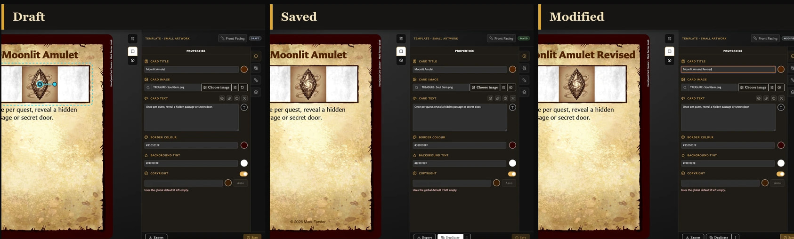

# Understand Card States and Saving

The status near the top of the Card Editor tells you whether the card already exists in **Cards** and whether the preview contains changes that still need to be saved.

## The three states

<!-- help-visual:p029:start -->
<figure class="hqcc-help-figure hqcc-help-figure--panoramic" markdown="span">
  
  <figcaption>Draft, Saved, and Modified describe whether a card exists in the library and whether edits are waiting to be saved.</figcaption>
</figure>
<!-- help-visual:p029:end -->

- **draft** means the card has not yet been saved as its own library card.
- **saved** means the open card matches the version currently stored in the library.
- **Modified** means a saved card is open, but the editor contains newer unsaved changes.

The live preview updates before saving, so seeing a change on the card does not by itself mean the library copy has been updated. Check the status and the **Save** action.

## What does Save do?

The same **Save** action has two jobs:

- On a draft, it creates a new saved card and changes the status to **saved**.
- On a modified saved card, it updates that same card and returns the status to **saved**.

Saving an existing card does not create another copy. Use **Duplicate** when you want a separate card based on the current one.

## Why is Save unavailable?

Save requires a non-empty identifying field. Depending on the template, this is the card title, name, or back label.

Save is also unavailable when a saved card has no unsaved changes. This is normal: the current editor already matches the library copy.

## What is kept automatically?

Work on a new draft is kept locally so that the draft can resume after an ordinary reload. It is still a draft, not a card in **Cards**, until you choose **Save**.

Do not treat this as a substitute for saving. Choosing **Discard**, replacing the draft with another new card, clearing the app's local data, or deliberately leaving without saving can remove the in-progress work.

Changes to an existing saved card are represented by **Modified** and should be saved explicitly.

## Which actions require a saved card?

Drafts can be edited, previewed, exported, and saved. Actions that need a permanent library card are unavailable until the first save, including:

- **Duplicate**.
- Managing collection membership.
- Managing pairings.
- Showing the card's deck relationships.

## Related guides

- [What Is a Draft?](../concepts/what-is-a-draft.md)
- [Save or Discard Card Changes](./save-or-discard-card-changes.md)
- [Duplicate a Card](./duplicate-a-card.md)
- [Create Your First Card](../getting-started/create-your-first-card.md)
