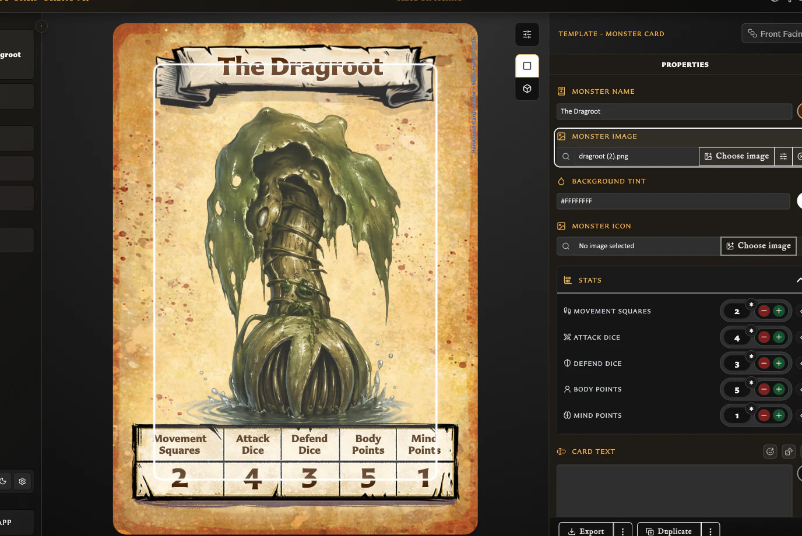
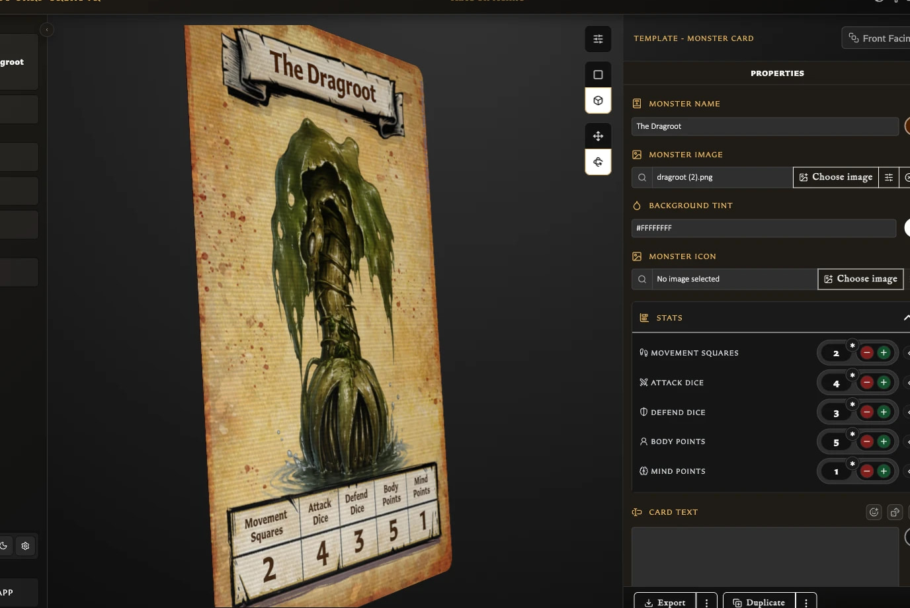

# Understand the Card Editing View

The Card Editor brings together a live view of your card and the fields used to change it. Use it to enter the card's content, check how everything fits, adjust its artwork, and preview how the finished card might look in your hand.

## What am I seeing?

The large card area shows the card you are currently editing.

<!-- help-visual:p009:start -->
<figure class="hqcc-help-figure hqcc-help-figure--wide" markdown="span">
  
  <figcaption>Standard preview shows the finished card alongside the properties used to build it.</figcaption>
</figure>
<!-- help-visual:p009:end -->

- When you start from a new template, it shows that template's default layout and any empty areas waiting for content.
- When you open a saved card, it shows its current title, artwork, text, statistics, colours, and other saved details.
- As you change a field, the card updates immediately. You do not need to save before checking the result.

The Properties panel beside the card contains the fields supported by the chosen template. Its status tells you whether the card is a new draft, a saved card, or has unsaved changes. Save becomes available when there is a valid change to store.

## Standard preview

**Standard** is the main working view. It shows the card clearly while you enter content and make precise adjustments.

You can also click parts of the card to move directly to their matching field in the Properties panel. For example, clicking the title selects the title field. The same direct selection can be available for text, statistics, colours, and other editable parts supported by the template.

Clicking the artwork selects the image and displays controls over the card for moving, scaling, and rotating it. The Properties panel also provides sliders, nudge buttons, centring, automatic scaling, and rotation controls. See [Add and Position Artwork](./add-and-position-artwork.md) for the full artwork guide.

Some card parts have a useful double-click action. For example, double-clicking an image can open the image chooser so you can replace it.

## Interactive preview

**Interactive** lets you examine the card more like a physical object. Use it to check the overall impression, surface, lighting, and how the card reads when it is tilted or turned. Return to Standard when you want to select card parts or make precise edits.

<!-- help-visual:p014:start -->
<figure class="hqcc-help-figure hqcc-help-figure--wide" markdown="span">
  
  <figcaption>Interactive preview lets you tilt and rotate the card to judge its physical appearance.</figcaption>
</figure>
<!-- help-visual:p014:end -->

Interactive preview has two ways to move the card:

- **Pan** gives the card a limited tilt as you move across it. Releasing it returns the card to the centre. This is useful for a quick physical-card impression.
- **Rotate** lets you turn the card fully and leave it at the chosen angle. This is useful for inspecting the edges and reverse face.

When the card has an opposite face paired with it, the reverse side uses that card. If it has not yet been paired, the reverse indicates that it is **Not Yet Paired**. Double-clicking while the front is facing you flips to the reverse; double-clicking from another angle returns the card to the centre.

## What can I change in Properties?

The fields depend on the template. A Hero card, Monster card, artwork card, Rules card, and card back each have different needs, so you will see only the relevant controls.

For a template-by-template comparison and the less obvious stat, colour, icon, copyright, logo, and back-text controls, see [Understand Template-Specific Card Controls](./understand-template-specific-card-controls.md).

| Field | What it is for |
| --- | --- |
| **Name, title, or label** | Sets the main identifying text. Some back templates can hide the title or change its position, colour, and ribbon style. |
| **Image** | Chooses reusable artwork from Assets and controls its position, scale, and rotation. |
| **Stats** | Sets values such as Attack, Defend, Body, and Mind on templates that use statistics. |
| **Card, rules, or back text** | Holds the main written content and offers the text helpers supported by that template. |
| **Background tint** | Changes the colour treatment behind the card content. |
| **Border colour** | Changes the outer border on templates that provide a configurable border. |
| **Monster icon** | Chooses the icon used by a Monster card. |
| **Hero Back logo** | Chooses or changes the logo used on supported back templates. |
| **Copyright** | Controls the small copyright text shown on the card. |

Saved cards can also show **Pairing**, **Collections**, and **Decks** tabs. These describe or manage how the current card relates to other saved work. Actions at the bottom of the panel can include Export, Duplicate, and Save.

See [Understand the Pairing Tab](./understand-the-pairing-tab.md) for the front- and back-facing relationship views and [Pair and Unpair Card Faces](./pair-and-unpair-card-faces.md) for the management steps and safety warnings.

## Body-text tools

The main text box is where you write the card's description, rules, or back text. Your changes appear on the card as you type.

Depending on the template, tools beside the text box can include:

- **Emoji** opens a picker and inserts an emoji at the current cursor position or replaces the selected text.
- **Inline dice** builds a dice symbol without requiring you to remember its code. You can choose a standard six-sided die, icon die, or detail die; select its face or value; choose colours; reuse recent choices; preview the result; and insert or copy it.
- **Formatting help** shows examples for bold, italic, underline, colour, size, titles, subtitles, alignment, leader lines, grouped leaders, and inline dice.
- **Text colour** changes the main body-text colour where the template supports it.
- **Backdrop controls** can show or hide the panel behind the text, place it inset or flush with the card, change which title corners it meets, fit it to the text or use the full available area, and change its colour.
- **Show or hide body text** lets supported back templates keep their text area optional.
- **Scale to fit body text** reduces body text when necessary so that it remains inside a fixed text area. The setting belongs to the current card.

See [Format Card Text](./format-card-text.md) for the available formatting patterns and examples.

## Why do the text options vary?

Each template has its own layout. Some provide a fixed panel for body text, while others arrange the text as part of a more flexible card design. The editor only shows controls that make sense for the current template.

For example, artwork, Rules, and supported back templates can provide **Scale to fit body text** because their text must stay inside a fixed area. Hero and Monster cards arrange their descriptions differently, so that per-card toggle is not shown there. Backdrop and title-layout controls appear only on templates designed to use them.

## Text fitting settings

**Text fitting settings** in the preview toolbar is separate from body-text fitting. It changes the app-wide rules used to keep **titles** and **stat headings** readable, including their minimum text sizes and whether overflowing text may end with an ellipsis.

Use the body-text toolbar when you want to fit the current card's main text. Use Text fitting settings when you want to change how titles and stat headings behave across the app.

## Related help

- [Create Your First Card](../getting-started/create-your-first-card.md)
- [Understand Card States and Saving](./understand-card-states-and-saving.md)
- [Duplicate a Card](./duplicate-a-card.md)
- [Understand the Pairing Tab](./understand-the-pairing-tab.md)
- [Pair and Unpair Card Faces](./pair-and-unpair-card-faces.md)
- [Add and Position Artwork](./add-and-position-artwork.md)
- [Format Card Text](./format-card-text.md)
- [Keyboard Shortcuts](../reference/keyboard-shortcuts.md)
- [Fix Keyboard Shortcut Problems](../troubleshooting/fix-keyboard-shortcut-problems.md)
- [What Is the Card Editor?](../concepts/what-is-the-card-editor.md)
