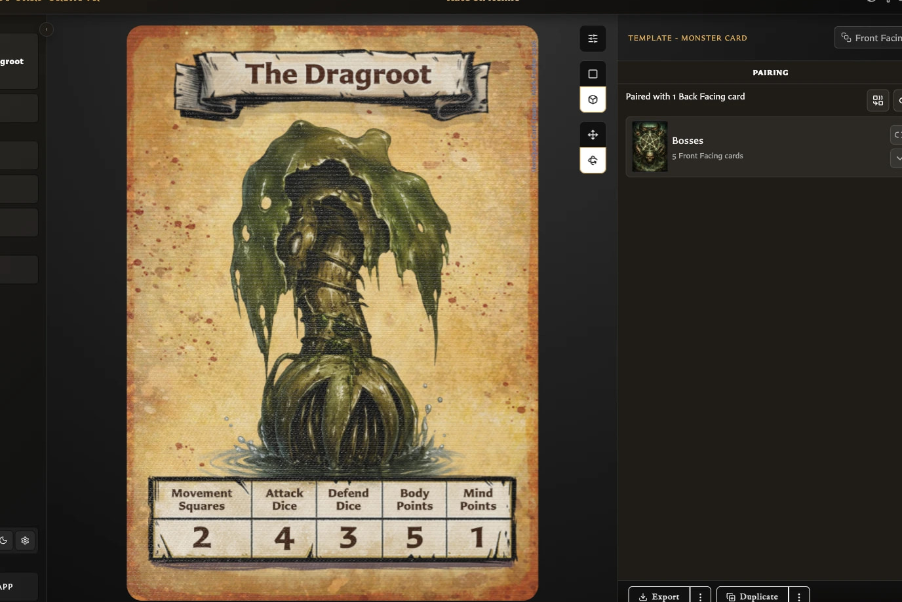

# Understand the Pairing Tab

The **Pairing** tab shows which saved front and back cards are connected to the card currently open in the Card Editor. Use it to review those relationships, open a related card, or change which faces belong together.

Pairing is available from the inspector beside the card preview. The exact view depends on whether the current card is **Front Facing** or **Back Facing**.

## Before a card is saved

A draft shows **Save this card to manage pairings**. Pairings belong to saved cards, so the pairing controls remain unavailable until the card has been saved for the first time.

After saving, return to **Pairing** to create or change its relationships.

## On a front-facing card

The tab shows:

<!-- help-visual:p034:start -->
<figure class="hqcc-help-figure hqcc-help-figure--wide" markdown="span">
  
  <figcaption>The Pairing tab lists the back faces connected to the card and provides pairing actions.</figcaption>
</figure>
<!-- help-visual:p034:end -->

- **Unpaired** when the front has no back.
- **Paired with 1 Back Facing card** or the number of backs when it has pairings.
- **Pair with a back card**, which opens a selector containing saved back-facing cards.
- **Unpair from all back facing cards** when the front has at least one back.
- One collapsible section for each paired back, including the other fronts that share that back.

Choose a paired back's thumbnail to open that back in the Card Editor. Expanding its section shows the front cards connected to it; choosing a front opens that card.

## On a back-facing card

The tab shows:

- **Unpaired** when no fronts use the back.
- **Paired with 1 Front Facing card** or the number of fronts when it has pairings.
- **Manage paired fronts**, which opens a selector containing saved front-facing cards.
- A thumbnail for every paired front.

Choose a front thumbnail to open that card in the Card Editor.

## What the selection window does

The selection window includes search, a template filter, collection filters, and a selected-card count. Already paired cards start selected.

For a front card, confirming the selection replaces its current set of backs with the selected backs. For a back card, confirming replaces its current set of fronts with the selected fronts. Removing a selected relationship may require an additional warning if it is used by a deck.

For step-by-step instructions, see [Pair and Unpair Card Faces](./pair-and-unpair-card-faces.md).

## Related guides

- [What Is Pairing?](../concepts/what-is-pairing.md)
- [Pair and Unpair Card Faces](./pair-and-unpair-card-faces.md)
- [Fix Pairing Problems](../troubleshooting/fix-pairing-problems.md)
