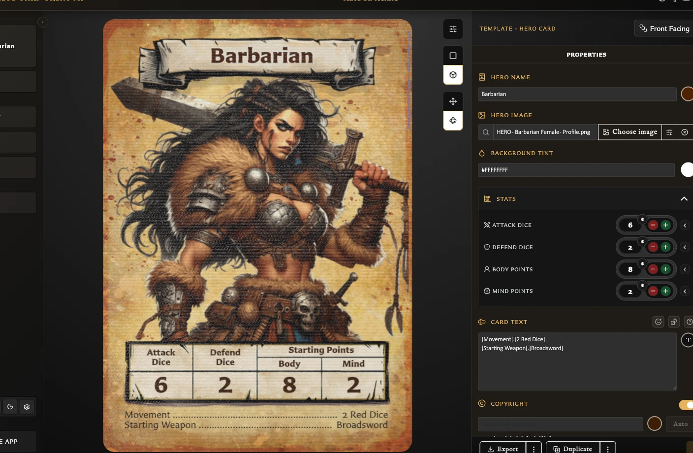
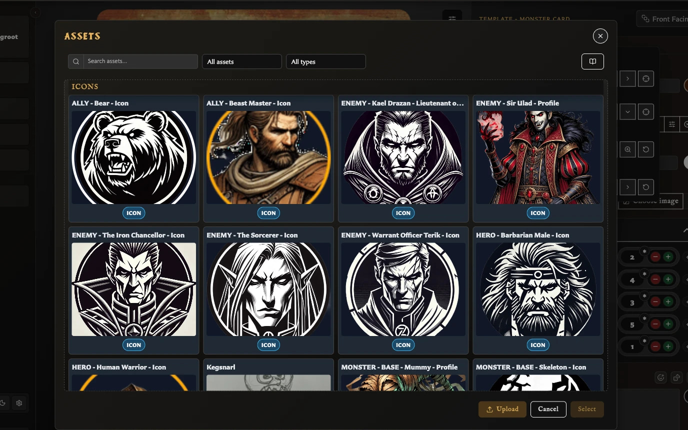

# Use Advanced Hero and Monster Controls

Hero and Monster cards provide compact controls for ordinary values, unusual values, split statistics, and optional asterisk markers.

## Change a stat

Under **Stats**, use the minus and plus buttons or enter the value directly. Hero cards provide Attack Dice, Defend Dice, Body Points and Mind Points. Monster cards also provide Movement.

Choose the **asterisk** button beside a number when that value needs a matching asterisk on the card. The marker belongs to that individual number, so a split stat can mark either value separately.

## Use a wildcard value

Enter `*` when a stat should show a wildcard rather than a number. A wildcard cannot also carry an asterisk marker because the wildcard is already displayed as an asterisk.

## Show two values for one stat

<!-- help-visual:p021:start -->
<figure class="hqcc-help-figure hqcc-help-figure--wide" markdown="span">
  
  <figcaption>Hero statistics are edited in Properties and appear in the stat row at the bottom of the card.</figcaption>
</figure>
<!-- help-visual:p021:end -->

1. Choose **Add second value** beside the stat.
2. Set the second number.
3. Choose the format between the values: `x / y`, `x ( y )`, or `( x ) y`.
4. Add an asterisk to either number if required.

The card preview updates immediately. Remove the second value when the card should return to one number.

Split values are useful when a rule needs two states, such as a normal and enhanced value. The app does not assign a meaning to the two numbers; explain that meaning in the card text when readers need it.

## Choose a Monster icon

Monster cards include a separate **Monster icon** field. Search by the image filename or open the full asset chooser, select an image, then adjust its horizontal position, vertical position, scale, or rotation as required.

<!-- help-visual:p022:start -->
<figure class="hqcc-help-figure hqcc-help-figure--wide" markdown="span">
  
  <figcaption>The asset chooser can filter library images suitable for a Monster Card icon.</figcaption>
</figure>
<!-- help-visual:p022:end -->

Assets classified as **Icon** appear before Artwork and unclassified images in the quick results. Classification improves the order; it does not prevent another image type from being selected. Clear the field to remove the icon or use its restore action to return the adjustments to their previous state.

For full image framing controls and asset organization, see [Add and Position Artwork](./add-and-position-artwork.md) and [Upload and Organize Assets](../managing-your-library/assets/upload-and-organize-assets.md).
