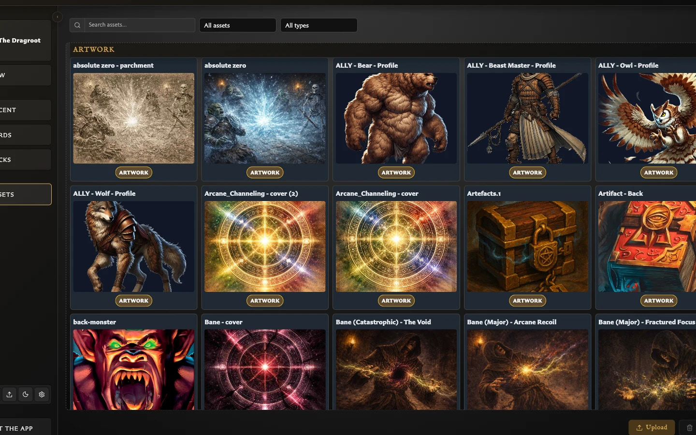

# Assets

Upload and manage reusable artwork and icons, then understand what happens when an image is replaced or removed.

<!-- help-visual:p047:start -->
<figure class="hqcc-help-figure hqcc-help-figure--wide" markdown="span">
  
  <figcaption>Assets groups reusable artwork and icons into a searchable visual library.</figcaption>
</figure>
<!-- help-visual:p047:end -->

## In this section

- [Replace Convert and Delete Assets](./replace-convert-and-delete-assets.md)
- [Understand the Assets Workspace](./understand-the-assets-workspace.md)
- [Upload and Organize Assets](./upload-and-organize-assets.md)
