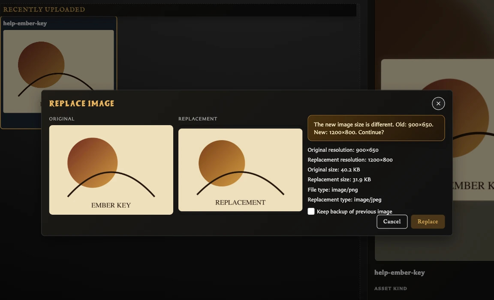
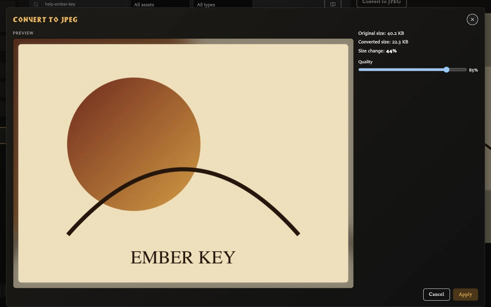
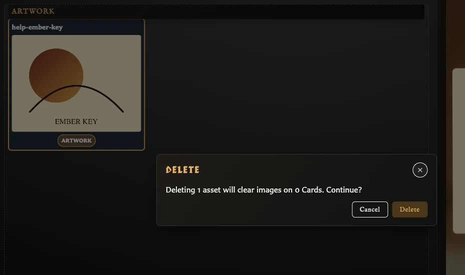

# Replace, Convert, and Delete Assets

The Assets inspector provides actions that change or remove reusable source images. Before using them, select the image and review its preview, dimensions, kind, and **Used on cards** information.

## Preview an image and check its use

Select one asset, then choose its inspector preview to open a larger view. Close the preview to return to the inspector.

**Used on cards** is intended to show the number of saved cards that refer to the asset. When cards are listed, choose one to open it. If the current editor has unsaved changes, the app can ask whether to save before navigating.

!!! warning "Known v0.8.0 issue"
    In version 0.8.0, **Used on cards** can report zero for an image that is still used by a saved card. Treat a zero count cautiously and manually check likely cards before replacing or deleting an image.

## Replace an asset everywhere it is used

Replacement changes the selected reusable image everywhere it is used.

<!-- help-visual:p054:start -->
<figure class="hqcc-help-figure hqcc-help-figure--wide" markdown="span">
  
  <figcaption>Replace compares the old and new images and warns when their dimensions differ.</figcaption>
</figure>
<!-- help-visual:p054:end -->

1. Select exactly one asset.
2. Choose **Replace**.
3. Select one PNG, JPEG, or WebP replacement file.
4. Compare the original and replacement previews, dimensions, sizes, and file types.
5. If the dimensions differ, read the warning and decide whether the new proportions are suitable.
6. Optionally enable **Keep backup of previous image**.
7. Choose **Replace** to confirm.

Cards continue using the replacement image. Their existing crop, position, scale, and rotation are preserved, so a replacement with different dimensions or proportions may need card-by-card framing adjustments.

**Keep backup of previous image** adds the old image back to the library as a separate dated backup asset. It does not make a full library backup and it does not switch any cards to the backup image.

If **Replace** is disabled, clear the selection and choose one image. Replacement is unavailable for a multi-selection.

## Convert an opaque PNG to JPEG

**Convert to JPEG** appears only for a selected PNG whose pixels are fully opaque. PNGs that need transparency must remain PNGs.

<!-- help-visual:p055:start -->
<figure class="hqcc-help-figure hqcc-help-figure--wide" markdown="span">
  
  <figcaption>Conversion previews the JPEG result while showing quality and estimated file-size changes.</figcaption>
</figure>
<!-- help-visual:p055:end -->

1. Select a fully opaque PNG.
2. Choose **Convert to JPEG**.
3. Review the preview, original size, converted size, and percentage change.
4. Adjust **Quality** and compare the result.
5. Choose **Apply**.

The asset remains the same reusable library item and its file type becomes `image/jpeg`, so cards can continue using it. In version 0.8.0, the stored display name still ended in `.png` after conversion even though the inspector correctly reported `image/jpeg`. This filename mismatch is a known issue.

## Delete assets

<!-- help-visual:p056:start -->
<figure class="hqcc-help-figure hqcc-help-figure--wide" markdown="span">
  
  <figcaption>Before deletion, the warning states how many cards will have their image reference cleared.</figcaption>
</figure>
<!-- help-visual:p056:end -->

1. Select one or more assets.
2. Choose **Delete**.
3. Read the confirmation, including the number of selected assets and affected cards.
4. Choose **Delete** again only when you understand the impact.

Deletion permanently removes the selected images from Assets. It is intended to clear those images from affected card fields rather than leave unavailable artwork behind.

!!! warning "Known v0.8.0 issue"
    In version 0.8.0, the app can fail to count a saved card in **Used on cards**, report zero affected cards, and leave the removed image selected on that card. Reopen likely cards after deletion and follow [Fix Missing Artwork](../../troubleshooting/fix-missing-artwork.md) if an image no longer renders.

## Related help

- [Understand the Assets Workspace](./understand-the-assets-workspace.md)
- [Upload and Organize Assets](./upload-and-organize-assets.md)
- [Fix Missing Artwork](../../troubleshooting/fix-missing-artwork.md)
- [Add and Position Artwork](../../making-cards/add-and-position-artwork.md)
- [Back Up and Restore Your Library](../../settings-and-data/back-up-and-restore-your-library.md)
