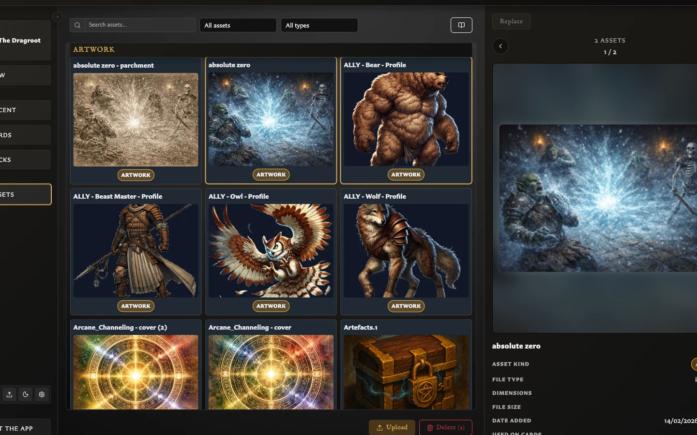

# Understand the Assets Workspace

The **Assets** workspace is the app's reusable image library. Upload artwork and icons here once, then choose those images while editing cards.

Open **Assets** from the left navigation. You can also press **A** when keyboard shortcuts are available.

## When the library is empty

A new browser profile does not contain preloaded artwork. The empty screen explains how to download the free artwork pack, extract its ZIP file, and upload the image files inside. It also links to optional artwork-generation resources.

You can ignore those resources and upload your own PNG, JPEG, or WebP images instead.

## What you see on the screen

<!-- help-visual:p048:start -->
<figure class="hqcc-help-figure hqcc-help-figure--wide" markdown="span">
  
  <figcaption>Assets groups reusable artwork and icons into a searchable visual library.</figcaption>
</figure>
<!-- help-visual:p048:end -->

### Find and filter controls

The controls above the image grid narrow the current results:

- **Search assets by name** finds images using their stored filename.
- **All assets** filters by asset kind: Artwork, Icons, or Unclassified.
- **All types** filters by the file types currently present, such as `image/png`, `image/jpeg`, or `image/webp`.
- **Resources** opens links to the free artwork pack, Art Generator, Card Art, and Icon Generator.

Search, kind, and file-type filters work together. If the grid says **No assets**, clear the search and return both filters to their All choices before assuming an image has been removed.

The Resources links leave the app. They are shortcuts to possible sources, not an endorsement or review of the material available there.

### Grouped image grid

Images are grouped by their current kind:

- **Recently uploaded** contains the latest successful upload batch.
- **Artwork** contains images classified for normal card artwork fields.
- **Icons** contains images classified for icon fields.
- **Unclassified** contains images whose automatic classification has not finished or has no result.

Uploading another successful batch replaces the contents of **Recently uploaded**. Earlier uploads are not deleted; they move back into their normal Artwork, Icons, or Unclassified groups.

### Selection and actions

Click one image to select it. Hold **Ctrl** on Windows or **Cmd** on macOS while clicking to add or remove individual images from the selection. Hold **Shift** and click another image to select the range between it and the current selection anchor.

**Delete** acts on every selected image. **Replace** is available only when exactly one image is selected because it updates one reusable asset in place.

### Inspector

Selecting an image opens its inspector. It shows:

<!-- help-visual:p050:start -->
<figure class="hqcc-help-figure hqcc-help-figure--wide" markdown="span">
  
  <figcaption>Selecting an asset opens its full preview, metadata, classification, and usage information.</figcaption>
</figure>
<!-- help-visual:p050:end -->

- A preview that can be opened at a larger size.
- The stored filename.
- Asset kind.
- File type, dimensions, file size, and date added.
- **Used on cards**, which is intended to count and list saved cards that refer to the image.

When several images are selected, the inspector becomes a carousel. Use **Previous** and **Next** to inspect each selected image without clearing the selection.

## What asset kind means

Asset kind helps the app offer suitable images in card fields. **Artwork** is intended for the main illustration or background area. **Icon** is intended for smaller icon fields, such as the Monster Card icon.

The app classifies uploads automatically, but the result is only organization. To correct it, select the image, choose its current kind in the inspector, and choose **Artwork** or **Icon** under **Override classification**. This does not alter the image file.

## Known v0.8.0 usage issue

In version 0.8.0, a saved card can continue using an image while **Used on cards** reports zero. The same missing usage affected the subsequent delete warning. Until this is fixed, do not rely on a zero count as proof that an image is unused; check cards you know may contain it before deleting.

## Related help

- [Upload and Organize Assets](./upload-and-organize-assets.md)
- [Fix Asset Upload Problems](../../troubleshooting/fix-asset-upload-problems.md)
- [Replace, Convert, and Delete Assets](./replace-convert-and-delete-assets.md)
- [Fix Missing Artwork](../../troubleshooting/fix-missing-artwork.md)
- [Add and Position Artwork](../../making-cards/add-and-position-artwork.md)
- [What Is an Asset?](../../concepts/what-is-an-asset.md)
