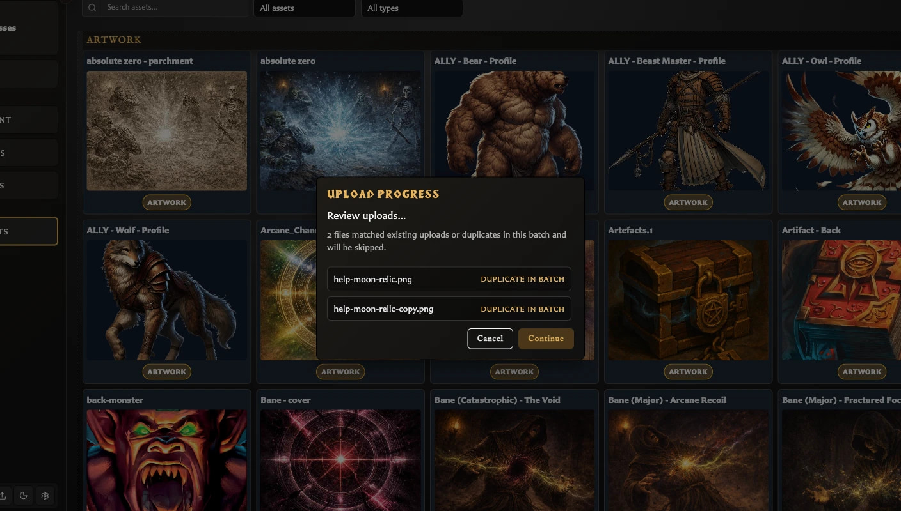
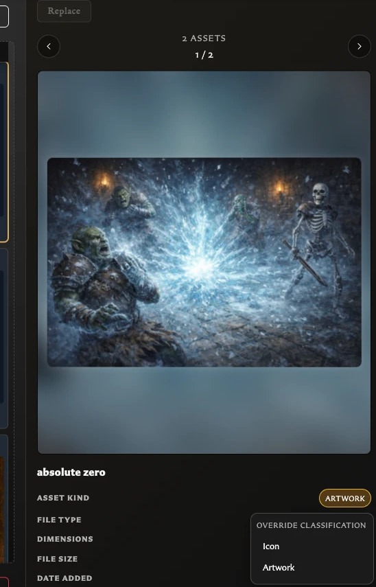

# Upload and Organize Assets

Use the Assets workspace to build a reusable image library before or while creating cards. The uploader accepts PNG, JPEG, and WebP images and can process several files in one batch.

## Upload one or more images

1. Open **Assets** from the left navigation.
2. Choose **Upload**.
3. Select one or more PNG, JPEG, or WebP files.
4. Follow **Scanning for duplicates** and **Processing images** while the batch runs.
5. If **Upload review** opens, check the skipped or renamed files and choose **Continue** to finish refreshing the library.

The successful files from the latest batch appear under **Recently uploaded**. A later batch replaces that temporary group, but it does not delete earlier assets.

## What happens to duplicates

The uploader checks both image content and filenames:

<!-- help-visual:p051:start -->
<figure class="hqcc-help-figure hqcc-help-figure--wide" markdown="span">
  
  <figcaption>Upload review identifies duplicates before the batch is added to the library.</figcaption>
</figure>
<!-- help-visual:p051:end -->

- An exact duplicate already in the library is skipped, even if the new file has a different filename.
- A different image that uses an existing filename is kept and renamed automatically, for example from `goblin.png` to `goblin (2).png`.

Review the upload summary instead of repeatedly uploading a file that was skipped as **Already in library**.

If identical new images are selected together, v0.8.0 can skip every copy as **Duplicate in batch**. Upload one copy separately. Do not use Upload Review's **Cancel** as an undo action: accepted files have already been added, and the current action can strand the progress window. See [Fix Asset Upload Problems](../../troubleshooting/fix-asset-upload-problems.md).

## Find a recent or existing image

Use **Search assets by name** when you remember part of the filename. Combine it with:

- **All assets**, **Artwork**, **Icons**, or **Unclassified**.
- **All types** or a listed file type such as `image/png`.

All active controls narrow the same grid. Clear each control when troubleshooting an empty result.

## Correct an image's kind

The app tries to classify each upload automatically. If an image appears in the wrong group:

<!-- help-visual:p053:start -->
<figure class="hqcc-help-figure hqcc-help-figure--portrait" markdown="span">
  
  <figcaption>Override classification when an uploaded image should be treated as an icon rather than artwork, or vice versa.</figcaption>
</figure>
<!-- help-visual:p053:end -->

1. Select the image.
2. In the inspector, choose its current **Asset kind**.
3. Under **Override classification**, choose **Artwork** or **Icon**.

Changing the kind affects organization and which image fields offer the asset. It does not convert, crop, or otherwise change the image itself.

## Select several assets

- Hold **Ctrl** on Windows or **Cmd** on macOS and click images to add or remove them individually.
- Hold **Shift** and click to select a continuous range.
- Use the inspector's **Previous** and **Next** controls to review the current multi-selection.

Bulk selection is useful for deletion and review. **Replace** remains disabled until the selection contains exactly one asset.

## Add an asset to a card

Choosing and positioning artwork is a card-editing task. See [Add and Position Artwork](../../making-cards/add-and-position-artwork.md) for the complete card workflow.

## Related help

- [Fix Asset Upload Problems](../../troubleshooting/fix-asset-upload-problems.md)
- [Understand the Assets Workspace](./understand-the-assets-workspace.md)
- [Replace, Convert, and Delete Assets](./replace-convert-and-delete-assets.md)
- [What Is an Asset?](../../concepts/what-is-an-asset.md)
