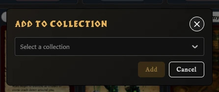
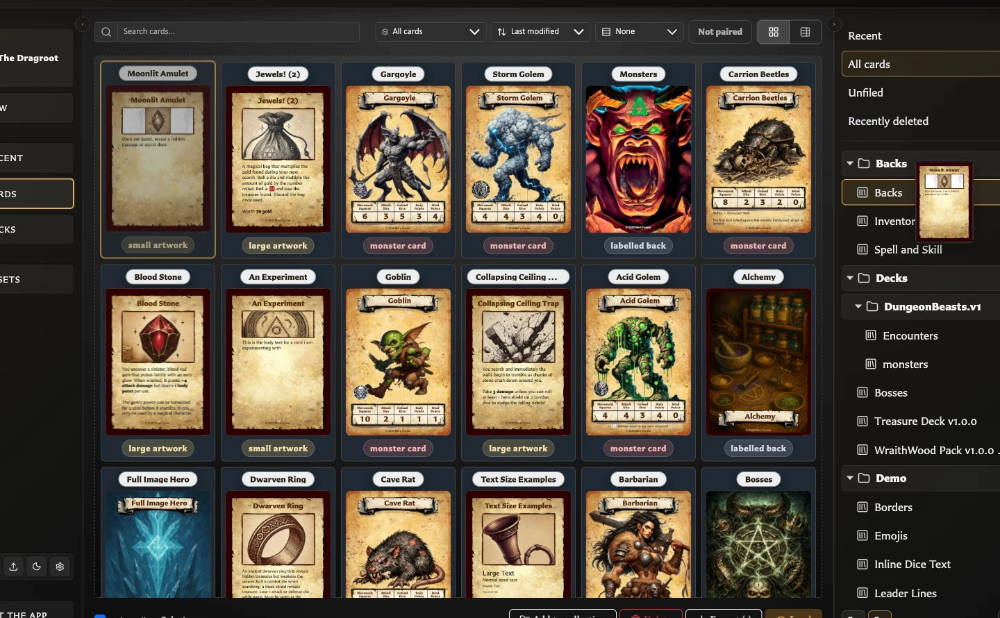

# Add and Remove Cards from Collections

A card can belong to more than one collection. Adding or removing membership does not duplicate or delete the saved card.

## Add selected cards with the action button

<!-- help-visual:p060:start -->
<figure class="hqcc-help-figure hqcc-help-figure--compact" markdown="span">
  
  <figcaption>The Add to collection window assigns the current card selection to a chosen collection.</figcaption>
</figure>
<!-- help-visual:p060:end -->

1. Open **Cards**, then open **All cards**, **Recent**, **Unfiled**, or another populated view.
2. Select a card. Use **Ctrl-click** or **Cmd-click** to select several cards, or use **Select all**.
3. Choose **Add to collection** in the bottom toolbar.
4. Choose the destination collection.
5. Choose **Add**.

The active collection is omitted from the destination list because those visible cards already belong to it.

## Drag cards into a collection

<!-- help-visual:p061:start -->
<figure class="hqcc-help-figure hqcc-help-figure--wide" markdown="span">
  
  <figcaption>Selected cards can be dragged directly onto a collection in the sidebar.</figcaption>
</figure>
<!-- help-visual:p061:end -->

1. Select one or more cards in **Cards**.
2. Drag any selected card tile onto a named collection in the Collections panel.
3. Release it when the collection is highlighted as the drop target.

If the card you begin dragging is already part of a multi-selection, the whole selection is added. Dragging an unselected card first selects and adds only that card.

In tree view, drag onto the named collection leaf, not its folder heading.

## Manage the card open in the editor

1. Save or load the card so it is a saved library card.
2. Open the inspector's **Collections** tab.
3. Choose **Add to collection**.
4. Add or remove one or more memberships, then choose **Confirm**.

Current memberships are listed in the same tab. You can also use the adjacent remove action to remove that card from one collection immediately.

## Remove cards from the collection you are viewing

1. Open the collection from the Collections panel.
2. Select one or more cards.
3. Choose **Remove from collection** above the results.

The cards remain in **All cards**. A card appears in **Unfiled** only when it belongs to no other named collection.

## Related help

- [Collections FAQ](./index.md)
- [Filter and Export a Collection](./filter-and-export-a-collection.md)
