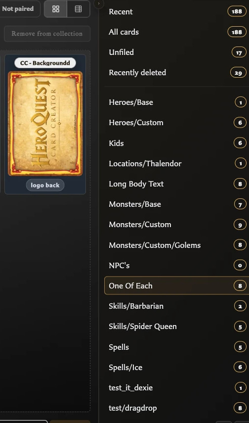

# Create and Organize Collections

## Create a collection

1. Open **Cards**.
2. In the Collections panel, choose **New collection**.
3. Enter a unique **Collection name**.
4. Optionally add a description explaining the collection's purpose.
5. Choose **Create**.

The new collection becomes the active Cards filter. Because it starts empty, return to **All cards**, **Recent**, or another populated view before selecting cards to add.

## Rename, describe, or delete collections

1. Choose **Manage collections** at the bottom of the Collections panel.
2. Choose **Edit collection** beside a collection to change its full name or description.
3. Choose **Delete** beside a collection when the grouping is no longer needed.
4. Choose **Cancel** to leave management mode.

Deleting a collection does not delete its saved cards. Cards that no longer belong to any named collection appear in **Unfiled**.

## Group collections into a tree

Tree view is useful when a flat list has become difficult to scan.

<!-- help-visual:p059:start -->
<figure class="hqcc-help-figure hqcc-help-figure--portrait" markdown="span">
  
  <figcaption>Tree view displays slash-separated collection names as expandable parent and child groups.</figcaption>
</figure>
<!-- help-visual:p059:end -->

1. Open **Settings**.
2. Choose **Collections**.
3. Enable **Group collections by folders**.
4. Use `/` in collection names to create folder paths.

For example, `spells/fire` and `spells/air` appear as **Fire** and **Air** inside a collapsible **Spells** folder. The folder is only a visual grouping; **Fire** and **Air** remain the actual collections you can select or use as drop targets.

Use **Collapse all** and **Expand all** at the bottom of the Collections panel to control a larger tree. The tree setting and expanded folders are remembered in the current browser profile.

## Related help

- [Collections FAQ](./index.md)
- [Add and Remove Cards from Collections](./add-and-remove-cards-from-collections.md)
