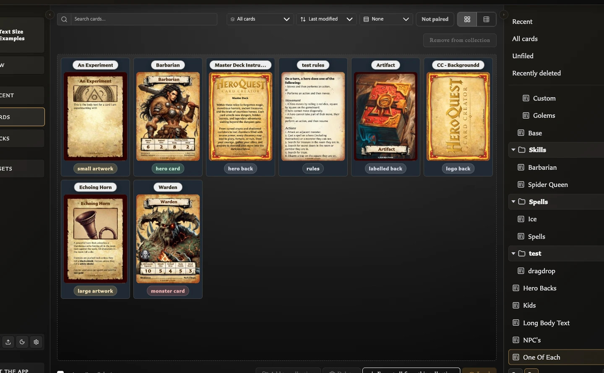

# Filter and Export a Collection

## Show only cards in one collection

1. Open **Cards**.
2. Choose a named collection in the right Collections panel.
3. Review the cards and the count shown beside the collection.

The collection controls the starting group of cards. Search, template type, sorting, and grouping can then narrow or rearrange what you see without changing collection membership.

Choose **All cards** to leave the collection filter. Choose **Unfiled** to find cards with no named collection membership.

## Export every card in a collection

<!-- help-visual:p062:start -->
<figure class="hqcc-help-figure hqcc-help-figure--wide" markdown="span">
  
  <figcaption>Filtering by a collection defines the card set that the collection export action will use.</figcaption>
</figure>
<!-- help-visual:p062:end -->

1. Open the collection.
2. Choose **Select none** if any cards are selected.
3. Choose **Export all from this collection**.

The app creates one ZIP containing the generated PNG card images. If collection cards have paired faces, it may first ask whether related paired cards should also be included. Those additional faces do not need to belong to the collection and are added to this export only.

## Export only part of a collection

1. Open the collection.
2. Select the cards you want.
3. Choose **Export (count) from this collection**.

The count in the action confirms the selected export scope. Clear the selection to return to exporting the whole collection.

## Collection membership versus visible filters

Search or template filtering does not remove hidden cards from the collection. Be deliberate about whether you want the whole collection or a selected subset before exporting.

## Related help

- [Collections FAQ](./index.md)
- [Add and Remove Cards from Collections](./add-and-remove-cards-from-collections.md)
- [Export Cards as PNG Images](../../exporting-and-printing/export-cards-as-png-images.md)
- [Organize and Recover Cards](../organize-and-recover-cards.md)
