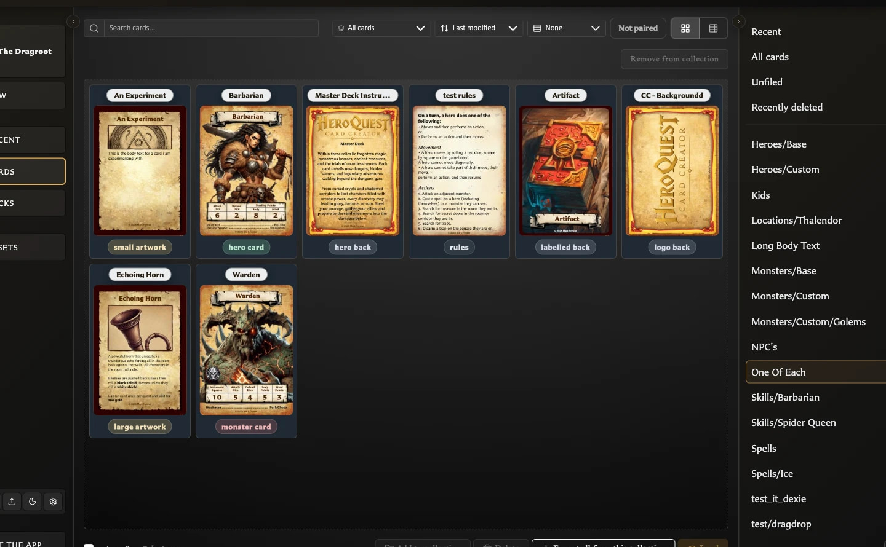

# Collections

Collections help you organize saved cards and work with related cards as a group. They are useful for projects, themes, card types, work stages, quests, expansions, or any other grouping that makes your library easier to use.

## Frequently asked questions

### What is a collection?

A collection is a named group of saved cards. Membership does not move or duplicate a card: the card remains in **All cards** and can belong to more than one collection.

<!-- help-visual:p057:start -->
<figure class="hqcc-help-figure hqcc-help-figure--wide" markdown="span">
  
  <figcaption>Selecting a collection filters Cards to the saved cards organised within it.</figcaption>
</figure>
<!-- help-visual:p057:end -->

### What are collections used for?

Use collections to:

- Find and filter related cards in **Cards**.
- Add, remove, or review several cards as a group.
- Export every card in a group or a selected subset.
- Narrow the front-facing or back-facing source cards shown while building a deck.

### When should I use a collection?

Use one whenever you want a flexible label or project grouping without changing the cards themselves. Examples include `Quest 1`, `Needs artwork`, `Treasure cards`, or `Print next`.

Use a [deck](../../concepts/what-is-a-deck.md) instead when you need quantities, ordering, shared back faces, groups, sets, entries, or structured PDF output. A collection can help you find the cards for a deck, but it is not itself a deck.

### Where can I find my collections?

Open **Cards**. The Collections panel appears on the right and lists **Recent**, **All cards**, **Unfiled**, and each named collection with a card count. On a narrow screen, open the Collections drawer from the Cards toolbar.

### What does Unfiled mean?

**Unfiled** contains saved cards that do not belong to any named collection. It is a useful way to find cards you have not organized yet.

### Does removing a card from a collection delete it?

No. It removes only that collection membership. The card remains in **All cards** and appears in **Unfiled** if it has no other collection memberships.

### Can deleting a collection delete its cards?

No. Deleting a collection removes the grouping. Its cards remain saved, and cards with no remaining memberships become Unfiled.

## Guides

- [Create and Organize Collections](./create-and-organize-collections.md)
- [Add and Remove Cards from Collections](./add-and-remove-cards-from-collections.md)
- [Filter and Export a Collection](./filter-and-export-a-collection.md)
- [Use Collections While Building a Deck](../../building-decks/use-collections-while-building-a-deck.md)
