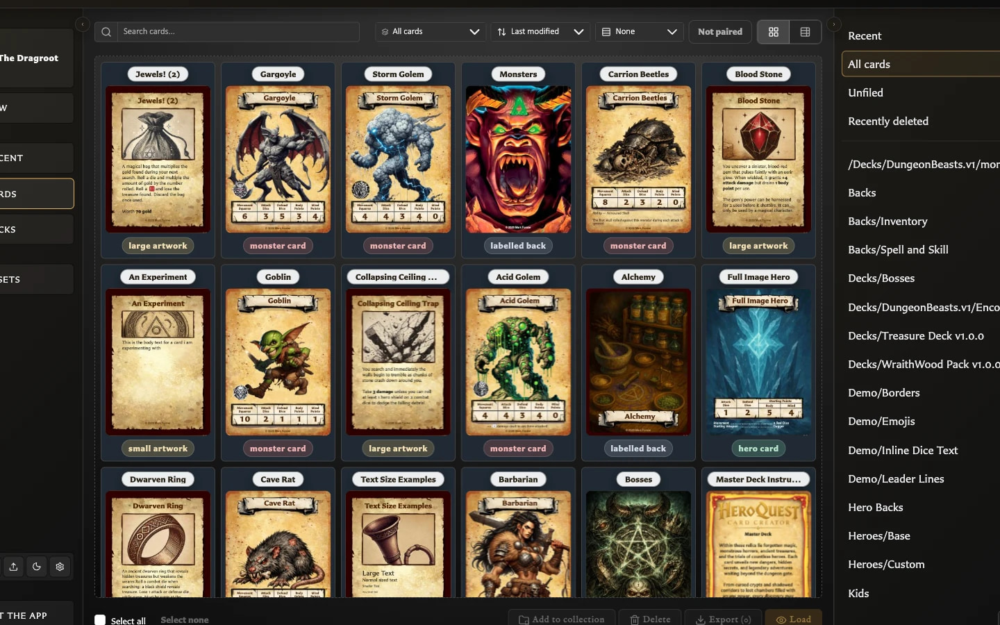

# Managing Your Library

Find, organise, recover, and reuse your saved cards and images.

<!-- help-visual:p040:start -->
<figure class="hqcc-help-figure hqcc-help-figure--wide" markdown="span">
  
  <figcaption>Cards combines the saved-card grid with search, filters, sorting, views, and collections.</figcaption>
</figure>
<!-- help-visual:p040:end -->

## In this section

- [Organize and Recover Cards](./organize-and-recover-cards.md)
- [Understand the Cards Workspace](./understand-the-cards-workspace.md)
- [View Your Recent Cards](./view-your-recent-cards.md)
- [Assets](./assets/index.md)
- [Collections](./collections/index.md)
