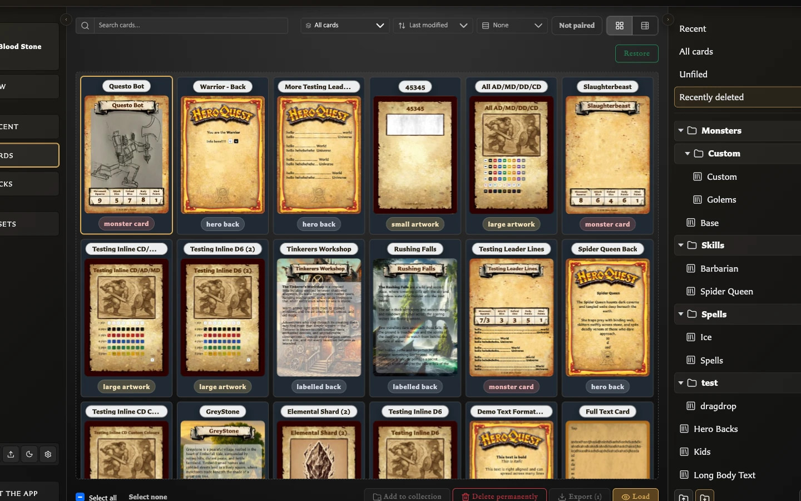

# Organize and Recover Cards

The **Cards** workspace is your saved-card library. Search, filters, collections, and selection change how cards are displayed or organized; they do not edit the card artwork itself.

For a complete tour of the screen and its contextual actions, see [Understand the Cards Workspace](./understand-the-cards-workspace.md).

If cards appear missing or an action is unexpectedly unavailable, see [Fix Cards Workspace Problems](../troubleshooting/fix-cards-workspace-problems.md).

## Find cards

- Use [Recent](./view-your-recent-cards.md) in the left navigation to quickly reopen a card you viewed before.
- Search by saved-card name.
- Filter by template type.
- Sort and group the current results.
- Switch between Grid and Table views.
- Use **Recent**, **All cards**, **Unfiled**, named collections, and **Recently deleted** in the Collections panel.

## Select cards

Click a card once to select it. Use **Ctrl** or **Cmd** while clicking to build a multi-selection, or use Select all/none. Selection enables actions such as Add to collection, Delete, Export, and Load. Load is only meaningful for one selected card.

Double-click a card when you want to open it immediately.

## Create and use a collection

Collections provide named, reusable groups for filtering and exporting saved cards. See [Collections FAQ and Guides](./collections/index.md) for creation, multi-card adding, drag-and-drop, removal, tree view, export, and deck-source filtering.

## Recover a deleted card

<!-- help-visual:p046:start -->
<figure class="hqcc-help-figure hqcc-help-figure--wide" markdown="span">
  
  <figcaption>Recently deleted keeps removed cards available until you restore or permanently delete them.</figcaption>
</figure>
<!-- help-visual:p046:end -->

1. Select the card and choose **Delete**.
2. Choose **Move to recently deleted**.
3. Open **Recently deleted**.
4. Select the card and choose **Restore**.

Restoring returns the card to the normal library but does not automatically reopen it in the editor.

### Permanent deletion warning

**Delete permanently** cannot be undone and can affect pairings, deck membership, and collection references. Version 0.8.0 exposes permanent deletion both in **Recently deleted** and in the normal **Delete** confirmation. Prefer the recoverable option unless permanent removal is intentional.

Moving a card to **Recently deleted** hides it from normal library results but keeps it available for restoration. Permanent deletion removes it from collections, removes its pairings, and removes affected deck entries or sets. An empty deck group may also be removed, while the deck itself remains. Review any additional usage warning before confirming.

## Bulk export

Select the cards you want and choose **Export**. Bulk export creates one ZIP containing the generated card images. The export can operate on a selection, filtered view, or collection and may ask whether paired faces should be included.
