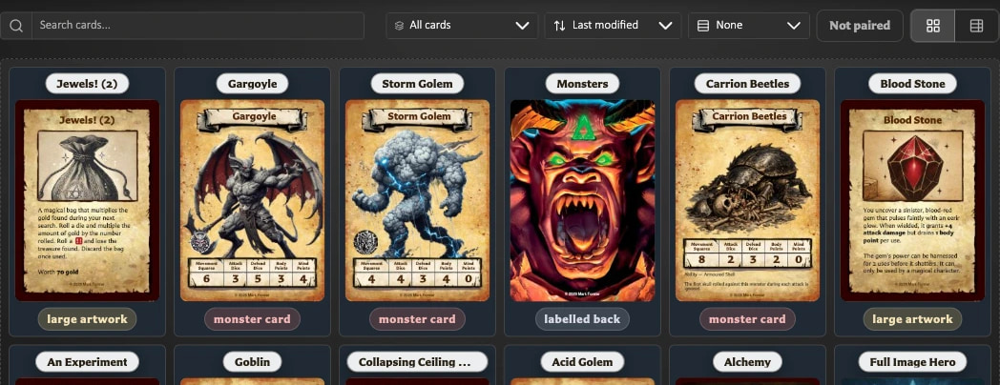
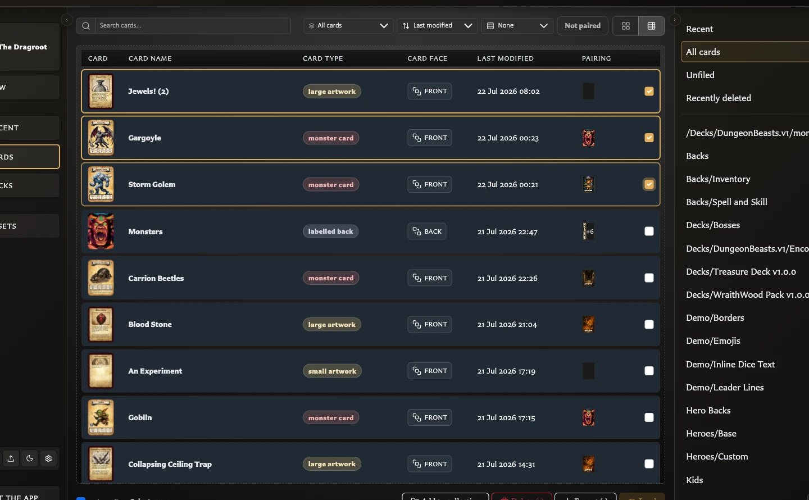

# Understand the Cards Workspace

The **Cards** workspace is your saved-card library. Use it to find and reopen cards, review them as a group, organize them into collections, select cards for bulk actions, export images, and recover recently deleted cards.

It does not edit the content printed on a card. Open a card in the Card Editor when you want to change its title, artwork, text, statistics, or appearance.

## Open Cards

Choose **Cards** in the left navigation. You can also press **C** when keyboard shortcuts are available.

The workspace remembers some local view choices, such as Grid or Table view, but the cards themselves remain saved independently of how the library is currently displayed.

## What you see on the screen

The Cards workspace has four main areas.

<!-- help-visual:p041:start -->
<figure class="hqcc-help-figure hqcc-help-figure--wide" markdown="span">
  
  <figcaption>Cards combines the saved-card grid with search, filters, sorting, views, and collections.</figcaption>
</figure>
<!-- help-visual:p041:end -->

### Find and arrange controls

The controls above the cards change which saved cards you see and how they are arranged:

<!-- help-visual:p043:start -->
<figure class="hqcc-help-figure hqcc-help-figure--panoramic" markdown="span">
  
  <figcaption>Use the Cards toolbar to search, filter, sort, group, change view, and limit results by pairing.</figcaption>
</figure>
<!-- help-visual:p043:end -->

- **Search saved cards by name** narrows the results using the saved card name.
- **Filter cards by template type** can show all cards, only front-facing or back-facing cards, or one specific card template.
- **Sort cards** orders results by Last modified, Card name, or Card type.
- **Group cards** can leave one continuous list or divide results by Card type or Card face.
- **Not paired** limits the results to cards that do not currently have a paired face.
- **Grid** and **Table** change how much information is visible for each result.

These controls do not change or move the cards. They only change the current view.

### Card results

**Grid** is the visual browsing view. It emphasizes each card's thumbnail, saved name, and card type.

**Table** is the detail-oriented view. It presents columns for the card, name, type, face, last modification, and pairing information. Use it when you want to compare several cards without opening each one.

Grouping adds headings to either view. Search, collection scope, face or template filtering, and **Not paired** work together, so a narrow result can be caused by more than one active control.

### Selection and action bar

Click a card once to select it. The actions beneath the results respond to the current selection:

<!-- help-visual:p044:start -->
<figure class="hqcc-help-figure hqcc-help-figure--wide" markdown="span">
  
  <figcaption>Table view supports multi-selection while keeping card type, face, modified date, and pairing visible.</figcaption>
</figure>
<!-- help-visual:p044:end -->

- **Add to collection** adds the selected cards to another named collection.
- **Delete** opens the deletion choices for the selected cards.
- **Export** creates PNG images for the selected scope.
- **Load** opens one selected card in the Card Editor.

Use **Ctrl-click** on Windows or **Cmd-click** on macOS to build a selection. **Select all** selects all cards in the current filtered results, while **Select none** clears the selection.

Double-click a card to open it directly without using **Load**.

### Collections panel

The Collections panel controls the library scope before the controls above it narrow the results further:

- **Recent** shows recently viewed cards inside the full Cards workspace.
- **All cards** shows every normally saved card.
- **Unfiled** shows cards that do not belong to a named collection.
- **Recently deleted** appears when recoverable deleted cards exist.
- Named collections show only their members.

Counts beside these choices can respond to broad filters such as the active search and **Not paired**. Sorting, grouping, and switching between Grid and Table do not change the counts. On a narrow screen, use the collections-panel control to open this area as a drawer.

## How the filters work together

Think of the workspace as narrowing the library in stages:

1. Choose the broad scope, such as All cards, Unfiled, Recent, Recently deleted, or a named collection.
2. Search by saved name if needed.
3. Limit the results by face or template.
4. Turn on **Not paired** if you only want cards without a pairing.
5. Sort, group, or switch view without changing which cards qualify.

If a card seems to be missing, clear the search, return the face/template filter to **All cards**, turn off **Not paired**, and check the selected collection scope.

## What Not paired means

**Not paired** shows cards that are not currently linked to another card face. It is useful for finding fronts that still need a back or backs that have not yet been connected to fronts.

The control is an additional filter. Turning it on does not remove an existing pairing or change the card.

## Why an action may be unavailable

Actions only become available when they have a valid target:

| Action | When it is available |
| --- | --- |
| **Add to collection** | One or more visible cards are selected, the current view is not Recently deleted, and another destination collection exists |
| **Delete** | At least one card is selected |
| **Export** | Cards are selected in All cards or Unfiled, or a populated named collection provides a collection export scope |
| **Load** | Exactly one card is selected |
| **Remove from collection** | Selected cards are being viewed inside a named collection |
| **Restore** | Selected cards are being viewed inside Recently deleted |

If several cards are selected, **Load** is disabled because the Card Editor can open only one card at a time. Clear the selection and choose one card.

## Selection is not editing

Selecting, searching, sorting, grouping, filtering, or switching views does not modify the saved card. Collection membership changes organization, but it does not duplicate or edit the card itself.

Deleting is different. **Move to recently deleted** is recoverable; **Delete permanently** cannot be undone and can affect collection, pairing, and deck references. Read [Organize and Recover Cards](./organize-and-recover-cards.md) before permanently removing cards.

## Related help

- [Fix Cards Workspace Problems](../troubleshooting/fix-cards-workspace-problems.md)
- [Organize and Recover Cards](./organize-and-recover-cards.md)
- [View Your Recent Cards](./view-your-recent-cards.md)
- [Collections FAQ and Guides](./collections/index.md)
- [Export Cards as PNG Images](../exporting-and-printing/export-cards-as-png-images.md)
- [Understand the Card Editing View](../making-cards/understand-the-card-editing-view.md)
- [Keyboard Shortcuts](../reference/keyboard-shortcuts.md)
